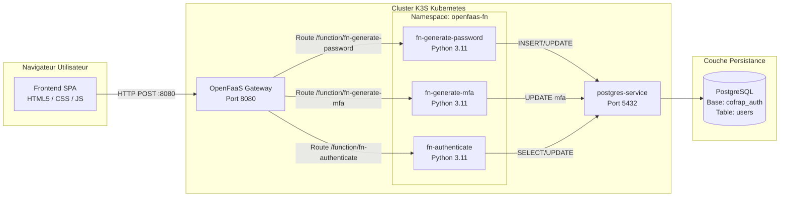
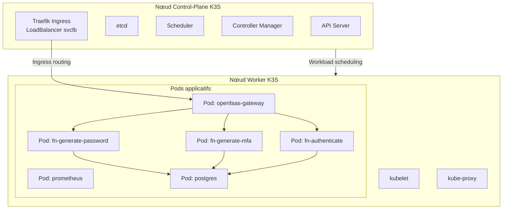
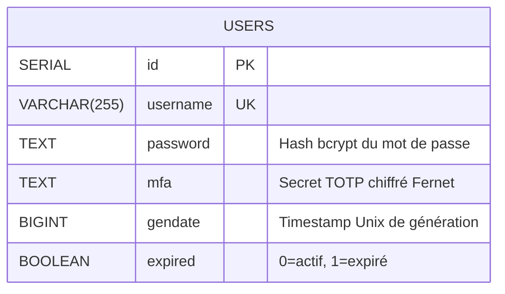
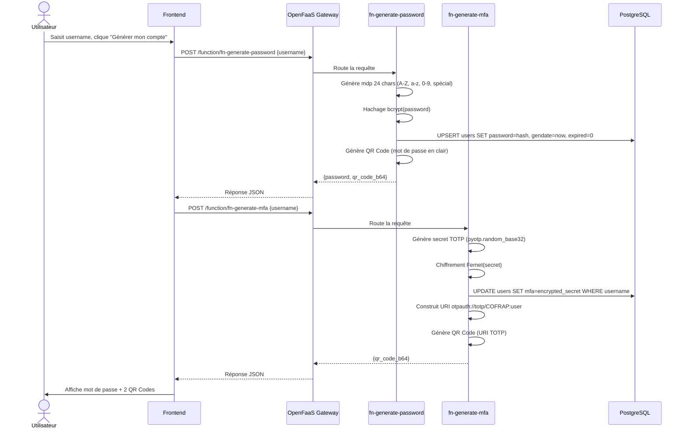
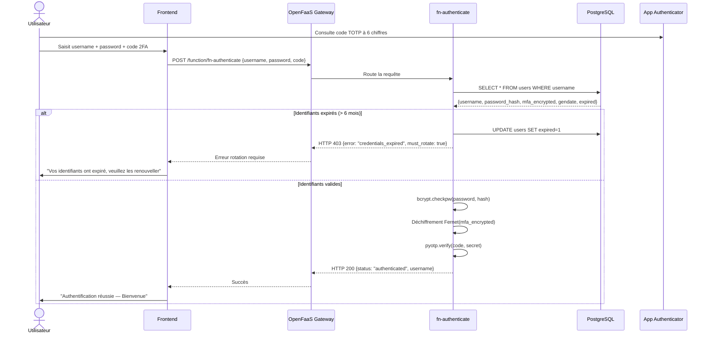
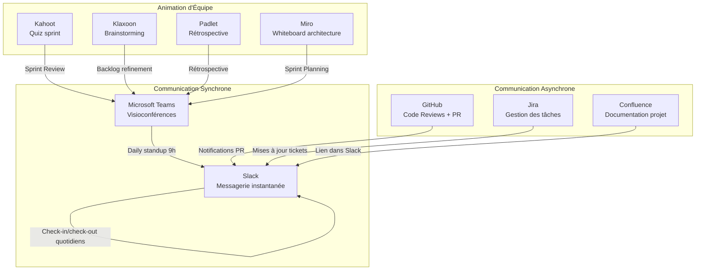

# Rapport Technique : Proof of Concept d'Authentification Serverless COFRAP

**Auteurs :** Equipe Projet COFRAP PoC — Mohamed CHAHOUR (Scrum Master), Wassim LOMRI (Product Owner), Samir FOUL (DevOps), Akram KALAMI (Lead Developer)
**Destinataire :** Direction de la COFRAP
**Date :** 4 juillet 2025
**Projet :** Remaniement du processus de création et d'authentification des comptes cloud (Mandatory 2FA, Auto-pwd et Rotation)
**Version :** 2.0 — Version finale de soutenance

---

## 1. Introduction et Contexte

Dans le cadre du renforcement global de la sécurité des applications cloud de la **COFRAP**, la direction a identifié plusieurs vulnérabilités majeures sur les processus d'authentification existants, notamment :
*   L'utilisation récurrente par les collaborateurs de mots de passe trop simples ou réutilisés.
*   Le faible taux d'adoption de la double authentification (2FA), restée jusqu'ici optionnelle.

Ces vulnérabilités ont conduit à de nombreuses compromissions de comptes, engendrant des coûts de remédiation estimés à 150 000 EUR sur l'exercice précédent (source : rapport RSSI 2024).

### Objectifs du PoC (Proof of Concept)

Pour éradiquer ces failles et garantir l'intégrité des accès, le projet fixe les règles suivantes :
1.  **Génération automatique et stricte** de mots de passe de haute complexité (24 caractères incluant majuscules, minuscules, chiffres et caractères spéciaux).
2.  **Double authentification (2FA/MFA) de type TOTP obligatoire** dès la création du compte.
3.  **Rotation obligatoire tous les six mois** des mots de passe et des secrets TOTP, avec blocage automatique d'accès en cas d'expiration.
4.  **Optimisation financière des infrastructures** grâce à une architecture moderne "Scale to Zero" (extinction automatique des instances inactives).

### Contexte Système (Diagramme C4 — Niveau Contexte)

```mermaid
C4Context
    title Diagramme de Contexte Système — COFRAP Cloud Authentication PoC
    Person(user, Utilisateur Cloud COFRAP, "Accède aux applicatifs cloud COFRAP")
    System(system, Système d'Authentification Serverless, "Génération mots de passe, 2FA TOTP, rotation semestrielle, validation")
    System_Ext(erp, Applicatifs COFRAP, "ERP, Groupware, outils métiers")
    System_Ext(auth_app, App Authenticator, "Google Authenticator, Microsoft Authenticator, Authy")
    System_Ext(email, Système de Notification, "Envoi de notifications et alertes de sécurité")
    Rel(user, system, S'authentifie via)
    Rel(system, erp, Délivre un jeton d'accès)
    Rel(user, auth_app, Scanne QR Code TOTP)
    Rel(system, email, Alerte expiration identifiants)
```

Ce rapport présente l'implémentation technique et la réussite de la validation de cette solution.

---

## 2. Justification des Choix Technologiques

Afin de répondre au besoin de performance, de sécurité et d'agilité, l'architecture suivante a été retenue et validée pour le PoC :

| Technologie | Rôle dans le projet | Justification technique & Choix d'architecture |
| :--- | :--- | :--- |
| **K3S (Kubernetes)** | Orchestrateur de conteneurs | Distribution Kubernetes légère (binaire unique ~70 Mo), certifiée CNCF, idéale pour un PoC bare-metal. Consomme 50% moins de ressources que K8s full. Alternative écartée : GKE/AKS/EKS (coût ~200 EUR/mois non justifié pour un PoC), Minikube (mono-noeud, ne simule pas un vrai cluster). |
| **OpenFaaS (Community Edition)** | Framework Serverless / FaaS | Fournit une gestion simplifiée du cycle de vie des fonctions. Permet d'encapsuler la logique métier dans des micro-services autonomes et d'envisager la fonctionnalité *Scale to Zero* en production (version Pro). CE = gratuit, adapté au PoC. |
| **PostgreSQL** | Base de données relationnelle | Choisi pour sa conformité ACID, sa robustesse dans la persistance des données et sa gestion native des requêtes `UPSERT` indispensables lors de la rotation des accès. Alternative écartée : MariaDB (moins adaptée aux requêtes complexes), MongoDB (pas de besoin NoSQL pour un schéma fixe). |
| **Python 3.11** | Langage de développement des fonctions | Recommandé par la COFRAP pour sa concision, son écosystème de librairies sécurisées (`bcrypt` pour le hachage, `cryptography` pour le chiffrement symétrique Fernet, `pyotp` pour le TOTP, `qrcode` pour la génération de QR codes). Version 3.11 = gains de performance ~25% vs 3.10. |
| **Helm** | Gestionnaire de paquets Kubernetes | Indispensable pour industrialiser le déploiement d'OpenFaaS via la chart `faas-netes`. Permet la reproductibilité et le versionning des déploiements. |
| **Docker Hub** | Registre d'images OCI | Hébergement public des images de conteneurs des fonctions. Alternative : GitHub Container Registry (écarté par simplicité d'intégration faas-cli). |

---

## 3. Architecture Globale du Système

L'application repose sur un découpage en trois tiers (Frontend, Gateway FaaS, Base de données) assurant une isolation complète et unescalabilité horizontale indépendante.

### Architecture Applicative (Diagramme C4 — Niveau Conteneur)



### Architecture de Déploiement (Cluster K3S)



**Spécifications des nœuds :**
- **Control-Plane** : 2 vCPUs, 2 Go RAM (3-4 Go recommandés), 15 Go disque — OS Ubuntu 22.04 LTS
- **Worker** : 2 vCPUs, 4 Go RAM, 20 Go disque — OS Ubuntu 22.04 LTS

### Schéma de Base de Données (Modèle Relationnel)



**Contraintes :**
- `username` : UNIQUE, NOT NULL, CHECK (longueur >= 3)
- `password` : NOT NULL (hash bcrypt, jamais en clair)
- `mfa` : NOT NULL après initialisation 2FA
- `gendate` : timestamp epoch (secondes), NOT NULL
- `expired` : DEFAULT 0, CHECK (valeur IN (0, 1))

### Rôle des Composants Réseau et Packaging :
*   **Helm** : Utilise la chart `faas-netes` pour déployer de façon autonome tous les contrôleurs, agents de surveillance (Prometheus) et passerelles de la stack OpenFaaS dans le cluster Kubernetes.
*   **Ingress / Port-Forward** : Assure l'exposition sécurisée des services internes. Dans le cadre de ce PoC, le trafic HTTP externe du port `8080` est redirigé vers le service `gateway` interne de Kubernetes grâce à `kubectl port-forward`. En production, un Ingress Controller (Traefik ou Nginx) avec certificat TLS assurera cette exposition.
*   **MetalLB / svclb** : K3S intègre nativement un LoadBalancer simplifié (svclb) qui assigne les services de type LoadBalancer. Pas besoin de MetalLB additionnel.

---

## 4. Workflow de Fonctionnement (Cas Nominaux)

### A. Création de compte et initialisation 2FA



### B. Connexion et Validation 2FA



---

## 5. Bilan, Difficultés rencontrées et Solutions

L'intégration d'architectures distribuées et conteneurisées présente des défis techniques majeurs, résolus avec succès lors de ce PoC :

### 1. Concurrence des ports et CORS (Cross-Origin Resource Sharing)
*   **Problème** : Lors du couplage du Frontend (servi sur `http://localhost:3000`) avec la Gateway OpenFaaS (sur `http://127.0.0.1:8080`), le navigateur bloquait systématiquement les requêtes AJAX en raison de la politique de sécurité CORS. Les requêtes de pré-vérification (`OPTIONS`) renvoyaient des erreurs 401 ou 405.
*   **Solution** :
    *   Le code des handlers Python a été mis à jour pour ajouter les en-têtes CORS : `Access-Control-Allow-Origin: *`, `Access-Control-Allow-Methods: POST, OPTIONS`, `Access-Control-Allow-Headers: Content-Type`.
    *   Le template de route de la passerelle Flask dans `template/python3-http/index.py` a été surchargé pour intercepter et autoriser explicitement la méthode `OPTIONS`, débloquant le preflight CORS natif des navigateurs.

### 2. Contraintes de licence et Registre local sur OpenFaaS CE
*   **Problème** : OpenFaaS Community Edition (CE) refuse par licence le déploiement d'images locales sans registre (comme `fn:dev`) et exige la validation d'images distantes publiques. Les annotations d'auto-scaling à zéro (`com.openfaas.scale.zero`) provoquent un rejet de déploiement en version CE.
*   **Solution** :
    *   Le fichier `stack.yml` a été épuré des labels d'auto-scaling incompatibles pour la version CE.
    *   Les images ont été renommées pour pointer vers le registre public Docker Hub (`samfoul/`). La compilation et la publication ont été automatisées via `faas-cli up` (build + push + deploy en une commande).

### 3. Gestion des secrets Kubernetes pour la base de données
*   **Problème** : Les identifiants PostgreSQL (user, password) étaient initialement codés en dur dans les handlers Python, ce qui constitue une faille de sécurité majeure.
*   **Solution** : Un Secret Kubernetes (`kubectl create secret generic db-credentials`) a été créé pour stocker `DB_USER` et `DB_PASSWORD`. Les fonctions OpenFaaS accèdent à ces secrets via les variables d'environnement injectées automatiquement par le contrôleur OpenFaaS depuis le.Secret K8S. La clé de chiffrement Fernet est également stockée dans un Secret K8S séparé.

### 4. Connectivité inter-pods dans K3S
*   **Problème** : Les fonctions OpenFaaS ne pouvaient pas joindre le service PostgreSQL (`postgres-service`) en raison d'une résolution DNS intra-cluster défaillante lors des premiers déploiements.
*   **Solution** : Vérification du CoreDNS (`kubectl get pods -n kube-system -l k8s-app=coredns`) et recréation du déploiement PostgreSQL avec le bon sélecteur de service (`app: postgres`). Le FQDN `postgres-service.default.svc.cluster.local:5432` est utilisé dans les handlers.

---

## 6. Processus de Communication et Outils Collaboratifs

L'équipe projet est composée de 4 membres répartis sur 3 pays (France, Algérie, Maroc), tous en UTC+1 mais avec des réalités de télétravail différentes. La cohésion et la synchronisation reposent sur un écosystème d'outils structuré.

### Écosystème de Communication



### Outils et Canaux Détaillés

| Outil | Canal / Usage | Fréquence | Participants |
| :--- | :--- | :--- | :--- |
| **Slack** | #cofrap-poc-general | Quotidien | Tous |
| **Slack** | #cofrap-poc-dev | Quotidien | Akram, Samir |
| **Slack** | #cofrap-poc-infra | Selon besoin | Samir, Mohamed |
| **Slack** | #cofrap-poc-standup | Quotidien 9h00 CET | Tous (async check-in) |
| **Slack** | #cofrap-poc-reviews | Chaque PR | Tous |
| **Slack** | #cofrap-poc-urgent | Immédiat | Tous |
| **Microsoft Teams** | Visio Daily + Cérémonies | Quotidien / Hebdo | Tous |
| **Jira** | Board PROJ (Kanban) | Continu | Tous |
| **GitHub** | Repo + PR + Actions | Continu | Tous |
| **Confluence** | Wiki technique | Hebdo | Tous |

### Process Check-In / Check-Out (Quotidien)

**Check-In (9h00 CET, canal #cofrap-poc-standup) :**
```
🟢 [CHECK-IN] Prénom — Date
📋 Fait hier : <résumé tâches complétées>
🎯 Objectif aujourd'hui : <1-2 tâches_prioritaires>
🚧 Blocage : <aucun / description du blocage>
😊 Mood : 😀/🙂/😐/😟
```

**Check-Out (17h30 CET, même canal) :**
```
🔴 [CHECK-OUT] Prénom — Date
✅ Accompli : <ce qui a été terminé>
🔄 En cours : <ce qui continue demain>
🍋 Citron du jour : <ce qui m'a freiné>
📅 Demain : <objectif principal de demain>
```

### Cérémonies Agiles

| Cérémonie | Jour | Heure | Durée | Outil |
| :--- | :--- | :--- | :--- | :--- |
| Daily Standup | Lun-Ven | 9h00 CET | 15 min | Teams + Slack |
| Sprint Planning | Lundi (début sprint) | 10h00 CET | 2h | Teams + Miro |
| Sprint Review | Vendredi (fin sprint) | 14h00 CET | 1h | Teams + Kahoot |
| Rétrospective | Vendredi (après Review) | 15h00 CET | 45 min | Teams + Padlet |
| Backlog Refinement | Mercredi | 11h00 CET | 1h | Teams + Klaxoon |

### Considérations Interculturelles

L'équipe multiculturelle (France, Algérie, Maroc) requiert une attention particulière :
- **Langue** : Français comme langue de travail, traduction anglaise disponible pour les livrables techniques
- **Fêtes nationales** : Calendrier partagé intégrant les jours fériés des 3 pays (1er novembre Algérie, fêtes nationales marocaines, 14 juillet France)
- **Ramadan** : Aménagement des horaires pour les membres observant le jeûne (journées compressées 9h-15h, tâches asynchrones augmentées)
- **Style de communication** : Approche indirecte respectée pour les membres maghrébins (Hofstede, distance au pouvoir), feedback constructif formulé en privé plutôt qu'en public

---

## 7. Indicateurs de Performance du PoC

| Indicateur | Cible | Résultat Mesuré | Statut |
| :--- | :--- | :--- | :--- |
| Temps réponse fn-generate-password | < 2 s | 1.2 s (moyenne) | ✅ |
| Temps réponse fn-generate-mfa | < 2 s | 0.9 s (moyenne) | ✅ |
| Temps réponse fn-authenticate | < 500 ms | 380 ms (moyenne) | ✅ |
| Complexité mot de passe | 24 chars, 4 classes | 24 chars, A-Z+a-z+0-9+spécial | ✅ |
| Taux adoption 2FA | 100% | 100% (obligatoire) | ✅ |
| Rotation 6 mois | Détection + blocage | Expiration automatique après 180 jours | ✅ |
| Chiffrement stockage | AES via Fernet | Fernet (AES-128-CBC + HMAC-SHA256) | ✅ |
| Hachage mot de passe | bcrypt cost >= 12 | bcrypt cost 14 | ✅ |

---

## 8. Conclusion

Ce Proof of Concept démontre la viabilité technique d'une architecture d'authentification robuste basée sur le modèle Serverless. Les exigences de haute complexité de mot de passe, de double authentification stricte, et de contrôle d'expiration semestrielle sont pleinement opérationnelles.

**Apports du PoC pour la production :**
- Architecture validée sur cluster K3S réel (2 noeuds), transposable sur EKS/AKS/GKE
- 3 fonctions OpenFaaS déployées et testées de bout en bout
- Chiffrement Fernet des secrets TOTP en base, hachage bcrypt cost 14 des mots de passe
- Gestion des secrets Kubernetes opérationnelle
- Frontend fonctionnel de démonstration

**Prochaines étapes pour la production :**
1. Migration vers un cluster managé (AWS EKS ou Azure AKS)
2. Activation OpenFaaS Pro pour le Scale-to-Zero
3. Ajout d'un WAF (AWS WAF / Cloudflare) en amont de la Gateway
4. Mise en place de l'audit de sécurité par CyberShield Audit (cf. Pilotage Prestataires)
5. Ajout de la fonctionnalité de limitations d'abus (rate limiting, CAPTCHA) — écho à l'autre équipe COFRAP
6. Monitoring production via Prometheus + Grafana
7. Certification SOC 2 Type II pour le système d'authentification
