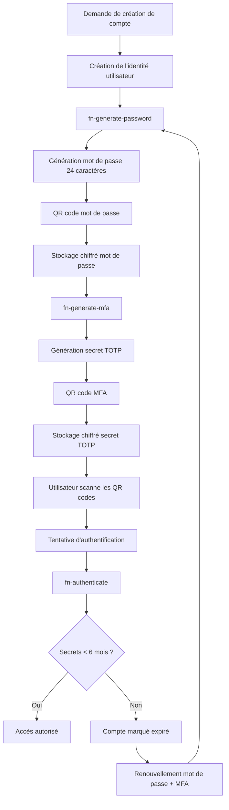
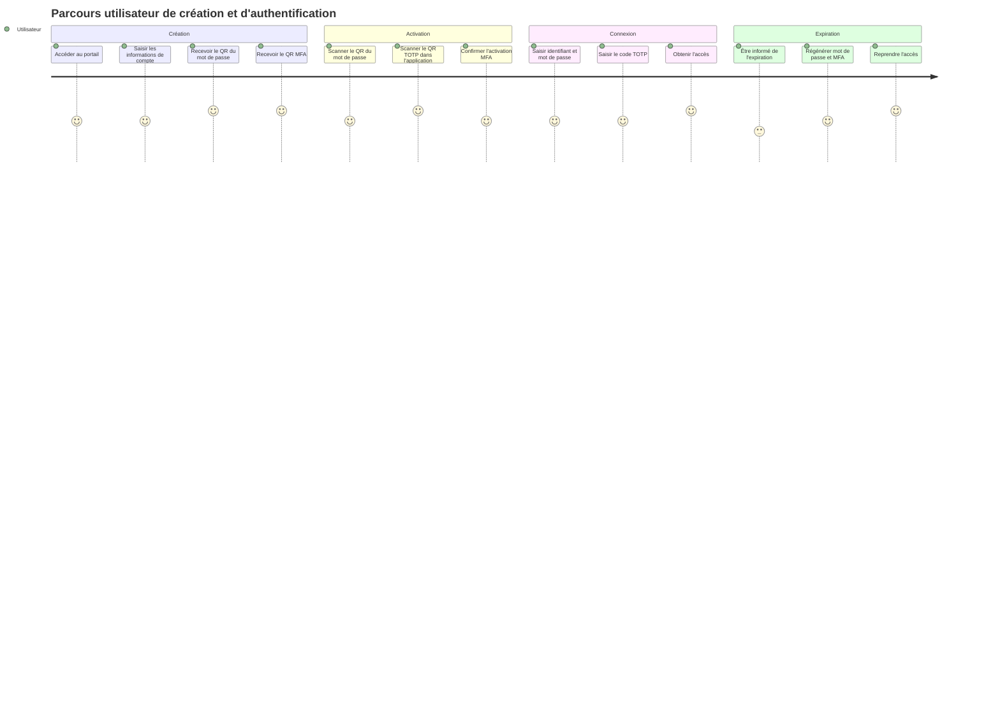
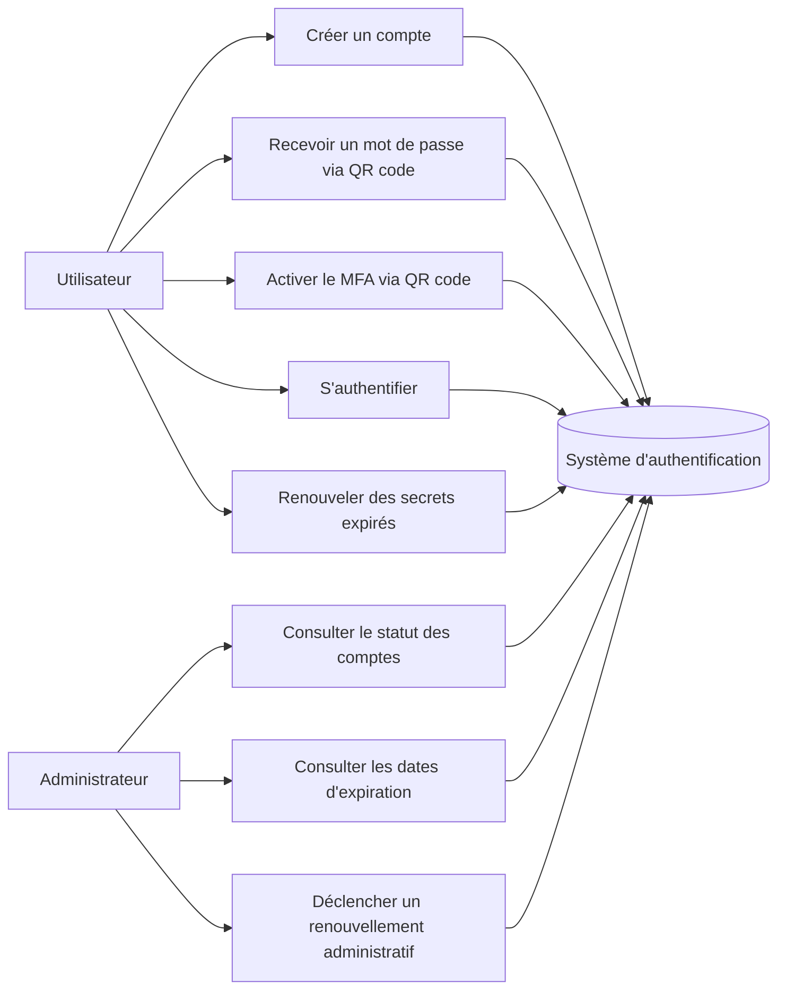

# Cahier des Charges Fonctionnel

## Projet

**Titre :** Système d'authentification serverless sécurisé pour la création automatisée de comptes utilisateurs  
**Entreprise commanditaire :** COFRAP — Compagnie Française de Réalisation d'Applicatifs Professionnels  
**Nature du projet :** Proof of Concept (PoC)  
**Architecture cible :** OpenFaaS sur Kubernetes  
**Périmètre fonctionnel :** création de comptes, génération de mots de passe, MFA TOTP, authentification, renouvellement des secrets  
**Version du document :** 1.0  
**Date de rédaction :** 18/06/2026  

---

## 1. Présentation générale

### 1.1 Contexte de l'entreprise

COFRAP est une entreprise spécialisée dans la conception et la réalisation d'applicatifs professionnels, notamment dans les domaines suivants :

- ERP ;
- groupware ;
- applications cloud à destination d'une clientèle B2B ;
- services logiciels métier à forte valeur ajoutée.

Dans le cadre de l'exploitation de ses solutions cloud, COFRAP a constaté plusieurs incidents de sécurité liés aux pratiques d'authentification de ses clients :

- utilisation de mots de passe faibles ;
- absence d'activation du second facteur d'authentification ;
- réutilisation de secrets sur plusieurs services ;
- mauvaise rotation des identifiants ;
- compromission de comptes utilisateurs.

Ces constats ont conduit la DSI et la RSSI à demander la mise en place d'un système d'authentification renforcé, automatisé et industrialisable, déployé dans une architecture moderne de type serverless.

### 1.2 Objet du projet

Le présent cahier des charges fonctionnel décrit le besoin métier et fonctionnel d'un **PoC de création automatisée de comptes utilisateurs** reposant sur :

- un générateur automatique de mots de passe robustes ;
- une distribution sécurisée via QR code ;
- une authentification multifacteur obligatoire par TOTP ;
- une rotation obligatoire des secrets tous les 6 mois ;
- un marquage des comptes expirés lorsque les secrets dépassent 6 mois ;
- une interface web simple pour les opérations utilisateur et administrateur.

### 1.3 Finalité du PoC

Le PoC doit permettre à COFRAP de :

- valider la faisabilité technique d'un modèle serverless sur OpenFaaS/Kubernetes ;
- démontrer la valeur métier d'une sécurisation forte du cycle de vie des comptes ;
- préparer une industrialisation future à l'échelle des clients cloud de COFRAP ;
- réduire rapidement le risque de compromission par mot de passe faible ou absence de MFA.

---

## 2. Périmètre du projet

### 2.1 Périmètre inclus

Le projet inclut les éléments suivants :

- création d'un compte utilisateur via une interface web ;
- génération d'un mot de passe aléatoire de 24 caractères ;
- génération d'un QR code contenant l'information de remise du mot de passe ;
- stockage chiffré du mot de passe en base de données ;
- génération d'un secret TOTP ;
- génération d'un QR code d'enrôlement MFA ;
- stockage chiffré du secret TOTP en base de données ;
- authentification par identifiant + mot de passe + code TOTP ;
- vérification de la date de création/rotation des secrets ;
- marquage des comptes expirés ;
- renouvellement des secrets expirés ;
- consultation de l'état des comptes par un administrateur.

### 2.2 Périmètre exclu

Le PoC n'inclut pas :

- fédération d'identité SSO ;
- connexion à un annuaire LDAP/Active Directory ;
- authentification sociale ;
- gestion avancée des rôles RBAC d'entreprise ;
- workflows RH complets d'onboarding/offboarding ;
- haute disponibilité multi-régions ;
- application mobile native.

---

## 3. Parties prenantes

### 3.1 Équipe projet

- **Mohamed CHAHOUR** — France  
- **Wassim LOMRI** — France  
- **Samir FOUL** — Algérie  
- **Akram KALAMI** — Maroc  

### 3.2 Parties prenantes métier

- Direction Générale ;
- DSI ;
- RSSI ;
- Direction Support ;
- équipes exploitation cloud ;
- administrateurs techniques ;
- utilisateurs finaux clients cloud.

---

## 4. Objectifs des directions métiers

### 4.1 Objectifs de la DSI

La DSI poursuit les objectifs suivants :

- réduire de **80 %** les compromissions de comptes liées à des mots de passe faibles dans les 12 mois suivant l'industrialisation ;
- automatiser à **95 %** le cycle de création technique des identifiants ;
- diminuer le temps moyen de provisioning d'un compte de **20 minutes à moins de 2 minutes** ;
- standardiser le processus de gestion des secrets sur l'ensemble des environnements cloud ;
- disposer d'un socle technique réplicable sur Kubernetes/OpenFaaS.

### 4.2 Objectifs de la RSSI

La RSSI poursuit les objectifs suivants :

- atteindre **100 % d'adoption du MFA** sur les comptes créés par le système ;
- éliminer **100 % des mots de passe faibles** lors de la création initiale ;
- imposer une rotation des secrets tous les **6 mois maximum** ;
- tracer les comptes expirés avec une détection à **J+0** dès dépassement du seuil ;
- réduire le risque d'accès non autorisé par compromission d'identifiants d'au moins **75 %**.

### 4.3 Objectifs de la Direction Générale

La Direction Générale attend :

- une amélioration mesurable de la posture de sécurité de l'offre cloud ;
- un retour sur investissement observable en moins de **12 mois** après industrialisation ;
- une baisse des coûts indirects liés aux incidents de sécurité et au support ;
- un gain de temps opérationnel estimé à **150 heures/an** sur les opérations manuelles de provisioning ;
- un argument commercial renforçant la confiance des clients sur la sécurité des services cloud COFRAP.

### 4.4 Objectifs de la Direction Support

La Direction Support vise :

- une réduction de **40 %** des tickets liés aux réinitialisations de mot de passe ;
- une diminution de **30 %** des sollicitations liées à la mauvaise configuration du MFA ;
- une meilleure visibilité sur l'état des comptes et les dates d'expiration ;
- la mise à disposition d'un parcours simple pour renouveler les secrets expirés ;
- une baisse du temps moyen de traitement d'un ticket d'authentification de **15 minutes à 5 minutes**.

---

## 5. Description de la solution attendue

### 5.1 Principe général

La solution s'appuie sur une architecture serverless composée de trois fonctions principales déployées sur OpenFaaS, lui-même exécuté sur Kubernetes.

Les fonctions sont les suivantes :

1. **fn-generate-password**  
   Génère un mot de passe de 24 caractères, crée un QR code de restitution et stocke le mot de passe chiffré en base de données.

2. **fn-generate-mfa**  
   Génère un secret TOTP, crée un QR code d'enrôlement MFA et stocke le secret chiffré en base de données.

3. **fn-authenticate**  
   Vérifie l'identifiant, le mot de passe et le code TOTP, contrôle la validité temporelle des secrets, puis marque le compte comme expiré si nécessaire.

### 5.2 Interface utilisateur attendue

L'application front-end web doit proposer au minimum :

- un écran de création de compte ;
- un écran d'affichage/téléchargement des QR codes ;
- un écran d'authentification ;
- un écran de renouvellement des secrets ;
- un écran administrateur de consultation d'état des comptes.

### 5.3 Règles de sécurité imposées

- mot de passe auto-généré de **24 caractères** ;
- présence obligatoire de :
  - majuscules ;
  - minuscules ;
  - chiffres ;
  - caractères spéciaux ;
- activation MFA TOTP obligatoire avant premier accès nominal ;
- rotation du mot de passe et du secret TOTP tous les **6 mois** ;
- marquage du compte en statut **expiré** si dépassement du délai ;
- conservation des secrets en base sous forme chiffrée ;
- interdiction d'un accès complet si MFA absent ou invalide.

---

## 6. Processus métier cible

### 6.1 Description textuelle du processus

1. L'utilisateur ou un administrateur déclenche la création du compte.
2. Le système crée l'identité utilisateur.
3. La fonction `fn-generate-password` produit un mot de passe robuste.
4. Le système génère un QR code associé au mot de passe.
5. La fonction `fn-generate-mfa` produit un secret TOTP.
6. Le système génère un QR code d'enrôlement MFA.
7. Les secrets sont chiffrés et enregistrés en base.
8. L'utilisateur scanne les QR codes.
9. L'utilisateur s'authentifie avec identifiant, mot de passe et TOTP.
10. La fonction `fn-authenticate` contrôle la validité des données et la date de rotation.
11. Si les secrets ont plus de 6 mois, le compte est marqué expiré.
12. L'utilisateur est redirigé vers le processus de renouvellement.

### 6.2 Diagramme Mermaid — Flux métier



---

## 7. Parcours utilisateur

### 7.1 User journey map



---

## 8. Diagramme de cas d'usage



---

## 9. Exigences fonctionnelles détaillées

### 9.1 Liste des grandes fonctionnalités

Les fonctionnalités attendues sont :

- F-01 : création de compte ;
- F-02 : génération automatique d'un mot de passe robuste ;
- F-03 : restitution du mot de passe sous forme de QR code ;
- F-04 : génération d'un secret TOTP ;
- F-05 : restitution du secret TOTP via QR code compatible application OTP ;
- F-06 : stockage chiffré des secrets ;
- F-07 : authentification forte à trois facteurs logiques (identifiant, mot de passe, TOTP) ;
- F-08 : détection d'expiration des secrets ;
- F-09 : renouvellement des secrets expirés ;
- F-10 : consultation administrative du statut des comptes.

---

## 10. User stories détaillées

### US-001 — Créer un compte utilisateur

- **Titre :** Création de compte
- **Description :** En tant que nouvel utilisateur, je veux créer un compte afin de pouvoir accéder au cloud COFRAP.
- **Priorité :** Must Have
- **Story points :** 5
- **Dépendances :** aucune
- **Critères d'acceptation :**

```gherkin
Scenario: Création réussie d'un compte
  Given un utilisateur non enregistré
  When il saisit les informations requises de création
  Then un compte utilisateur est créé avec un identifiant unique
  And le système déclenche la génération du mot de passe et du MFA
```

```gherkin
Scenario: Refus de création si données incomplètes
  Given un utilisateur sur le formulaire de création
  When il soumet le formulaire avec des champs obligatoires manquants
  Then le système refuse la création
  And affiche les erreurs de validation
```

### US-002 — Recevoir le mot de passe via QR code

- **Titre :** Distribution sécurisée du mot de passe
- **Description :** En tant qu'utilisateur, je veux recevoir mon mot de passe via QR code afin qu'il soit transmis de manière plus sécurisée.
- **Priorité :** Must Have
- **Story points :** 5
- **Dépendances :** US-001
- **Critères d'acceptation :**

```gherkin
Scenario: Génération du mot de passe conforme
  Given un compte utilisateur nouvellement créé
  When la fonction de génération de mot de passe est exécutée
  Then le système génère un mot de passe de 24 caractères
  And le mot de passe contient majuscules, minuscules, chiffres et caractères spéciaux
```

```gherkin
Scenario: Mise à disposition du QR code mot de passe
  Given un mot de passe généré
  When la restitution est préparée
  Then un QR code lisible est affiché à l'utilisateur
  And le mot de passe est stocké chiffré en base
```

### US-003 — Activer le MFA avec QR code

- **Titre :** Enrôlement MFA TOTP
- **Description :** En tant qu'utilisateur, je veux configurer mon MFA avec un QR code afin que mon compte soit protégé.
- **Priorité :** Must Have
- **Story points :** 5
- **Dépendances :** US-001
- **Critères d'acceptation :**

```gherkin
Scenario: Génération d'un secret TOTP
  Given un compte actif
  When la fonction de génération MFA est appelée
  Then un secret TOTP unique est généré
  And il est stocké chiffré en base de données
```

```gherkin
Scenario: QR code d'enrôlement MFA
  Given un secret TOTP généré
  When l'utilisateur affiche les informations d'activation MFA
  Then un QR code compatible Google Authenticator ou équivalent est présenté
  And l'utilisateur peut l'enregistrer dans son application OTP
```

### US-004 — S'authentifier avec mot de passe et code TOTP

- **Titre :** Authentification forte
- **Description :** En tant qu'utilisateur, je veux m'authentifier avec mot de passe et 2FA afin d'accéder à mon compte.
- **Priorité :** Must Have
- **Story points :** 8
- **Dépendances :** US-002, US-003
- **Critères d'acceptation :**

```gherkin
Scenario: Authentification réussie
  Given un utilisateur avec un compte actif
  And un mot de passe valide
  And un code TOTP valide
  When il soumet ses identifiants
  Then le système autorise l'accès
```

```gherkin
Scenario: Échec si TOTP invalide
  Given un utilisateur avec un mot de passe valide
  When il saisit un code TOTP invalide
  Then le système refuse l'accès
  And affiche un message d'erreur explicite
```

### US-005 — Renouveler les secrets expirés

- **Titre :** Renouvellement après expiration
- **Description :** En tant qu'utilisateur dont les secrets ont expiré, je veux renouveler mon mot de passe et mon MFA.
- **Priorité :** Must Have
- **Story points :** 8
- **Dépendances :** US-002, US-003, US-004
- **Critères d'acceptation :**

```gherkin
Scenario: Détection d'expiration
  Given un compte dont les secrets ont plus de 6 mois
  When l'utilisateur tente de se connecter
  Then le système marque le compte comme expiré
  And bloque l'accès nominal
```

```gherkin
Scenario: Renouvellement réussi
  Given un compte expiré
  When l'utilisateur lance le renouvellement
  Then un nouveau mot de passe est généré
  And un nouveau secret TOTP est généré
  And les anciennes valeurs sont invalidées
```

### US-006 — Consulter le statut des comptes

- **Titre :** Vue administrateur des comptes
- **Description :** En tant qu'administrateur, je veux voir le statut des comptes et les dates d'expiration.
- **Priorité :** Should Have
- **Story points :** 5
- **Dépendances :** US-001 à US-005
- **Critères d'acceptation :**

```gherkin
Scenario: Consultation de la liste des comptes
  Given un administrateur authentifié
  When il accède à l'écran de supervision
  Then il voit la liste des comptes
  And le statut actif ou expiré de chacun
  And la date de dernière rotation
```

### US-007 — Être informé avant expiration

- **Titre :** Notification préventive
- **Description :** En tant qu'utilisateur, je veux être averti avant l'expiration de mes secrets.
- **Priorité :** Could Have
- **Story points :** 3
- **Dépendances :** US-005
- **Critères d'acceptation :**

```gherkin
Scenario: Alerte avant échéance
  Given un compte dont les secrets expirent dans moins de 15 jours
  When l'utilisateur se connecte ou consulte son compte
  Then le système affiche une notification préventive
```

### US-008 — Interdire le contournement du MFA

- **Titre :** Obligation MFA
- **Description :** En tant que RSSI, je veux qu'aucun compte ne puisse accéder au service sans MFA actif.
- **Priorité :** Must Have
- **Story points :** 5
- **Dépendances :** US-003, US-004
- **Critères d'acceptation :**

```gherkin
Scenario: Refus d'accès sans MFA enrôlé
  Given un compte créé sans MFA activé complètement
  When l'utilisateur tente de se connecter
  Then le système refuse l'accès
  And demande la finalisation de l'enrôlement MFA
```

### US-009 — Journaliser les événements sensibles

- **Titre :** Traçabilité sécurité
- **Description :** En tant qu'administrateur sécurité, je veux que les événements critiques soient journalisés.
- **Priorité :** Should Have
- **Story points :** 5
- **Dépendances :** US-004, US-005
- **Critères d'acceptation :**

```gherkin
Scenario: Journalisation des événements
  Given une action sensible sur un compte
  When une authentification, une expiration ou un renouvellement survient
  Then le système journalise l'événement avec horodatage et identifiant du compte
```

### US-010 — Déclencher un renouvellement administrateur

- **Titre :** Forçage de rotation
- **Description :** En tant qu'administrateur, je veux pouvoir forcer un renouvellement de secrets.
- **Priorité :** Should Have
- **Story points :** 3
- **Dépendances :** US-006
- **Critères d'acceptation :**

```gherkin
Scenario: Forçage du renouvellement
  Given un administrateur habilité
  When il déclenche une rotation sur un compte
  Then le compte est marqué à renouveler
  And l'utilisateur doit régénérer mot de passe et MFA au prochain accès
```

---

## 11. Exigences fonctionnelles par fonction serverless

### 11.1 Fonction `fn-generate-password`

Cette fonction doit :

- générer un mot de passe strictement aléatoire ;
- imposer une longueur fixe de 24 caractères ;
- garantir la présence de 4 familles de caractères ;
- produire un QR code exploitable par l'utilisateur ;
- stocker la valeur en base de données sous forme chiffrée ;
- enregistrer la date de génération ;
- retourner un statut d'exécution clair au front-end.

### 11.2 Fonction `fn-generate-mfa`

Cette fonction doit :

- générer un secret TOTP unique par utilisateur ;
- produire une URI d'enrôlement compatible RFC 6238 / clients standards ;
- créer un QR code lisible ;
- stocker le secret TOTP sous forme chiffrée ;
- enregistrer la date de génération/rotation ;
- invalider l'ancien secret lors d'un renouvellement.

### 11.3 Fonction `fn-authenticate`

Cette fonction doit :

- vérifier l'existence du compte ;
- valider le mot de passe fourni ;
- valider le code TOTP fourni ;
- vérifier la date de dernière rotation ;
- marquer le compte expiré si le délai de 6 mois est dépassé ;
- refuser l'accès aux comptes expirés ;
- consigner les événements d'authentification.

---

## 12. Exigences non fonctionnelles

### 12.1 Sécurité

- chiffrement des secrets au repos ;
- chiffrement TLS des échanges ;
- séparation des responsabilités entre front-end et fonctions ;
- traçabilité des actions critiques ;
- absence de stockage en clair des mots de passe et secrets TOTP ;
- contrôle strict des erreurs pour ne pas exposer d'information sensible.

### 12.2 Performance

- temps de réponse d'authentification cible inférieur à **500 ms** en charge nominale ;
- temps de génération de mot de passe + QR code inférieur à **2 secondes** ;
- temps de génération de MFA + QR code inférieur à **2 secondes** ;
- affichage du tableau d'administration inférieur à **1,5 seconde** pour 1 000 comptes.

### 12.3 Disponibilité

- objectif de disponibilité du service : **99,5 %** ;
- redémarrage automatique des composants applicatifs ;
- tolérance aux pannes applicatives unitaires via orchestration Kubernetes ;
- supervision des fonctions critiques.

### 12.4 Ergonomie

- interface simple ;
- parcours guidé ;
- messages explicites ;
- compatibilité desktop prioritaire ;
- prise en main sans formation lourde.

---

## 13. Règles de gestion

### 13.1 Règles de mot de passe

- longueur exacte : 24 caractères ;
- au moins 1 majuscule ;
- au moins 1 minuscule ;
- au moins 1 chiffre ;
- au moins 1 caractère spécial ;
- non modifiable manuellement lors de la création initiale dans le PoC ;
- régénéré entièrement lors d'une rotation.

### 13.2 Règles de MFA

- un secret TOTP unique par compte ;
- TOTP obligatoire pour l'accès ;
- rotation tous les 6 mois ;
- invalidation immédiate de l'ancien secret après renouvellement.

### 13.3 Règles d'expiration

- seuil d'expiration : 6 mois glissants ;
- calcul à partir de la date de génération ou de la dernière rotation ;
- compte marqué expiré si le mot de passe ou le secret TOTP dépasse le seuil ;
- renouvellement obligatoire avant réactivation complète.

---

## 14. Indicateurs de performance (KPI)

### 14.1 KPI sécurité

| Indicateur | Situation initiale estimée | Cible PoC / cible projet | Méthode de mesure |
|---|---:|---:|---|
| Taux d'adoption MFA | 35 % | 100 % | Nombre de comptes avec MFA actif / nombre total de comptes |
| Taux d'élimination des mots de passe faibles | 0 % sur comptes existants | 100 % sur comptes créés via PoC | Audit de conformité des secrets générés |
| Réduction des compromissions liées aux identifiants | Base 100 | -80 % | Comparaison incidents avant/après déploiement |
| Taux de comptes expirés détectés à temps | N/A | 100 % | Comptes expirés marqués automatiquement |
| Taux de stockage chiffré conforme | N/A | 100 % | Contrôle technique base de données |

### 14.2 KPI performance

| Indicateur | Cible |
|---|---:|
| Temps de réponse authentification | < 500 ms |
| Temps de génération mot de passe + QR | < 2 s |
| Temps de génération MFA + QR | < 2 s |
| Temps d'affichage de l'écran de connexion | < 1 s |
| Taux de succès des fonctions serverless | > 99 % |

### 14.3 KPI disponibilité

| Indicateur | Cible |
|---|---:|
| Disponibilité mensuelle du service | 99,5 % |
| RTO applicatif cible | 30 min |
| RPO cible pour données de compte | 15 min |
| Taux d'échec de déploiement | < 5 % |

### 14.4 KPI support et satisfaction

| Indicateur | Situation initiale estimée | Cible |
|---|---:|---:|
| Réduction des tickets de reset mot de passe | Base 100 | -40 % |
| Réduction des tickets MFA | Base 100 | -30 % |
| Temps moyen de traitement ticket auth | 15 min | 5 min |
| Taux de satisfaction utilisateur | 70 % | 85 % |
| NPS cible | +10 | +35 |

### 14.5 KPI ROI et métier

| Indicateur | Cible |
|---|---:|
| Gain annuel de temps opérationnel | 150 h/an |
| Temps de création de compte | < 2 min |
| ROI attendu après industrialisation | < 12 mois |
| Taux d'automatisation du provisioning | 95 % |

---

## 15. Dates clés des livrables

### 15.1 Hypothèse de démarrage

Le projet démarre le **lundi 01/09/2025**.  
Le PoC est planifié sur **5 sprints d'une semaine**.

### 15.2 Planning des sprints

| Sprint | Dates | Objectifs principaux | Livrables |
|---|---|---|---|
| Sprint 1 | 01/09/2025 au 05/09/2025 | cadrage, backlog, maquettage, architecture cible | backlog priorisé, maquettes, dossier d'architecture initial |
| Sprint 2 | 08/09/2025 au 12/09/2025 | développement création de compte + fn-generate-password | prototype création compte, génération mot de passe, QR password |
| Sprint 3 | 15/09/2025 au 19/09/2025 | développement fn-generate-mfa + enrôlement MFA | prototype MFA, QR TOTP, stockage chiffré |
| Sprint 4 | 22/09/2025 au 26/09/2025 | développement fn-authenticate + gestion expiration | authentification complète, logique expiration, marquage compte |
| Sprint 5 | 29/09/2025 au 03/10/2025 | tests, stabilisation, démo, documentation | PoC final, rapport de tests, démonstration, documentation finale |

### 15.3 Jalons projet

| Jalon | Date | Description |
|---|---|---|
| Kick-off projet | 01/09/2025 | lancement officiel du projet |
| Validation du cahier des charges | 03/09/2025 | validation métier et technique |
| Validation du backlog sprint 1 | 05/09/2025 | backlog figé pour le PoC |
| Démo intermédiaire 1 | 12/09/2025 | démonstration création compte + mot de passe |
| Démo intermédiaire 2 | 19/09/2025 | démonstration MFA |
| Démo intermédiaire 3 | 26/09/2025 | démonstration authentification + expiration |
| Recette fonctionnelle | 02/10/2025 | validation du PoC par les parties prenantes |
| Soutenance / livraison finale | 03/10/2025 | remise officielle des livrables |

### 15.4 Livrables attendus

- cahier des charges fonctionnel ;
- backlog produit ;
- maquettes de l'interface ;
- architecture technique cible ;
- code source du PoC ;
- manifests/déploiements OpenFaaS et Kubernetes ;
- rapport de tests ;
- guide utilisateur ;
- guide d'administration ;
- bilan de démonstration et recommandations.

---

## 16. Critères de recette fonctionnelle

Le PoC sera considéré comme conforme si :

- un compte peut être créé depuis l'interface web ;
- un mot de passe de 24 caractères est généré automatiquement ;
- le mot de passe est restitué par QR code ;
- un secret TOTP est généré automatiquement ;
- le secret TOTP est restitué par QR code ;
- les secrets sont stockés de manière chiffrée ;
- l'authentification nécessite mot de passe + TOTP ;
- les comptes expirés sont détectés automatiquement à 6 mois ;
- un compte expiré est marqué comme tel ;
- un renouvellement permet de régénérer les secrets ;
- un administrateur peut visualiser l'état des comptes.

---

## 17. Contraintes et hypothèses

### 17.1 Contraintes

- déploiement dans un environnement Kubernetes compatible OpenFaaS ;
- simplicité du front-end pour rester dans le cadre d'un PoC ;
- sécurisation minimale forte exigée malgré le caractère démonstrateur ;
- disponibilité limitée dans le temps pour le développement ;
- coordination multi-pays de l'équipe projet.

### 17.2 Hypothèses

- les bibliothèques de génération QR et TOTP sont disponibles et validées ;
- une base de données sécurisée est disponible pour le stockage ;
- un mécanisme de chiffrement des secrets est intégré ;
- l'environnement Kubernetes/OpenFaaS est opérationnel avant le sprint 2 ;
- le panel de recette utilisateur est disponible en sprint 5.

---

## 18. Risques fonctionnels et mesures associées

| Risque | Impact | Probabilité | Mesure préventive |
|---|---|---|---|
| Difficulté de prise en main du QR code par certains utilisateurs | Moyen | Moyen | tutoriel et messages d'aide |
| Mauvaise compréhension du renouvellement à 6 mois | Moyen | Moyen | notifications claires et parcours guidé |
| Latence serverless trop élevée | Moyen | Faible | optimisation des fonctions et warm-up |
| Défaillance du stockage chiffré | Fort | Faible | tests de sécurité et revue technique |
| Rejet utilisateur du MFA obligatoire | Moyen | Moyen | communication, onboarding simple, support dédié |

---

## 19. Bénéfices attendus

### 19.1 Bénéfices sécurité

- suppression des mots de passe faibles à la création ;
- généralisation du MFA ;
- meilleure maîtrise de la durée de vie des secrets ;
- réduction de la surface d'attaque liée aux identifiants.

### 19.2 Bénéfices opérationnels

- automatisation du cycle de vie des comptes ;
- baisse des manipulations manuelles ;
- meilleure visibilité sur l'état du parc de comptes ;
- simplification des contrôles de conformité.

### 19.3 Bénéfices business

- amélioration de la confiance client ;
- meilleure image de maturité cybersécurité ;
- différenciation commerciale ;
- réduction potentielle du coût des incidents et du support.

---

## 20. Conclusion

Ce cahier des charges fonctionnel formalise le besoin de COFRAP pour un PoC d'authentification serverless sécurisé orienté création automatisée de comptes. Le besoin répond à un enjeu métier concret : réduire les compromissions liées à la faiblesse des pratiques d'authentification observées chez certains clients cloud.

Le système attendu impose une approche sécurisée par défaut :

- mot de passe fort généré automatiquement ;
- distribution via QR code ;
- MFA TOTP obligatoire ;
- rotation semestrielle ;
- blocage et marquage des comptes expirés.

Le PoC devra démontrer la faisabilité fonctionnelle, la pertinence métier et la capacité d'industrialisation future dans un environnement OpenFaaS sur Kubernetes.

---

## 21. Synthèse exécutive

### 21.1 En une phrase

COFRAP souhaite valider un PoC d'authentification serverless capable de créer automatiquement des comptes sécurisés, d'imposer le MFA, et de gérer la rotation des secrets tous les 6 mois.

### 21.2 Résultats cibles à atteindre

- **100 %** des nouveaux comptes avec MFA actif ;
- **100 %** des nouveaux mots de passe conformes à la politique forte ;
- **-80 %** de compromissions liées aux identifiants après industrialisation ;
- **-40 %** de tickets de reset mot de passe ;
- **99,5 %** de disponibilité cible ;
- **< 500 ms** sur l'authentification nominale.

### 21.3 Décision attendue

À l'issue du PoC, COFRAP devra décider :

- de l'industrialisation du dispositif ;
- de l'extension au parc existant ;
- de l'intégration éventuelle avec des systèmes d'identité d'entreprise ;
- de la généralisation du modèle serverless pour d'autres briques de sécurité.
