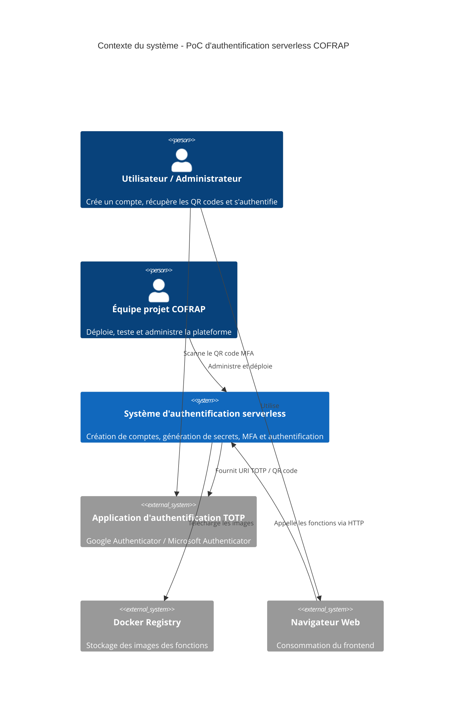
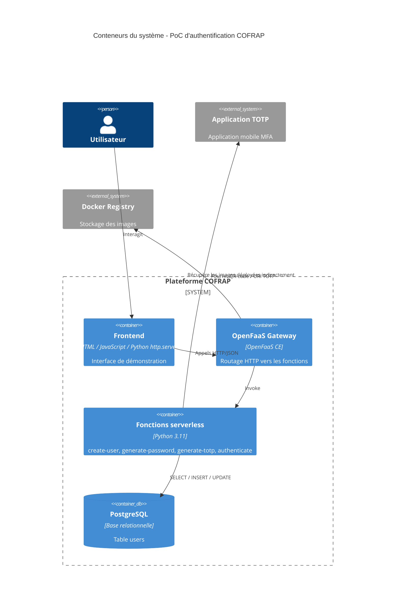
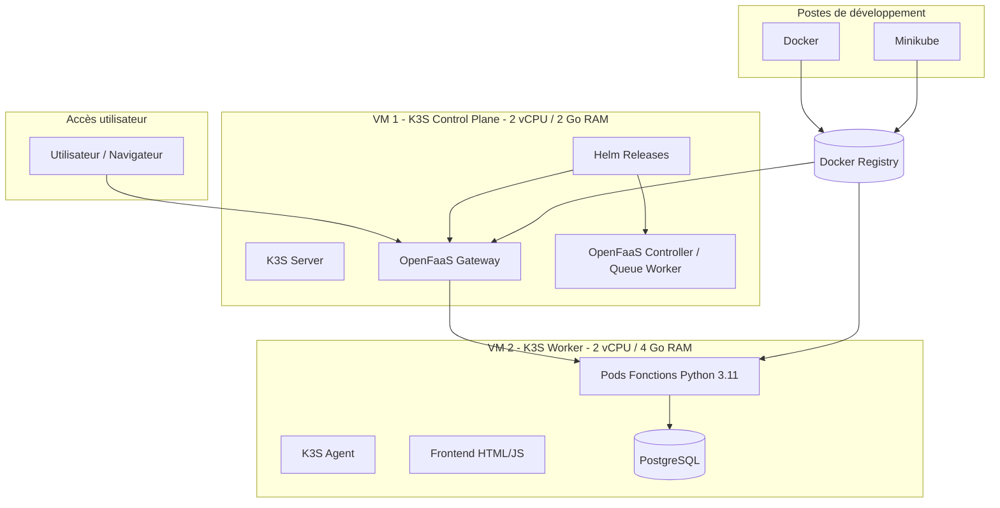
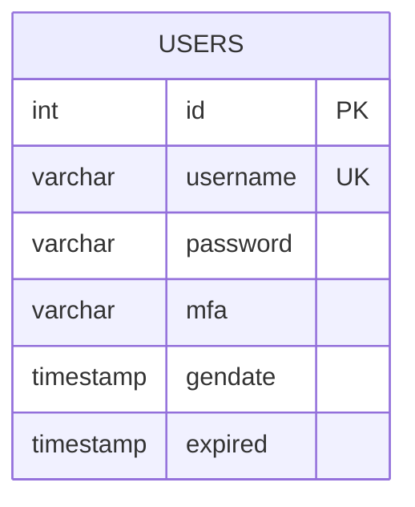
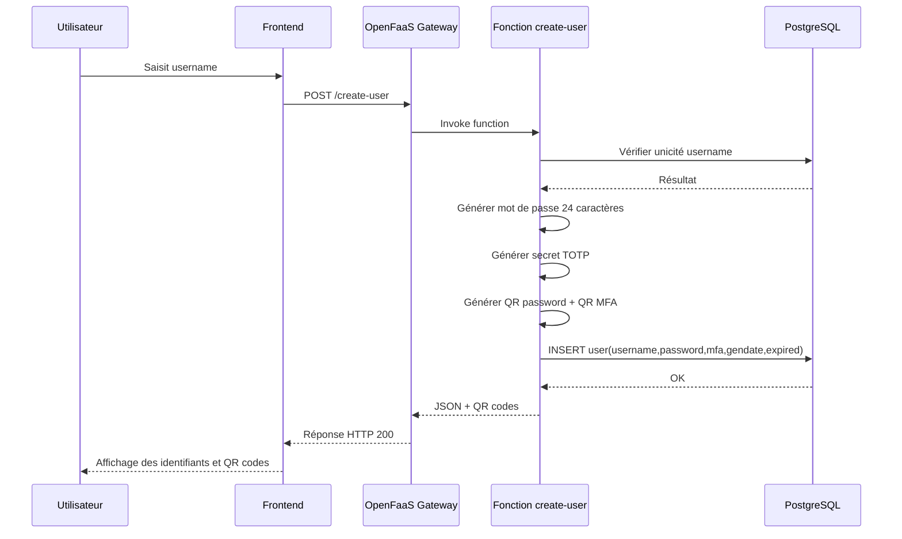
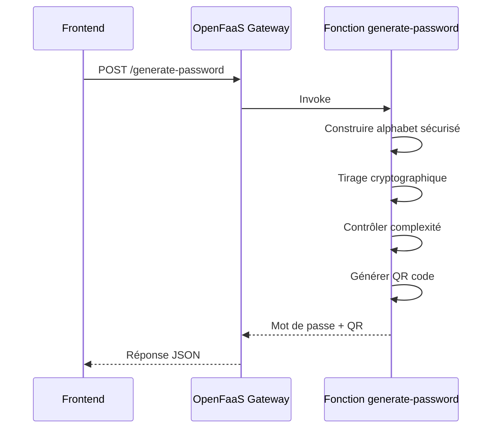
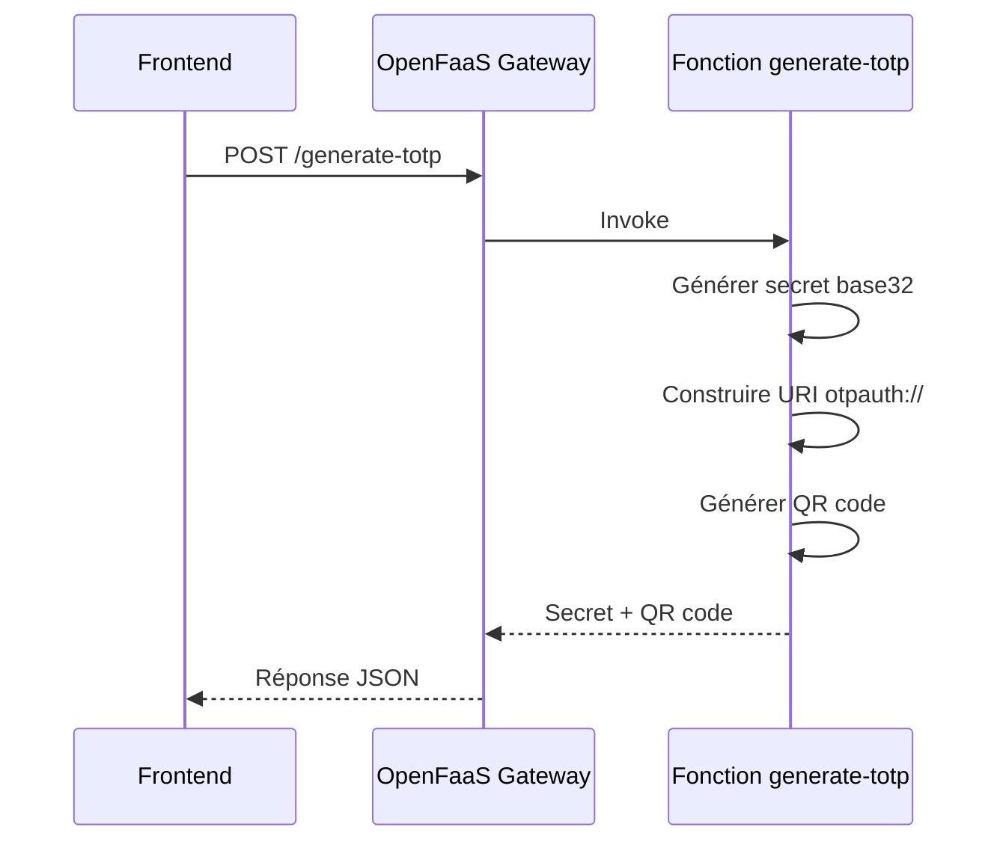
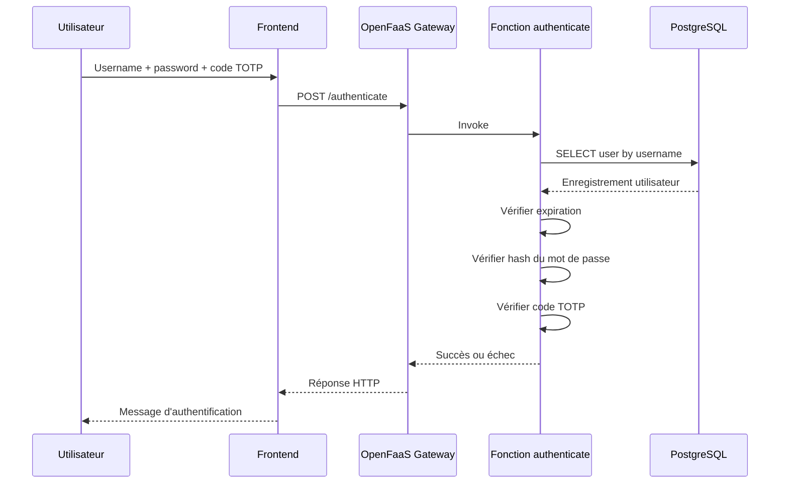
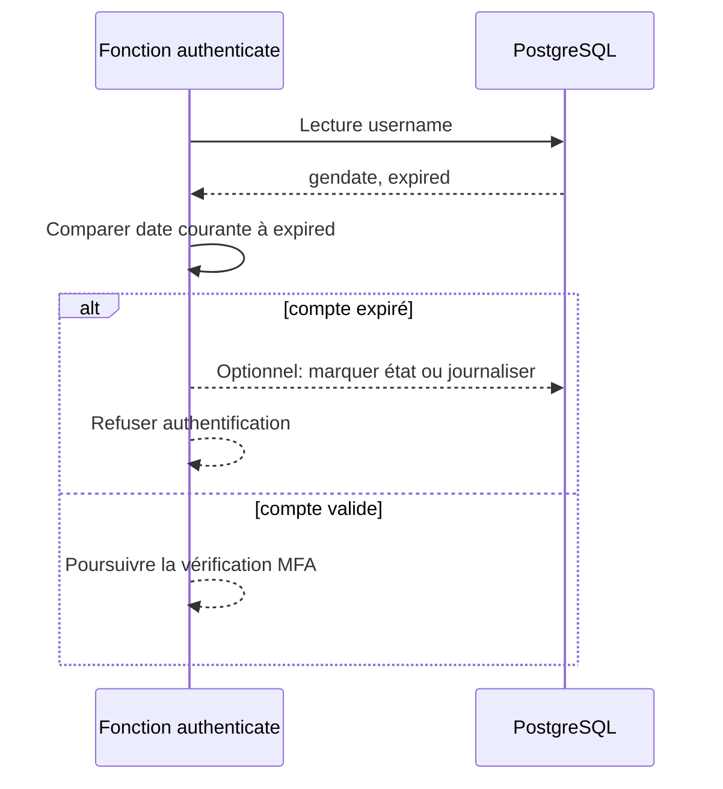

# Cahier des Charges Technique

## Projet PoC d'authentification serverless pour COFRAP

**Entreprise :** COFRAP — Compagnie Française de Réalisation d'Applicatifs Professionnels  
**Nature du document :** Cahier des charges technique  
**Niveau visé :** Certification niveau 7 (Master)  
**Version :** 1.0  
**Date :** Juin 2026  

---

## 1. Objet du document

Le présent cahier des charges technique définit l'architecture, les ressources, les objectifs mesurables, les procédures de mise en oeuvre, les critères d'évaluation et les choix technologiques d'un **Proof of Concept (PoC)** de système d'authentification serverless pour COFRAP.

Le projet vise à démontrer la faisabilité technique d'un dispositif automatisé de création et de gestion de comptes utilisateurs sécurisé, déployé sur une plateforme **OpenFaaS Community Edition** exécutée sur **Kubernetes K3S**.

Le système couvre les fonctions suivantes :

- génération automatique d'un mot de passe de **24 caractères** ;
- génération d'un **QR code** associé au mot de passe ;
- génération d'un secret **TOTP** et de son QR code d'enrôlement ;
- authentification par **mot de passe + second facteur** ;
- rotation des secrets tous les **6 mois** ;
- mise à disposition d'une **interface web** simple permettant d'appeler l'ensemble des fonctions.

---

## 2. Contexte et périmètre

COFRAP souhaite valider une architecture légère, industrialisable et orientée services pour automatiser des fonctions d'authentification sans dépendre d'un monolithe applicatif.

Le périmètre de ce PoC comprend :

- les fonctions serverless Python 3.11 ;
- la base de données PostgreSQL ;
- l'exposition des fonctions via OpenFaaS Gateway ;
- un frontend HTML/JavaScript minimal ;
- le déploiement sur un cluster K3S bare metal à 2 machines virtuelles ;
- le développement local sur Minikube ;
- la conteneurisation Docker ;
- la validation fonctionnelle, sécuritaire et de performance.

Le périmètre exclut volontairement :

- la fédération d'identité d'entreprise (SSO, LDAP, SAML, OIDC) ;
- la haute disponibilité multi-région ;
- la reprise après sinistre inter-site ;
- l'intégration à un annuaire d'entreprise existant ;
- la conformité réglementaire complète de production.

---

## 3. Présentation synthétique du besoin

Le besoin métier consiste à fournir un système capable de :

1. créer un compte utilisateur de manière automatisée ;
2. générer des secrets robustes et non prédictibles ;
3. transmettre ces informations sous une forme exploitable via QR code ;
4. authentifier un utilisateur avec un schéma MFA ;
5. contrôler la péremption des identifiants ;
6. démontrer qu'une architecture serverless sur Kubernetes peut répondre au besoin avec un coût maîtrisé.

---

## 4. Objectifs du projet

### 4.1 Objectifs fonctionnels

- Permettre la création d'un compte avec identifiant unique, mot de passe fort et secret TOTP.
- Fournir un QR code pour le mot de passe généré et un QR code d'enrôlement MFA.
- Permettre une authentification par combinaison **mot de passe + code TOTP**.
- Gérer la péremption d'un compte ou d'un secret sur une durée de **6 mois maximum**.
- Mettre à disposition un frontend de démonstration permettant d'invoquer les fonctions sans outillage tiers.

### 4.2 Objectifs quantifiés et mesurables

| Domaine | Objectif | Valeur cible | Méthode de mesure |
|---|---:|---:|---|
| Couverture de tests unitaires | Couvrir le code métier Python | >= 85 % | `pytest --cov` |
| Couverture des tests d'intégration | Couvrir les parcours critiques | 100 % des parcours nominaux + 100 % des erreurs critiques | Rapport de tests |
| Disponibilité de la plateforme PoC | Disponibilité sur fenêtre de démonstration | >= 99 % sur 5 jours ouvrés | Sondes HTTP |
| Temps de réponse création compte | Latence p95 | <= 800 ms | K6 / Hey |
| Temps de réponse authentification | Latence p95 | <= 500 ms | K6 / Hey |
| Temps de réponse génération QR | Latence p95 | <= 400 ms | K6 / Hey |
| Débit minimal création | Requêtes soutenues | 20 req/s | Test de charge |
| Débit minimal authentification | Requêtes soutenues | 50 req/s | Test de charge |
| Taux d'erreurs HTTP | Sous charge nominale | < 1 % | Monitoring OpenFaaS |
| Rotation des secrets | Respect de la politique | 100 % des comptes marqués à 6 mois | Test SQL + tests métier |
| Robustesse des mots de passe | Complexité conforme | 100 % | Tests automatiques |
| Entropie du mot de passe | Entropie estimée | > 120 bits | Validation algorithmique |
| Validation de sécurité | Vulnérabilités critiques | 0 | Revue + scan |
| Validation sécurité dépendances | CVE critiques en prod | 0 | Trivy / pip-audit |

### 4.3 Objectifs de sécurité

- Garantir des mots de passe aléatoires de 24 caractères contenant majuscules, minuscules, chiffres et caractères spéciaux.
- Ne jamais journaliser les secrets en clair.
- Stocker les mots de passe sous forme **hachée et salée**.
- Limiter l'exposition des secrets TOTP aux seuls flux nécessaires.
- Restreindre l'accès réseau à PostgreSQL au cluster applicatif.
- Protéger les secrets techniques via **Kubernetes Secrets** avec chiffrement côté cluster.

### 4.4 Objectifs pédagogiques et d'architecture

- Démontrer l'intérêt d'OpenFaaS pour découper les responsabilités par fonction.
- Valider la pertinence de K3S sur une infrastructure légère à faible coût.
- Disposer d'une base documentée réutilisable pour une évolution vers un service interne industrialisé.

---

## 5. Équipe projet

### 5.1 Composition de l'équipe

- **Mohamed CHAHOUR** — France
- **Wassim LOMRI** — France
- **Samir FOUL** — Algérie
- **Akram KALAMI** — Maroc

### 5.2 Répartition des rôles et responsabilités

| Membre | Rôle principal | Responsabilités clés | Charge estimée | TJM estimé | Coût estimé |
|---|---|---|---:|---:|---:|
| Mohamed CHAHOUR | Chef de projet / Architecte technique | cadrage, architecture, arbitrages techniques, validation finale | 15 j | 550 € | 8 250 € |
| Wassim LOMRI | Développeur backend / DevOps | fonctions Python, Docker, Helm, OpenFaaS, CI technique | 20 j | 450 € | 9 000 € |
| Samir FOUL | Développeur full stack / QA | frontend, intégration API, tests d'intégration, documentation technique | 18 j | 420 € | 7 560 € |
| Akram KALAMI | Référent sécurité / Data | PostgreSQL, sécurité applicative, validation MFA, revues de risques | 12 j | 480 € | 5 760 € |

### 5.3 Total des ressources humaines

| Poste | Montant |
|---|---:|
| Total ressources humaines | **30 570 €** |

### 5.4 Gouvernance projet

- **Comité projet hebdomadaire** : 1 fois par semaine, 45 minutes.
- **Point technique quotidien** : 15 minutes.
- **Revue d'architecture** : à la fin des phases conception et pré-production.
- **Revue de sécurité** : avant démonstration finale.

---

## 6. Ressources planifiées

### 6.1 Ressources techniques

| Ressource | Quantité | Spécification | Usage |
|---|---:|---|---|
| VM control-plane K3S | 1 | 2 vCPU, 2 Go RAM, 30 Go SSD | orchestration, API Kubernetes, contrôleur OpenFaaS |
| VM worker K3S | 1 | 2 vCPU, 4 Go RAM, 40 Go SSD | exécution des pods applicatifs |
| PostgreSQL | 1 instance | PostgreSQL 15+, 1 CPU logique réservé, 1 Go RAM cible | stockage utilisateurs |
| OpenFaaS Gateway | 1 service | exposé en ClusterIP/Ingress selon environnement | routage des fonctions |
| Docker Registry | 1 | registry privé léger ou Docker Hub privé | stockage des images |
| Minikube local | 1 par développeur | 2 CPU, 4 Go RAM recommandés | développement et tests locaux |
| Poste développeur | 4 | Docker Desktop / WSL2 / kubectl / Helm / Python 3.11 | développement |
| Frontend de démonstration | 1 | HTML/JS + `python -m http.server` | interface de test |

### 6.2 Répartition logique des ressources Kubernetes

| Composant | Namespace | Réplicas cibles | CPU request | RAM request | CPU limit | RAM limit |
|---|---|---:|---:|---:|---:|---:|
| OpenFaaS Gateway | openfaas | 1 | 100m | 128Mi | 300m | 256Mi |
| Queue Worker | openfaas | 1 | 100m | 128Mi | 300m | 256Mi |
| Provider | openfaas | 1 | 100m | 128Mi | 300m | 256Mi |
| Fonction create-user | openfaas-fn | 1-5 | 100m | 128Mi | 500m | 256Mi |
| Fonction generate-password | openfaas-fn | 1-5 | 100m | 128Mi | 500m | 256Mi |
| Fonction generate-totp | openfaas-fn | 1-5 | 100m | 128Mi | 500m | 256Mi |
| Fonction authenticate | openfaas-fn | 1-10 | 150m | 128Mi | 700m | 256Mi |
| Frontend | web | 1 | 50m | 64Mi | 150m | 128Mi |
| PostgreSQL | data | 1 | 300m | 512Mi | 1000m | 1024Mi |

### 6.3 Ressources financières

Hypothèse budgétaire : PoC sur **3 mois**, hébergement IaaS mutualisé.

| Poste budgétaire | Hypothèse | Coût unitaire | Quantité / durée | Montant |
|---|---|---:|---:|---:|
| VM control-plane | 2 vCPU / 2 Go | 28 €/mois | 3 mois | 84 € |
| VM worker | 2 vCPU / 4 Go | 42 €/mois | 3 mois | 126 € |
| Stockage / snapshots | sauvegardes et snapshots | 15 €/mois | 3 mois | 45 € |
| Registry privé | abonnement de base | 12 €/mois | 3 mois | 36 € |
| Nom de domaine / DNS / TLS | mutualisé | 30 € | 1 | 30 € |
| Outillage sécurité open source | Trivy, pip-audit, pytest, K6 | 0 € | - | 0 € |
| Contingence infra | marge 20 % | - | - | 64 € |

### 6.4 Budget global estimatif

| Catégorie | Montant |
|---|---:|
| Ressources humaines | 30 570 € |
| Infrastructure et exploitation | 385 € |
| Réserve de risque projet (10 %) | 3 095 € |
| **Budget total estimatif** | **34 050 €** |

---

## 7. Exigences fonctionnelles

### 7.1 Fonction F1 — Création de compte

Le système doit :

- recevoir un `username` ;
- vérifier son unicité ;
- générer un mot de passe aléatoire ;
- générer un secret TOTP ;
- produire deux QR codes ;
- insérer l'enregistrement en base ;
- initialiser la date de génération et la date d'expiration.

### 7.2 Fonction F2 — Génération de mot de passe

Le mot de passe doit :

- comporter exactement **24 caractères** ;
- contenir au moins 1 majuscule ;
- contenir au moins 1 minuscule ;
- contenir au moins 1 chiffre ;
- contenir au moins 1 caractère spécial ;
- être généré via un générateur cryptographiquement robuste.

### 7.3 Fonction F3 — Génération TOTP

Le système doit :

- produire un secret compatible TOTP RFC 6238 ;
- générer une URI d'enrôlement ;
- produire un QR code lisible par Google Authenticator, Microsoft Authenticator ou équivalent.

### 7.4 Fonction F4 — Authentification

Le système doit :

- vérifier l'existence du compte ;
- contrôler la non-expiration ;
- vérifier le mot de passe ;
- vérifier le code TOTP avec fenêtre de dérive maîtrisée ;
- retourner un résultat explicite mais non bavard pour éviter la fuite d'information.

### 7.5 Fonction F5 — Frontend

Le frontend doit :

- exposer les formulaires nécessaires ;
- appeler les endpoints OpenFaaS ;
- afficher les résultats, messages et QR codes ;
- gérer les erreurs de manière intelligible.

---

## 8. Exigences non fonctionnelles

### 8.1 Performance

- Démarrage à froid acceptable : <= 2 secondes.
- Temps moyen d'authentification sous charge nominale : <= 300 ms.
- Dégradation tolérée sous montée en charge : < 20 % au p95 jusqu'à 50 req/s.

### 8.2 Sécurité

- TLS obligatoire sur les environnements de démonstration distants.
- Hachage mot de passe avec algorithme moderne recommandé (Argon2id ou bcrypt selon implémentation retenue).
- Validation stricte des entrées.
- Politique CORS restrictive.

### 8.3 Maintenabilité

- Une fonction = une responsabilité principale.
- Code Python documenté et testé.
- Déploiement reproductible par Helm / YAML versionné.

### 8.4 Exploitabilité

- Journaux applicatifs structurés.
- Journalisation des événements métier sans exposition des secrets.
- Procédure de redéploiement documentée en moins de 15 minutes.

---

## 9. Architecture générale

### 9.1 Diagramme C4 — Contexte

### 9.2 Diagramme C4 — Conteneurs

### 9.3 Diagramme de déploiement — Architecture K3S

---

## 10. Modèle de données

### 10.1 Schéma relationnel attendu

Table unique conformément au besoin :

- `id`
- `username`
- `password`
- `mfa`
- `gendate`
- `expired`

### 10.2 Diagramme ER

### 10.3 Contraintes recommandées

- `id` : clé primaire auto-incrémentée.
- `username` : unique, non nul, longueur contrôlée.
- `password` : stockage haché, non nul.
- `mfa` : secret MFA encodé, non nul.
- `gendate` : date de génération.
- `expired` : date d'expiration calculée à J + 183 jours.

### 10.4 Exigences SQL minimales

- index unique sur `username` ;
- vérification applicative de la validité du format ;
- interdiction d'écriture directe hors fonctions applicatives.

---

## 11. Description des flux applicatifs

### 11.1 Séquence — Création de compte

### 11.2 Séquence — Génération de mot de passe

### 11.3 Séquence — Génération TOTP

### 11.4 Séquence — Authentification MFA

### 11.5 Séquence — Contrôle de rotation à 6 mois

---

## 12. Choix technologiques et justification détaillée

### 12.1 Python 3.11 pour toutes les fonctions

**Justification :**

- excellente productivité pour un PoC ;
- écosystème mature pour la sécurité (`secrets`, `qrcode`, `pyotp`, connecteurs PostgreSQL) ;
- simplicité de maintenance pour des fonctions courtes ;
- temps de développement réduit ;
- version 3.11 offrant de meilleures performances que les versions 3.9/3.10 sur de nombreux cas d'usage CPU modestes.

**Alternatives étudiées :**

- **Node.js** : pertinent pour frontend/backend homogène, mais moins naturel pour certaines briques crypto et QR dans l'équipe cible.
- **Go** : plus performant et plus léger en mémoire, mais coût de développement supérieur pour un PoC.
- **Java** : robuste mais surdimensionné pour des fonctions simples et plus coûteux en démarrage à froid.

**Décision :** Python 3.11 est retenu comme meilleur compromis vitesse de réalisation / lisibilité / richesse des bibliothèques.

### 12.2 OpenFaaS Community Edition sur Kubernetes

**Justification :**

- modèle serverless simple à comprendre ;
- découplage par fonction ;
- intégration native avec Kubernetes ;
- support du scaling automatique des fonctions ;
- expérience développeur claire pour un PoC académique et technique.

**Pourquoi Community Edition :**

- absence de coût de licence ;
- suffisante pour le périmètre de démonstration ;
- alignée avec un budget PoC réduit.

**Pourquoi pas OpenFaaS Enterprise :**

- fonctionnalités avancées non nécessaires au stade PoC ;
- coût non justifié avant validation de la valeur métier.

### 12.3 K3S comme distribution Kubernetes

**Justification :**

- consommation mémoire réduite ;
- installation simple ;
- adapté à une infrastructure bare metal légère ;
- très bon compromis pour un cluster de test et démonstration.

**Pourquoi K3S plutôt que GKE / AKS / EKS :**

- pas de dépendance à un cloud provider ;
- coûts d'exploitation très faibles ;
- meilleure maîtrise pédagogique de la pile ;
- adéquation avec les ressources disponibles (2 VMs modestes).

**Limites assumées :**

- absence des services managés cloud ;
- haute disponibilité limitée sur 2 noeuds ;
- exploitation plus manuelle.

### 12.4 PostgreSQL pour la base utilisateurs

**Justification :**

- fiabilité transactionnelle ;
- contraintes d'intégrité natives ;
- excellente adéquation avec un schéma simple et relationnel ;
- requêtes de contrôle d'unicité et de dates très naturelles.

**Pourquoi PostgreSQL plutôt que MariaDB :**

- robustesse reconnue sur l'intégrité et les types avancés ;
- écosystème très mature en environnement conteneurisé ;
- forte compatibilité avec les pratiques DevOps modernes.

**Pourquoi PostgreSQL plutôt que MongoDB :**

- le besoin porte sur une structure stable et simple ;
- le relationnel est plus adapté à un enregistrement utilisateur classique ;
- absence de bénéfice concret du document-oriented dans ce cas.

### 12.5 Helm pour le déploiement OpenFaaS

**Justification :**

- packaging standard Kubernetes ;
- paramétrage reproductible ;
- mise à niveau simplifiée ;
- cohérence avec les pratiques d'industrialisation.

### 12.6 Minikube pour le développement local

**Justification :**

- environnement Kubernetes local isolé ;
- validation rapide des manifests et images ;
- réduction du risque avant déploiement sur K3S.

### 12.7 Docker pour la conteneurisation

**Justification :**

- standard de facto ;
- compatibilité avec OpenFaaS et Kubernetes ;
- portabilité entre postes développeurs, Minikube et K3S.

### 12.8 Frontend HTML/JS + Python http.server

**Justification :**

- simplicité maximale ;
- charge faible ;
- aucun framework lourd requis pour un PoC ;
- permet de concentrer l'effort sur la logique d'authentification.

---

## 13. Considérations de sécurité

### 13.1 Protection des mots de passe

- génération via module Python `secrets` ;
- hachage impératif avant stockage ;
- sel unique par mot de passe ;
- non-réutilisation du mot de passe en clair après émission.

### 13.2 Protection des secrets TOTP

- stockage minimalement exposé ;
- interdiction de journaliser le secret ;
- chiffrement au repos recommandé au niveau disque ou volume.

### 13.3 Chiffrement au repos

- chiffrement des volumes VM recommandé ;
- chiffrement des sauvegardes PostgreSQL ;
- chiffrement des secrets Kubernetes activé côté K3S si possible via configuration `secrets-encryption`.

### 13.4 Gestion des secrets Kubernetes

- stockage des credentials DB dans `Secret` Kubernetes ;
- pas de secret en dur dans les manifests ;
- séparation des namespaces `openfaas`, `openfaas-fn`, `data`, `web` ;
- droits RBAC minimaux.

### 13.5 CORS et exposition HTTP

- autoriser uniquement l'origine du frontend de démonstration ;
- refuser les méthodes non nécessaires ;
- limiter les headers autorisés ;
- désactiver les wildcards en environnement de démonstration finale.

### 13.6 Validation des entrées

- contrôle de longueur et format sur `username` ;
- refus des valeurs nulles ou mal formées ;
- requêtes SQL paramétrées ;
- messages d'erreur génériques côté authentification.

### 13.7 Journalisation et traçabilité

- journaliser : timestamp, fonction appelée, résultat, identifiant technique ;
- ne jamais journaliser : mot de passe, secret TOTP, QR code brut ;
- conserver les erreurs d'exécution pour diagnostic.

### 13.8 Durcissement conteneurs

- images Python minimales ;
- exécution en utilisateur non root ;
- suppression des dépendances inutiles ;
- scan Trivy avant déploiement.

---

## 14. Analyse de scalabilité

### 14.1 Scalabilité OpenFaaS

Le moteur OpenFaaS permet :

- l'auto-scaling basé sur la charge ;
- l'augmentation du nombre de pods par fonction ;
- l'isolation des pics sur la fonction d'authentification sans affecter les autres briques.

**Cibles PoC :**

- min replicas : 1 ;
- max replicas : 5 pour création / génération ;
- max replicas : 10 pour authentification.

### 14.2 Limites de la plateforme K3S à 2 VMs

La plateforme est volontairement légère. Les limites probables sont :

- saturation RAM du worker au-delà de 10 à 15 pods actifs ;
- contention CPU sur pics simultanés de génération QR ;
- point unique de faiblesse sur PostgreSQL si colocalisé sur le worker.

### 14.3 PostgreSQL et pool de connexions

Pour éviter l'épuisement des connexions :

- réutilisation des connexions côté fonction quand possible ;
- limitation du nombre de workers concurrents ;
- recours recommandé à un pooler type PgBouncer si passage en pré-production.

### 14.4 Recommandations d'évolution

- ajout d'un second worker ;
- externalisation de PostgreSQL ;
- ajout d'un Ingress Controller avec TLS ;
- supervision Prometheus/Grafana ;
- séparation frontend / backend sur namespaces distincts avec policies réseau.

---

## 15. Outils d'évaluation

### 15.1 Critères d'acceptation par fonction

| Fonction | Critères d'acceptation |
|---|---|
| Création de compte | création réussie en < 1 s, username unique, insertion base valide, QR codes générés |
| Génération mot de passe | 24 caractères exacts, présence des 4 classes de caractères, QR code décodable |
| Génération TOTP | secret base32 valide, URI conforme, QR code scannable par app MFA |
| Authentification | succès avec bons facteurs, échec avec mauvais mot de passe, échec avec mauvais TOTP, refus si expiré |
| Frontend | appel correct de toutes les API, affichage des réponses, gestion des erreurs réseau et métier |

### 15.2 Plan de tests d'intégration

| ID | Scénario | Résultat attendu |
|---|---|---|
| IT-01 | Création d'un utilisateur inédit | HTTP 200, user présent en base |
| IT-02 | Création d'un utilisateur existant | HTTP 409 ou erreur métier contrôlée |
| IT-03 | Génération mot de passe seule | mot de passe + QR retournés |
| IT-04 | Génération TOTP seule | secret + QR retournés |
| IT-05 | Authentification valide | succès HTTP 200 |
| IT-06 | Mot de passe erroné | refus HTTP 401/403 |
| IT-07 | TOTP erroné | refus HTTP 401/403 |
| IT-08 | Compte expiré | refus explicite d'expiration |
| IT-09 | Frontend sans backend | message d'erreur exploitable |
| IT-10 | Redéploiement d'une fonction | absence de régression sur API |

### 15.3 Validation sécurité

| Contrôle | Critère de réussite |
|---|---|
| Scan dépendances Python | 0 vulnérabilité critique |
| Scan images Docker | 0 vulnérabilité critique, < 5 hautes non contournables |
| Revue code | 0 secret codé en dur |
| Revue SQL | 100 % requêtes paramétrées |
| Revue CORS | aucune origine non autorisée |
| Test brute force simple | mécanisme de refus cohérent / journalisation adaptée |
| Vérification hachage | aucun mot de passe en clair stocké |

### 15.4 Benchmarks de performance

| Test | Charge | Objectif |
|---|---:|---|
| Login nominal | 10 utilisateurs concurrents | p95 <= 500 ms |
| Création utilisateur | 5 utilisateurs concurrents | p95 <= 800 ms |
| Montée en charge auth | 50 req/s pendant 5 min | erreurs < 1 % |
| Stabilité | 2 h de trafic modéré | aucune fuite mémoire visible |
| Cold start | 1er appel après idle | <= 2 s |

### 15.5 Outils recommandés

- **Pytest** : tests unitaires et intégration Python ;
- **pytest-cov** : couverture ;
- **K6** ou **Hey** : tests de charge ;
- **Trivy** : scan d'images ;
- **pip-audit** : sécurité dépendances Python ;
- **kubectl logs / top** : diagnostic runtime ;
- **psql** : vérification base ;
- **Mermaid** : formalisation documentaire.

---

## 16. Mise en oeuvre

### 16.1 Phasage projet

| Phase | Intitulé | Durée estimée | Dépendances | Livrables |
|---|---|---:|---|---|
| P1 | Cadrage et spécification | 3 j | aucune | besoin, exigences, architecture cible |
| P2 | Conception technique détaillée | 4 j | P1 | schémas, contrats API, modèle de données |
| P3 | Mise en place environnements | 4 j | P2 | Minikube, K3S, registry, OpenFaaS |
| P4 | Développement fonctions Python | 8 j | P2, P3 | fonctions packagées |
| P5 | Développement frontend | 4 j | P4 partiel | interface de démonstration |
| P6 | Intégration PostgreSQL | 3 j | P4 | persistance opérationnelle |
| P7 | Tests et sécurisation | 5 j | P4, P5, P6 | rapports de tests |
| P8 | Déploiement final et soutenance | 2 j | P7 | plateforme démontrable |

### 16.2 Dépendances majeures

- le frontend dépend de la stabilisation des endpoints ;
- les tests d'intégration dépendent de la disponibilité du cluster K3S ;
- la validation performance dépend d'un packaging Docker finalisé ;
- la validation sécurité dépend d'images figées.

### 16.3 Environnements

| Environnement | Finalité | Technologie | Données |
|---|---|---|---|
| Dev local | développement rapide | Minikube + Docker | jeux de test fictifs |
| Staging / intégration | validation intégrée | K3S | données de démonstration |
| Prod PoC / démo | soutenance et démonstration | K3S | données fictives maîtrisées |

### 16.4 Procédure de déploiement

1. Construire les images Docker des fonctions Python 3.11.
2. Pousser les images vers le registre Docker.
3. Déployer ou mettre à jour OpenFaaS via Helm.
4. Déployer PostgreSQL et ses secrets Kubernetes.
5. Déployer les fonctions dans `openfaas-fn`.
6. Déployer le frontend web.
7. Exécuter les tests de smoke.
8. Valider les journaux et la connectivité DB.

### 16.5 Procédure de rollback

- rollback Helm si la release OpenFaaS échoue ;
- retour à l'image précédente pour chaque fonction ;
- restauration d'un snapshot PostgreSQL si corruption logique détectée ;
- blocage de l'environnement si les tests de smoke échouent.

---

## 17. Procédures opérationnelles recommandées

### 17.1 Déploiement initial

- installation K3S control-plane ;
- jointure du worker ;
- installation Helm ;
- installation OpenFaaS CE ;
- création des namespaces ;
- déploiement PostgreSQL ;
- déploiement des fonctions ;
- déploiement frontend.

### 17.2 Exploitation courante

- consultation journalière des logs ;
- vérification hebdomadaire de l'espace disque ;
- revue mensuelle des images et dépendances ;
- test de rotation de comptes sur jeu de données contrôlé.

### 17.3 Sauvegarde

- dump PostgreSQL quotidien ;
- conservation 7 jours ;
- snapshot VM avant démonstration majeure ;
- restauration testée au moins une fois avant soutenance.

---

## 18. Analyse des risques et stratégies de mitigation

| Risque | Probabilité | Impact | Niveau | Mesure de mitigation |
|---|---|---|---|---|
| Saturation mémoire du worker | Moyen | Élevé | Fort | limites K8S, tests de charge, réduction empreinte images |
| Mauvaise gestion des connexions PostgreSQL | Moyen | Moyen | Moyen | pool ou réutilisation, limites de concurrence |
| Exposition de secrets dans les logs | Faible | Élevé | Fort | revue code, filtres de logs, tests sécurité |
| Erreur de configuration CORS | Moyen | Moyen | Moyen | checklist sécurité et tests navigateur |
| Démarrages à froid trop lents | Moyen | Moyen | Moyen | maintien d'un replica minimal |
| Perte de données de démonstration | Faible | Moyen | Faible | dump régulier + snapshot |
| Défaillance unique du control-plane | Faible | Élevé | Fort | documentation de redéploiement rapide |
| Dépendances Python vulnérables | Moyen | Élevé | Fort | pip-audit, gel des versions |
| QR code illisible selon terminal | Faible | Moyen | Faible | tests multi-appareils et taille minimale garantie |
| Complexité pédagogique insuffisante | Faible | Élevé | Fort | documentation exhaustive, métriques, justification des choix |

---

## 19. Contraintes techniques et hypothèses

### 19.1 Contraintes

- cluster limité à 2 VMs ;
- budget restreint ;
- choix OpenFaaS CE imposé ;
- frontend volontairement minimal ;
- une seule table PostgreSQL dans le cadre de l'exercice.

### 19.2 Hypothèses

- les données utilisées sont fictives ;
- le PoC n'est pas exposé à un trafic Internet massif ;
- la gestion des certificats TLS est disponible sur l'infrastructure cible ;
- les bibliothèques Python nécessaires sont compatibles avec 3.11.

---

## 20. Critères de réussite globaux

Le PoC sera considéré comme réussi si les conditions suivantes sont remplies :

1. toutes les fonctions sont déployées sur OpenFaaS ;
2. le frontend permet d'exécuter les parcours critiques ;
3. PostgreSQL contient les enregistrements attendus ;
4. l'authentification à deux facteurs fonctionne ;
5. la rotation à 6 mois est correctement appliquée ;
6. les objectifs mesurables principaux sont atteints ;
7. la documentation technique permet la reprise du projet par un tiers.

---

## 21. Livrables attendus

- code source des fonctions Python 3.11 ;
- Dockerfiles ;
- manifests / valeurs Helm ;
- scripts de déploiement ;
- frontend HTML/JS ;
- schéma PostgreSQL ;
- rapport de tests ;
- présent cahier des charges technique.

---

## 22. Perspectives d'évolution

À l'issue du PoC, les évolutions possibles sont :

- ajout d'un annuaire externe ;
- émission de jetons JWT après authentification ;
- ajout de rate limiting et d'anti-bruteforce ;
- supervision Prometheus/Grafana ;
- externalisation de PostgreSQL ;
- mise en place d'un Ingress NGINX + cert-manager ;
- ajout d'une CI/CD complète ;
- extension du modèle de données à l'audit et à la révocation.

---

## 23. Conclusion

Ce cahier des charges technique formalise un PoC cohérent, réaliste et soutenable pour COFRAP autour d'un système d'authentification serverless sécurisé. Le choix de **Python 3.11**, **OpenFaaS CE**, **K3S**, **PostgreSQL**, **Helm**, **Docker** et d'un **frontend minimal** est techniquement pertinent au regard :

- du niveau d'effort attendu ;
- des contraintes budgétaires ;
- de la nécessité de démontrer rapidement de la valeur ;
- de la volonté d'obtenir une architecture moderne, modulaire et explicable.

L'ensemble des éléments définis ici — objectifs mesurables, ressources planifiées, outils d'évaluation, procédures de mise en oeuvre, analyses de risques et justifications d'architecture — répond à un niveau d'exigence compatible avec une production académique et professionnelle de niveau Master.

---

## 24. Annexe A — Synthèse des endpoints cibles

| Endpoint | Méthode | Usage |
|---|---|---|
| `/generate-password` | POST | génère un mot de passe et son QR code |
| `/generate-totp` | POST | génère un secret TOTP et son QR code |
| `/create-user` | POST | crée un utilisateur complet |
| `/authenticate` | POST | vérifie password + TOTP |

---

## 25. Annexe B — Politique de qualité logicielle

- PEP 8 respectée ;
- lint Python recommandé ;
- revue croisée du code ;
- branches dédiées par fonctionnalité ;
- versionnement Git ;
- dépendances figées pour reproductibilité.

---

## 26. Annexe C — KPI de suivi projet

| KPI | Cible |
|---|---:|
| Avancement hebdomadaire | >= 90 % du plan |
| Taux de réussite des tests | >= 95 % |
| Dette critique ouverte avant soutenance | 0 |
| Nombre de vulnérabilités critiques | 0 |
| Temps moyen de restauration | < 30 min |

---

## 27. Annexe D — Positionnement vis-à-vis de la grille d'évaluation

Le document couvre explicitement les éléments attendus pour un niveau élevé d'évaluation :

- **Objectifs** : définis, mesurables, quantifiés ;
- **Ressources planifiées** : humaines, techniques et financières ;
- **Outils d'évaluation** : critères d'acceptation, tests, sécurité, performance ;
- **Mise en oeuvre** : phases, dépendances, environnements, déploiement ;
- **Vision d'architecture** : diagrammes C4, déploiement, séquences, ERD ;
- **Capacité d'analyse** : justification des choix, risques, scalabilité, sécurité.

Ce positionnement rend le livrable compatible avec une attente **Niveau 3 sur la grille** et pertinent pour une soutenance de **niveau 7**.
