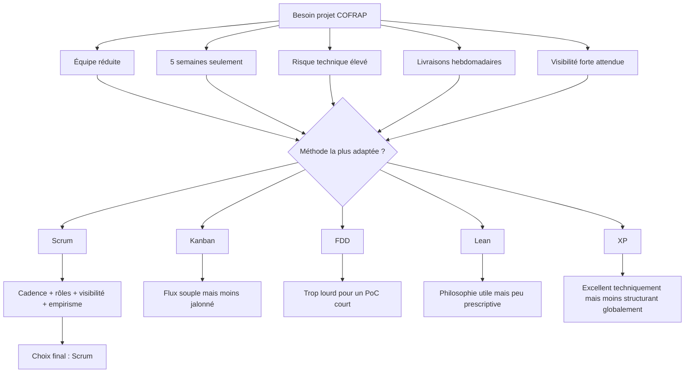
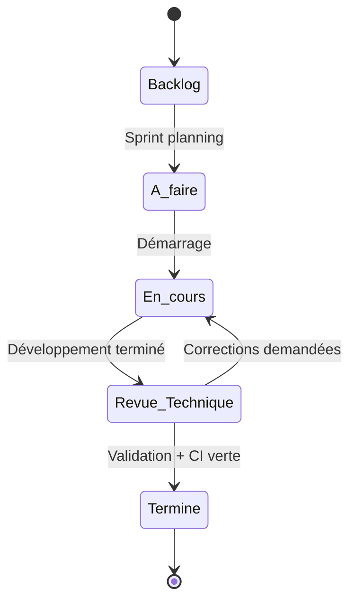
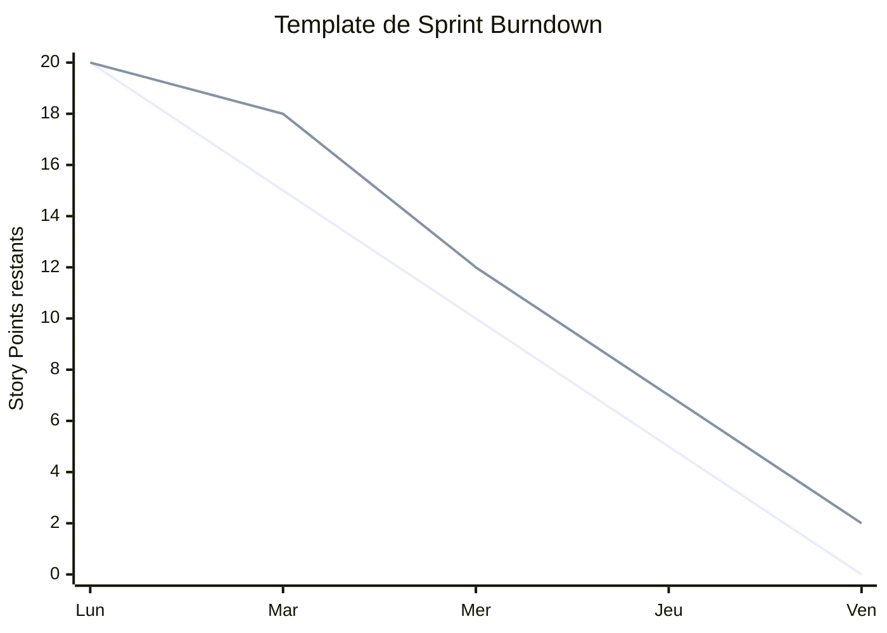

# Gestion Agile du projet COFRAP serverless authentication PoC

## Informations générales

- **Compétence visée** : C3 — Piloter un projet de développement, coordonner l'équipe et organiser la production.
- **Niveau attendu** : **NIVEAU 3**.
- **Projet** : Proof of Concept d'authentification serverless pour COFRAP.
- **Période projet** : du **8 septembre 2025** au **10 octobre 2025**.
- **Cadence** : **5 sprints de 1 semaine**.
- **Équipe** :
  - **Mohamed CHAHOUR** — Scrum Master
  - **Wassim LOMRI** — Product Owner
  - **Samir FOUL** — DevOps
  - **Akram KALAMI** — Lead Developer

---

## 1. Objectif du document

Ce document formalise l'organisation agile retenue pour le PoC d'authentification serverless COFRAP.

Il démontre la capacité de l'équipe à choisir une méthode adaptée, à configurer les outils de communication, à centraliser et piloter les tâches, et à encadrer l'exécution d'un projet court à forte contrainte de délai.

Le projet a pour finalité de produire, en cinq semaines, un prototype fonctionnel intégrant plusieurs fonctions serverless d'authentification, une base de données, une chaîne DevOps, un front de démonstration, ainsi que l'ensemble des livrables de démonstration et de soutenance.

Dans cette logique, l'agilité n'est pas utilisée comme un simple cadre organisationnel.

Elle constitue un mécanisme de réduction du risque, de synchronisation d'équipe et d'adaptation rapide aux retours fonctionnels, techniques et pédagogiques.

---

## 2. Fondements théoriques mobilisés

### 2.1 Références théoriques principales

- **Agile Manifesto** (Beck et al., 2001)
- **Scrum Guide** (Schwaber & Sutherland, 2020)
- Principes de **contrôle empirique des processus** : **transparence**, **inspection**, **adaptation**

### 2.2 Valeurs du Manifeste Agile mobilisées

Les quatre valeurs du Manifeste Agile structurent le pilotage retenu :

1. **Les individus et leurs interactions plus que les processus et les outils**.
2. **Des logiciels opérationnels plus qu'une documentation exhaustive**.
3. **La collaboration avec le client plus que la négociation contractuelle**.
4. **L'adaptation au changement plus que le suivi d'un plan**.

### 2.3 Principes du Manifeste Agile particulièrement pertinents pour ce PoC

Les principes suivants sont particulièrement adaptés au projet COFRAP :

- **Principe 1** : satisfaire le client par des livraisons rapides et continues de fonctionnalités à valeur.
- **Principe 2** : accueillir positivement les changements, même tardifs.
- **Principe 3** : livrer fréquemment un logiciel opérationnel.
- **Principe 4** : faire collaborer quotidiennement les parties prenantes et l'équipe.
- **Principe 7** : mesurer l'avancement principalement par le logiciel qui fonctionne.
- **Principe 8** : maintenir un rythme soutenable.
- **Principe 11** : favoriser l'auto-organisation de l'équipe.
- **Principe 12** : améliorer régulièrement la manière de travailler.

### 2.4 Principes Scrum retenus

Selon le **Scrum Guide 2020** (Schwaber & Sutherland, 2020), Scrum repose sur :

- une **petite équipe**,
- des **incréments fréquents**,
- une **responsabilisation claire** des rôles,
- une **visibilité permanente** du travail,
- un pilotage fondé sur l'**empirisme**.

L'empirisme est central pour ce projet court.

Il implique :

- **Transparence** : backlog clair, tâches visibles, critères de fin explicites.
- **Inspection** : revues quotidiennes et revue de sprint.
- **Adaptation** : re-priorisation hebdomadaire au regard des risques et blocages.

---

## 3. Choix de la méthode agile appropriée

### 3.1 Contexte de choix

Le projet COFRAP possède les caractéristiques suivantes :

- équipe réduite de **4 personnes**,
- durée très courte de **5 semaines**,
- objectif de **PoC** avec risque technique élevé,
- besoin de **démonstrations fréquentes**,
- nécessité de coordonner **développement, infrastructure, intégration, tests et documentation**,
- besoin de conserver une **trace visible** de l'avancement pour la soutenance et l'évaluation.

Dans ce contexte, plusieurs méthodes agiles ont été comparées.

### 3.2 Tableau comparatif des méthodes

| Méthode | Adaptation au changement | Adéquation taille équipe | Structure d'itération | Vitesse de livraison | Visibilité parties prenantes | Gestion de la complexité | Évaluation pour COFRAP |
|---|---|---|---|---|---|---|---|
| **Scrum** | Très forte grâce au backlog repriorisable à chaque sprint | Très adaptée à une équipe de 4 personnes | Forte, avec sprints, cérémonies et incréments | Élevée, avec livrables hebdomadaires | Très forte via backlog, revues et vélocité | Bonne, par découpage en stories et inspection continue | **Méthode la plus pertinente** |
| **Kanban** | Forte par flux continu | Adaptée aux petites équipes | Faible structuration temporelle | Très élevée en flux tendu | Bonne via tableau visuel | Moyenne pour un PoC nécessitant jalons pédagogiques | Intéressant, mais moins cadrant |
| **FDD** | Moyenne, car centré sur des fonctionnalités planifiées | Plutôt adapté à des équipes plus structurées | Structuré par fonctionnalités | Bonne si architecture stable | Moyenne | Bonne sur produits plus vastes et structurés | Trop lourd pour 5 semaines |
| **Lean Software** | Forte, via réduction du gaspillage | Adaptée théoriquement à toutes tailles | Peu prescriptive | Élevée si culture mature | Moyenne | Bonne mais conceptuelle | Trop abstrait seul pour ce projet |
| **Extreme Programming (XP)** | Très forte | Très adaptée à petite équipe | Itérative et très technique | Élevée | Bonne | Très bonne côté qualité logicielle | Très pertinent techniquement, mais moins adapté comme cadre global unique |

### 3.3 Analyse comparative détaillée

#### Scrum

Scrum apporte un cadre simple, lisible et immédiatement exploitable sur un projet court.

La présence de sprints fixes d'une semaine facilite la planification pédagogique, la production de preuves d'avancement et l'organisation des démonstrations.

Le cadre Scrum convient particulièrement à un PoC, car il permet de réduire l'incertitude par incréments successifs.

#### Kanban

Kanban est performant pour fluidifier un flux d'activités continues.

Cependant, l'absence d'itérations formelles rend moins naturelle la synchronisation hebdomadaire des livrables attendus dans un projet académique court.

Kanban aurait pu être utilisé comme visualisation opérationnelle, mais pas comme cadre principal.

#### FDD

Feature Driven Development est utile sur des projets où les fonctionnalités sont nombreuses, bien identifiées et où l'architecture est relativement stabilisée.

Pour un PoC d'authentification serverless avec exploration technique initiale, FDD apparaît trop rigide et trop coûteux en formalisation.

#### Lean Software

Lean apporte des principes précieux : limitation du gaspillage, réduction du travail partiellement terminé, optimisation du flux.

Néanmoins, Lean seul ne donne pas un cadre d'exécution suffisamment concret pour rythmer l'équipe sur cinq semaines.

Il est plus pertinent comme philosophie complémentaire à Scrum.

#### Extreme Programming

XP est très attractif pour un projet technique comportant intégration continue, tests, qualité de code et refactoring.

En revanche, comme cadre de pilotage global, Scrum reste plus lisible pour organiser les rôles, les cérémonies et la relation Product Owner / équipe.

Le projet peut donc emprunter des pratiques XP à l'intérieur d'un cadre Scrum.

### 3.4 Justification du choix de Scrum

Le choix de **Scrum** est retenu pour les raisons suivantes :

1. **Compatibilité avec une petite équipe** : le Scrum Guide recommande des équipes resserrées, auto-organisées et pluridisciplinaires.
2. **Cadence courte et visible** : un sprint d'une semaine correspond parfaitement à la durée du projet et au besoin de montrer une progression constante.
3. **Pilotage par incréments** : chaque semaine peut produire un résultat démontrable.
4. **Gestion du risque technique** : le backlog et la revue de sprint permettent d'ajuster rapidement en cas de difficulté sur Kubernetes, les fonctions serverless ou l'intégration base de données.
5. **Lisibilité pour les parties prenantes** : le Product Owner, le Scrum Master et les développeurs ont des responsabilités bien identifiées.
6. **Adéquation au contexte PoC** : le but n'est pas de livrer un produit exhaustif, mais un prototype fonctionnel, testable et démontrable rapidement.

### 3.5 Adaptation spécifique de Scrum au projet COFRAP

Le Scrum retenu n'est pas appliqué de manière dogmatique.

Il est **adapté** à une équipe de 4 personnes sur 5 semaines.

Les adaptations choisies sont les suivantes :

- **Sprints d'une semaine** au lieu de sprints plus longs.
- **Daily Scrum de 15 minutes** en synchrone quand possible, sinon asynchrone sur Slack pour les membres à distance.
- **Sprint Planning condensé** à 1 heure maximum.
- **Sprint Review** orientée démonstration fonctionnelle et technique.
- **Sprint Retrospective courte** centrée sur 3 questions : ce qui a marché, ce qui a bloqué, ce qu'on change dès la semaine suivante.
- **Backlog volontairement compact** afin d'éviter la sur-documentation.
- **Pratiques XP intégrées** : revue de code, CI, critères de qualité, dette technique visible.

Cette adaptation respecte l'esprit du Scrum Guide tout en tenant compte du contexte d'un PoC intensif.

### 3.6 Diagramme de comparaison des méthodes



---

## 4. Mise en œuvre de Scrum sur le projet COFRAP

### 4.1 Rôles Scrum adaptés à l'équipe

#### Product Owner — Wassim LOMRI

Le Product Owner porte la vision produit.

Il priorise le backlog.

Il valide la valeur des incréments.

Il arbitre les compromis entre ambition fonctionnelle et faisabilité sur 5 semaines.

#### Scrum Master — Mohamed CHAHOUR

Le Scrum Master garantit le respect du cadre Scrum.

Il anime les cérémonies.

Il traite les obstacles organisationnels.

Il facilite la circulation d'information entre les rôles.

#### Developers

L'équipe de développement comprend l'ensemble des membres qui produisent l'incrément.

Dans ce projet, la spécialisation existe mais la responsabilité de livraison reste collective.

- **Samir FOUL** : DevOps, infrastructure, déploiement, CI/CD, Kubernetes.
- **Akram KALAMI** : Lead Developer, architecture applicative, logique serveur, coordination technique.
- Le reste de l'équipe contribue également aux tests, à la documentation et à l'intégration selon les besoins du sprint.

### 4.2 Cérémonies Scrum retenues

- **Sprint Planning** : chaque lundi matin.
- **Daily Scrum** : tous les jours, 15 minutes.
- **Backlog Refinement** : une session hebdomadaire légère.
- **Sprint Review** : chaque vendredi.
- **Sprint Retrospective** : chaque vendredi après la review.

### 4.3 Flux des cérémonies Scrum


### 4.4 Principes opérationnels de pilotage

Pour conserver un rythme soutenable et visible, les règles suivantes sont retenues :

- une seule priorité dominante par sprint,
- limitation du travail en cours,
- démonstration hebdomadaire obligatoire,
- aucun ticket « en cours » sans responsable identifié,
- toute dette technique significative doit apparaître dans Jira,
- toute story commencée doit viser un état démontrable avant la fin du sprint.

---

## 5. Outil de communication pour échanger avec les acteurs du projet

## 5.1 Slack comme outil principal de communication

Slack est retenu comme outil principal de communication synchrone et asynchrone.

Ce choix est cohérent avec un projet court nécessitant :

- échanges rapides,
- traçabilité légère,
- notifications automatiques,
- coordination entre dev, infra, revue et gestion des urgences.

### 5.2 Configuration des canaux Slack

| Canal | Finalité | Public | Règles principales |
|---|---|---|---|
| **#cofrap-poc-general** | Annonces d'équipe, décisions globales, planning sprint, points d'information | Toute l'équipe | Pas de débats techniques longs, messages synthétiques |
| **#cofrap-poc-dev** | Discussions techniques backend, serverless, architecture, debugging applicatif | Développeurs + PO si besoin | Utilisation systématique des threads |
| **#cofrap-poc-infra** | Kubernetes, CI/CD, déploiement, secrets, observabilité, environnement | DevOps + Lead Dev + équipe | Incidents et changements d'infra documentés |
| **#cofrap-poc-reviews** | Notifications GitHub PR, demandes de review, statut des validations | Toute l'équipe technique | Une review = un thread dédié |
| **#cofrap-poc-standup** | Standup asynchrone quotidien pour membres distants | Toute l'équipe | Format imposé en 3 points |
| **#cofrap-poc-urgent** | Incidents critiques, blocages majeurs, problèmes de build ou déploiement | Toute l'équipe | Réservé aux urgences réelles |

### 5.3 Intégrations Slack

#### Intégration GitHub

Slack est connecté au dépôt GitHub du projet pour remonter automatiquement :

- ouverture de Pull Request,
- demande de review,
- push sur branches principales,
- échec de CI,
- merge de PR.

Les notifications GitHub sont routées vers :

- **#cofrap-poc-reviews** pour les PR,
- **#cofrap-poc-dev** pour les événements de développement,
- **#cofrap-poc-urgent** pour les échecs critiques de pipeline.

#### Intégration Jira

Slack est également connecté à Jira pour remonter :

- création de ticket,
- changement de statut,
- affectation,
- démarrage / clôture de sprint,
- dépassement de délai sur tickets critiques.

Les notifications Jira sont routées surtout vers :

- **#cofrap-poc-general** pour les informations de sprint,
- **#cofrap-poc-standup** pour les rappels opérationnels,
- **#cofrap-poc-urgent** pour les anomalies bloquantes.

### 5.4 Règles de communication Slack

#### SLA de réponse

- **Urgence critique** : réponse attendue sous **15 minutes** sur le créneau de travail.
- **Question bloquante de développement** : réponse attendue sous **2 heures**.
- **Question non bloquante** : réponse attendue sous **la journée**.
- **Message d'information générale** : accusé de lecture implicite suffisant sauf mention contraire.

#### Protocole de @mention

- **@channel** ou **@here** uniquement pour incident majeur ou action immédiate nécessaire.
- **@nom** pour une demande précise avec action attendue.
- Éviter les mentions massives pour les sujets de suivi courant.

#### Politique de threads

- Toute discussion qui dépasse un message de clarification doit être poursuivie en **thread**.
- Un thread = un sujet.
- La décision finale issue d'un thread doit être résumée dans le canal principal si elle impacte l'équipe.

#### Format des standups asynchrones

Chaque membre publie dans **#cofrap-poc-standup** :

1. Ce que j'ai terminé hier.
2. Ce que je fais aujourd'hui.
3. Mes blocages éventuels.

### 5.5 Bénéfices attendus de Slack

Slack apporte :

- une communication rapide,
- un cloisonnement clair des sujets,
- une réduction du bruit informationnel,
- une intégration native aux outils du flux de développement,
- une meilleure coordination d'une petite équipe en cadence courte.

---

## 6. GitHub comme second outil de communication et de coordination

GitHub ne sert pas uniquement à stocker le code.

Il agit comme un outil de communication technique structuré, car les échanges liés au code, aux revues et aux validations y sont tracés et contextualisés.

### 6.1 Structure du dépôt

Structure proposée du dépôt :

```text
cofrap-serverless-auth-poc/
├── .github/
│   ├── pull_request_template.md
│   └── workflows/
├── docs/
│   ├── architecture/
│   ├── agile/
│   └── soutenance/
├── infra/
│   ├── k8s/
│   ├── helm/
│   └── scripts/
├── functions/
│   ├── fn-generate-password/
│   ├── fn-generate-mfa/
│   └── fn-authenticate/
├── frontend/
├── tests/
│   ├── unit/
│   ├── integration/
│   └── e2e/
├── database/
├── README.md
└── CHANGELOG.md
```

### 6.2 Convention de nommage des branches

Conventions retenues :

- **feature/PROJ-XX-description**
- **bugfix/PROJ-XX-description**
- **hotfix/PROJ-XX-description** si incident bloquant
- **chore/PROJ-XX-description** pour dette technique ou maintenance

Exemples :

- `feature/PROJ-12-fn-generate-password`
- `feature/PROJ-18-db-auth-integration`
- `bugfix/PROJ-24-fix-mfa-token-validation`

### 6.3 Politique de Pull Request

Chaque évolution doit passer par Pull Request.

La Pull Request est à la fois un mécanisme de qualité et un espace de communication technique.

#### Template de Pull Request

```markdown
## Résumé

- [ ] La PR est liée à un ticket Jira : PROJ-XX
- [ ] Le périmètre fonctionnel est décrit clairement

## Changements réalisés

- 
- 
- 

## Vérifications effectuées

- [ ] Build local OK
- [ ] Tests unitaires OK
- [ ] Tests d'intégration OK si applicable
- [ ] Lint / format OK
- [ ] Aucun secret ni fichier sensible ajouté

## Impacts

- [ ] Backend
- [ ] Frontend
- [ ] Infrastructure
- [ ] Documentation
- [ ] Base de données

## Preuves / captures / logs utiles

- 

## Checklist revue

- [ ] Code relu par au moins 2 personnes
- [ ] Tous les checks CI sont au vert
- [ ] La documentation utile a été mise à jour
- [ ] Critères d'acceptation du ticket couverts
```

### 6.4 Règles de revue de code

Règles retenues :

- **2 approbations minimum** avant merge.
- **Tous les checks CI doivent être verts**.
- **Aucun merge direct sur la branche principale**.
- **Tout commentaire bloquant doit être résolu**.
- **La PR doit rester de taille raisonnable** pour garantir une review efficace.

### 6.5 Valeur de GitHub comme outil de communication

GitHub permet :

- de discuter au plus près du code,
- d'ancrer les décisions techniques dans des diffs concrets,
- de lier les changements au backlog Jira,
- de sécuriser l'intégration continue,
- d'assurer une traçabilité exploitable lors de la soutenance.

---

## 7. Outil de centralisation des tâches : Jira

Jira est retenu comme outil de centralisation des tâches et de pilotage opérationnel.

Il permet de visualiser le backlog, de structurer les stories, de suivre les sprints et de conserver un historique des décisions d'avancement.

## 7.1 Configuration du projet Jira

- **Nom du projet** : COFRAP-POC
- **Clé projet** : **PROJ**
- **Type de projet** : Scrum software project
- **Board principal** : tableau Scrum hebdomadaire

### 7.2 Colonnes du board

Le tableau comporte les colonnes suivantes :

1. **Backlog**
2. **À faire**
3. **En cours**
4. **Revue Technique**
5. **Terminé**

### 7.3 Types de tickets

- **Epic**
- **Story**
- **Task**
- **Bug**
- **Sub-task**

### 7.4 Règles de gestion des tickets

- Toute fonctionnalité orientée valeur est formalisée en **Story**.
- Les chantiers transverses ou techniques peuvent être modélisés en **Task**.
- Les anomalies constatées sont créées en **Bug**.
- Les découpages fins d'exécution sont gérés en **Sub-task**.
- Toute Story doit être rattachée à un Epic.

### 7.5 Workflows Jira

#### Description textuelle du workflow

- **Backlog** : ticket identifié mais non encore engagé.
- **À faire** : ticket sélectionné pour le sprint et prêt à démarrer.
- **En cours** : ticket activement travaillé.
- **Revue Technique** : code terminé, en attente de validation technique, review ou vérification CI.
- **Terminé** : ticket validé, démontrable et conforme à la DoD.

#### Diagramme Mermaid du workflow Jira



### 7.6 Visualisation Kanban du board


---

## 8. Planification des sprints

### 8.1 Hypothèses de planification

- durée d'un sprint : **1 semaine**,
- capacité moyenne : **20 story points par sprint**,
- capacité globale estimée : **100 story points** sur 5 sprints,
- prise en compte d'un volant de sécurité pour intégration, bugs et soutenance.

### 8.2 Calendrier global

| Sprint | Dates | Objectif principal |
|---|---|---|
| Sprint 1 | 8 sept. – 12 sept. 2025 | Mise en place infrastructure + choix technologiques |
| Sprint 2 | 15 sept. – 19 sept. 2025 | Développement `fn-generate-password` + `fn-generate-mfa` |
| Sprint 3 | 22 sept. – 26 sept. 2025 | Développement `fn-authenticate` + intégration base de données |
| Sprint 4 | 29 sept. – 3 oct. 2025 | Frontend + intégration end-to-end |
| Sprint 5 | 6 oct. – 10 oct. 2025 | Tests, documentation, préparation soutenance |

### 8.3 Détail Sprint 1

#### Sprint 1 — 8 septembre au 12 septembre 2025

**Objectif** : disposer d'un socle technique et organisationnel opérationnel.

**Contenu** :

- choix de l'architecture serverless,
- préparation du dépôt GitHub,
- configuration initiale de Jira et Slack,
- préparation du cluster / environnement Kubernetes,
- définition du schéma de données cible,
- mise en place du pipeline CI initial.

**Livrable attendu** : environnement de développement prêt et première base d'industrialisation disponible.

### 8.4 Détail Sprint 2

#### Sprint 2 — 15 septembre au 19 septembre 2025

**Objectif** : implémenter les premières fonctions métier de génération.

**Contenu** :

- `fn-generate-password`,
- `fn-generate-mfa`,
- premiers tests unitaires,
- exposition des endpoints nécessaires,
- sécurisation minimale des flux.

**Livrable attendu** : deux fonctions déployables et démontrables individuellement.

### 8.5 Détail Sprint 3

#### Sprint 3 — 22 septembre au 26 septembre 2025

**Objectif** : réaliser le cœur d'authentification et connecter la base de données.

**Contenu** :

- `fn-authenticate`,
- intégration base de données,
- gestion des accès et secrets,
- tests d'intégration,
- validation des flux d'authentification.

**Livrable attendu** : chaîne d'authentification fonctionnelle côté backend.

### 8.6 Détail Sprint 4

#### Sprint 4 — 29 septembre au 3 octobre 2025

**Objectif** : intégrer l'interface et connecter l'ensemble du parcours.

**Contenu** :

- développement frontend de démonstration,
- intégration des appels aux fonctions serverless,
- test du parcours complet utilisateur,
- correction des incompatibilités frontend / backend / infra.

**Livrable attendu** : démonstrateur end-to-end exploitable.

### 8.7 Détail Sprint 5

#### Sprint 5 — 6 octobre au 10 octobre 2025

**Objectif** : stabiliser, documenter et préparer la soutenance.

**Contenu** :

- campagne de tests,
- correction des bugs restants,
- finalisation de la documentation,
- préparation des supports de démonstration,
- répétition de soutenance.

**Livrable attendu** : PoC stabilisé, documenté et prêt à être présenté.

---

## 9. Product Backlog complet

### 9.1 Structuration par Epics

#### EPIC 1 — Cadre projet et outillage

- PROJ-1 : Initialiser le dépôt GitHub et la structure du projet
- PROJ-2 : Configurer Jira, Slack et conventions d'équipe
- PROJ-3 : Définir l'architecture cible et les choix techniques

#### EPIC 2 — Infrastructure et DevOps

- PROJ-4 : Préparer l'environnement Kubernetes
- PROJ-5 : Mettre en place le pipeline CI/CD
- PROJ-6 : Gérer la configuration et les secrets

#### EPIC 3 — Fonctions serverless

- PROJ-7 : Développer `fn-generate-password`
- PROJ-8 : Développer `fn-generate-mfa`
- PROJ-9 : Développer `fn-authenticate`

#### EPIC 4 — Données et intégration

- PROJ-10 : Concevoir le schéma de données
- PROJ-11 : Intégrer la base de données au backend
- PROJ-12 : Journaliser et tracer les flux critiques

#### EPIC 5 — Frontend et démonstration

- PROJ-13 : Concevoir l'interface de démonstration
- PROJ-14 : Connecter le frontend aux fonctions serverless
- PROJ-15 : Réaliser le parcours utilisateur complet

#### EPIC 6 — Qualité, tests et soutenance

- PROJ-16 : Écrire les tests unitaires et d'intégration
- PROJ-17 : Corriger les bugs de stabilisation
- PROJ-18 : Finaliser la documentation et la soutenance

### 9.2 Backlog détaillé avec estimation en story points

| Clé | Type | User Story / Tâche | Epic | Estimation (SP) | Sprint cible |
|---|---|---|---|---:|---|
| PROJ-1 | Task | Initialiser le repository, l'arborescence et les protections de branches | EPIC 1 | 3 | Sprint 1 |
| PROJ-2 | Task | Configurer Slack, Jira et les conventions de collaboration | EPIC 1 | 3 | Sprint 1 |
| PROJ-3 | Story | En tant qu'équipe, nous voulons valider les choix techniques pour réduire le risque d'architecture | EPIC 1 | 5 | Sprint 1 |
| PROJ-4 | Story | En tant que DevOps, je veux préparer l'environnement Kubernetes pour héberger le PoC | EPIC 2 | 5 | Sprint 1 |
| PROJ-5 | Story | En tant qu'équipe, nous voulons un pipeline CI/CD initial pour sécuriser les intégrations | EPIC 2 | 5 | Sprint 1 |
| PROJ-6 | Task | Configurer les variables d'environnement et les secrets du PoC | EPIC 2 | 3 | Sprint 1 |
| PROJ-7 | Story | En tant qu'utilisateur, je veux générer un mot de passe robuste via une fonction dédiée | EPIC 3 | 8 | Sprint 2 |
| PROJ-8 | Story | En tant qu'utilisateur, je veux générer un facteur MFA pour renforcer la sécurité | EPIC 3 | 8 | Sprint 2 |
| PROJ-19 | Task | Exposer les endpoints et la documentation technique minimale des fonctions de génération | EPIC 3 | 3 | Sprint 2 |
| PROJ-20 | Task | Ajouter les tests unitaires des fonctions de génération | EPIC 6 | 3 | Sprint 2 |
| PROJ-9 | Story | En tant qu'utilisateur, je veux m'authentifier via la fonction `fn-authenticate` | EPIC 3 | 8 | Sprint 3 |
| PROJ-10 | Story | En tant qu'équipe, nous voulons un schéma de données cohérent pour stocker les informations d'authentification | EPIC 4 | 5 | Sprint 3 |
| PROJ-11 | Story | En tant que système, je veux intégrer la base de données aux fonctions backend | EPIC 4 | 5 | Sprint 3 |
| PROJ-12 | Task | Mettre en place logs et traces techniques pour le débogage et la démonstration | EPIC 4 | 2 | Sprint 3 |
| PROJ-13 | Story | En tant qu'utilisateur, je veux une interface simple pour interagir avec le PoC | EPIC 5 | 8 | Sprint 4 |
| PROJ-14 | Story | En tant qu'utilisateur, je veux que le frontend appelle les fonctions serverless de bout en bout | EPIC 5 | 8 | Sprint 4 |
| PROJ-15 | Story | En tant que démonstrateur, je veux un parcours utilisateur complet et cohérent | EPIC 5 | 5 | Sprint 4 |
| PROJ-16 | Story | En tant qu'équipe, nous voulons une couverture de tests suffisante pour sécuriser la démonstration | EPIC 6 | 5 | Sprint 5 |
| PROJ-17 | Bug | Corriger les anomalies critiques issues des tests d'intégration et E2E | EPIC 6 | 8 | Sprint 5 |
| PROJ-18 | Story | En tant qu'équipe, nous voulons finaliser la documentation et préparer la soutenance | EPIC 6 | 7 | Sprint 5 |

### 9.3 Répartition prévisionnelle de vélocité

| Sprint | Charge cible (SP) | Charge planifiée (SP) | Commentaire |
|---|---:|---:|---|
| Sprint 1 | 20 | 24 | Sprint volontairement ambitieux, possibilité de décaler PROJ-6 si besoin |
| Sprint 2 | 20 | 22 | Charge forte mais cohérente avec focus backend |
| Sprint 3 | 20 | 20 | Sprint cœur de valeur, charge stable |
| Sprint 4 | 20 | 21 | Intégration frontend exigeante, buffer faible |
| Sprint 5 | 20 | 20 | Stabilisation et soutenance |

### 9.4 Interprétation de la vélocité

La vélocité de référence est fixée à **20 story points par sprint**.

Pour une équipe de 4 personnes sur un PoC, cette estimation est réaliste si :

- les stories restent petites,
- les dépendances techniques sont anticipées,
- les revues de code ne créent pas de goulot majeur,
- la charge documentaire est intégrée au backlog.

La vélocité n'est pas utilisée comme un indicateur de performance individuelle.

Elle sert à calibrer la capacité collective et à améliorer la prévisibilité du planning.

---

## 10. Définition of Ready (DoR)

Une Story est considérée **Ready** seulement si tous les critères suivants sont satisfaits :

1. Le besoin métier ou technique est exprimé clairement.
2. La valeur attendue est comprise par l'équipe.
3. Les critères d'acceptation sont écrits.
4. Les dépendances connues sont identifiées.
5. Les prérequis techniques sont précisés.
6. L'estimation en story points a été validée collectivement.
7. Le ticket possède un rattachement à un Epic.
8. Le ticket est suffisamment petit pour être achevé dans un sprint.
9. Les éléments nécessaires de maquette, schéma, contrat API ou règle métier sont disponibles.
10. Le Product Owner considère le ticket priorisé et prêt à entrer en sprint.

---

## 11. Definition of Done (DoD)

Une Story est considérée **Done** uniquement si l'ensemble des critères suivants est respecté :

1. Le développement est terminé.
2. Le code est versionné sur une branche dédiée.
3. Une Pull Request a été ouverte.
4. La PR a obtenu **2 approbations**.
5. Tous les checks CI sont verts.
6. Les tests unitaires pertinents sont passés.
7. Les tests d'intégration pertinents sont passés.
8. Les corrections de review ont été intégrées.
9. La documentation utile a été mise à jour.
10. Les critères d'acceptation sont satisfaits.
11. La fonctionnalité est démontrable en Sprint Review.
12. Le ticket Jira est mis à jour et déplacé en **Terminé**.

Pour les tickets d'infrastructure, la DoD inclut en plus :

- la reproductibilité minimale,
- la validation de configuration,
- la traçabilité du changement.

---

## 12. Répartition opérationnelle par sprint

### 12.1 Sprint 1 — Infrastructure setup + technology choices

**Responsabilités dominantes** :

- Scrum Master : mise en place du cadre et rituels.
- Product Owner : priorisation du backlog initial.
- DevOps : socle Kubernetes et CI.
- Lead Developer : structure technique et standards de code.

**Résultat attendu** : un environnement prêt à produire.

### 12.2 Sprint 2 — fn-generate-password + fn-generate-mfa

**Responsabilités dominantes** :

- Lead Developer : logique applicative des fonctions.
- DevOps : déploiement et intégration pipeline.
- Product Owner : validation des comportements attendus.

**Résultat attendu** : deux briques métiers démontrables.

### 12.3 Sprint 3 — fn-authenticate + DB integration

**Responsabilités dominantes** :

- Lead Developer : fonction d'authentification.
- DevOps : configuration d'intégration et sécurité.
- Toute l'équipe : tests d'intégration.

**Résultat attendu** : backend complet et cohérent.

### 12.4 Sprint 4 — Frontend + end-to-end integration

**Responsabilités dominantes** :

- Lead Developer : coordination intégration front / back.
- Product Owner : validation du parcours démonstrateur.
- Scrum Master : fluidification des arbitrages rapides.

**Résultat attendu** : démonstration fonctionnelle complète.

### 12.5 Sprint 5 — Testing, documentation, soutenance prep

**Responsabilités dominantes** :

- Toute l'équipe : stabilisation et documentation.
- Product Owner : vérification de la valeur démontrable.
- Scrum Master : sécurisation du timing de soutenance.

**Résultat attendu** : PoC stabilisé et présentable.

---

## 13. Modèle de burndown de sprint

Le burndown est utilisé comme indicateur de visibilité, non comme outil de pression.

Il sert à détecter rapidement les écarts entre travail restant et fin de sprint.



---

## 14. Gouvernance de pilotage agile

### 14.1 Règles de priorisation

Le Product Owner priorise selon :

1. valeur démontrable,
2. réduction du risque technique,
3. dépendances d'intégration,
4. proximité de soutenance,
5. coût d'un retard.

### 14.2 Gestion des risques en mode agile

Les principaux risques projet sont :

- difficulté d'intégration Kubernetes / fonctions,
- dette technique accumulée par manque de temps,
- sous-estimation du travail de test,
- surcharge en fin de projet sur la documentation et la soutenance.

Les réponses agiles retenues sont :

- incréments démontrables chaque semaine,
- exposition visible des bugs dans Jira,
- revue de sprint orientée preuves concrètes,
- arbitrage précoce du backlog si la capacité baisse.

### 14.3 Mesures de suivi

Les indicateurs suivis sont :

- vélocité de sprint,
- nombre de tickets terminés / engagés,
- taux de PR validées sans aller-retour important,
- nombre de bugs bloquants ouverts par sprint,
- stabilité de la CI,
- progression du burndown.

---

## 15. Complémentarité Scrum + bonnes pratiques XP + discipline Lean

Bien que Scrum soit la méthode principale, le pilotage retenu combine aussi :

- des pratiques **XP** pour la qualité logicielle,
- des réflexes **Lean** pour éviter le gaspillage.

### 15.1 Pratiques XP retenues

- revue de code systématique,
- intégration continue,
- feedback rapide,
- petits incréments,
- tests automatisés ciblés,
- refactoring lorsque nécessaire avant accumulation de dette critique.

### 15.2 Réflexes Lean retenus

- éviter les tickets trop gros,
- éviter le multitâche excessif,
- limiter le travail partiellement terminé,
- ne documenter en détail que ce qui crée une valeur de démonstration ou de maintenance.

Cette hybridation renforce la pertinence de Scrum sur un PoC technique court.

---

## 16. Exemple de séquence hebdomadaire type

### Lundi

- Sprint Planning
- découpage final des tickets
- lancement des tâches prioritaires

### Mardi

- Daily Scrum
- développement principal
- premiers commits et PR intermédiaires

### Mercredi

- Daily Scrum
- poursuite du développement
- premiers tests et intégrations

### Jeudi

- Daily Scrum
- revue de code
- sécurisation de la démonstration du vendredi

### Vendredi

- Daily Scrum
- finalisation des merges
- Sprint Review
- Sprint Retrospective
- préparation du sprint suivant

---

## 17. Exemple de règles d'équipe explicites

1. Aucun ticket ne passe en **En cours** sans responsable.
2. Aucun ticket ne passe en **Terminé** sans démonstration ou preuve technique.
3. Une urgence doit passer par **#cofrap-poc-urgent** et être reportée ensuite dans Jira.
4. Toute décision impactant l'architecture est résumée dans GitHub ou dans `docs/`.
5. Toute PR doit référencer un ticket Jira.
6. La branche principale doit toujours rester démontrable.
7. En fin de sprint, la stabilité de l'incrément prime sur l'ajout d'une fonctionnalité incomplète.

---

## 18. Apport de cette organisation pour la compétence C3 niveau 3

Cette organisation agile démontre la maîtrise de la compétence C3 au niveau 3, car elle montre la capacité à :

- **choisir une méthode de gestion adaptée** à un contexte donné,
- **justifier ce choix théoriquement**,
- **configurer des outils de communication structurants**,
- **mettre en place un outil de pilotage du backlog et des sprints**,
- **définir des règles de qualité, de priorisation et de suivi**,
- **organiser un projet multi-compétences dans un délai contraint**,
- **piloter la production par l'empirisme et la démonstration**.

Le document ne se limite donc pas à décrire Scrum.

Il montre comment Scrum est réellement adapté à un projet court, technique et démonstratif.

---

## 19. Conclusion

Pour le PoC d'authentification serverless COFRAP, **Scrum** est la méthode agile la plus adaptée.

Elle répond simultanément à la taille de l'équipe, à la brièveté du projet, au besoin de visibilité et à l'incertitude technique inhérente à un PoC serverless intégrant fonctions backend, base de données, infrastructure Kubernetes, frontend et démonstration finale.

L'utilisation conjointe de **Slack**, **GitHub** et **Jira** permet de couvrir trois dimensions complémentaires :

- communication rapide,
- collaboration technique tracée,
- centralisation des tâches et suivi d'avancement.

Enfin, l'application de l'empirisme Scrum — **transparence, inspection, adaptation** — garantit un pilotage réaliste et robuste sur les cinq semaines du projet.

Cette organisation fournit ainsi un cadre cohérent, justifié et opérationnel pour conduire le PoC jusqu'à une livraison démontrable et soutenable.

---

## 20. Références bibliographiques

- Beck, K., Beedle, M., van Bennekum, A., Cockburn, A., Cunningham, W., Fowler, M., Grenning, J., Highsmith, J., Hunt, A., Jeffries, R., Kern, J., Marick, B., Martin, R. C., Mellor, S., Schwaber, K., Sutherland, J., & Thomas, D. (2001). **Manifesto for Agile Software Development**.
- Schwaber, K., & Sutherland, J. (2020). **The Scrum Guide: The Definitive Guide to Scrum: The Rules of the Game**.
- Poppendieck, M., & Poppendieck, T. (2003). **Lean Software Development: An Agile Toolkit**. Addison-Wesley.
- Beck, K. (2004). **Extreme Programming Explained: Embrace Change**. Addison-Wesley.

---

## 21. Annexe — Synthèse très opérationnelle

### Méthode choisie

- **Scrum**

### Pourquoi

- équipe de 4 personnes,
- projet court,
- démonstration hebdomadaire,
- forte visibilité,
- besoin d'adaptation rapide.

### Outils

- **Slack** : communication rapide
- **GitHub** : collaboration technique et revues
- **Jira** : backlog, sprints, workflow

### Rythme

- 5 sprints
- 1 semaine par sprint
- Daily Scrum quotidien
- Review + Rétrospective chaque vendredi

### Critères de réussite

- incrément démontrable chaque semaine,
- CI verte,
- stories terminées selon DoD,
- documentation et soutenance prêtes en Sprint 5.
