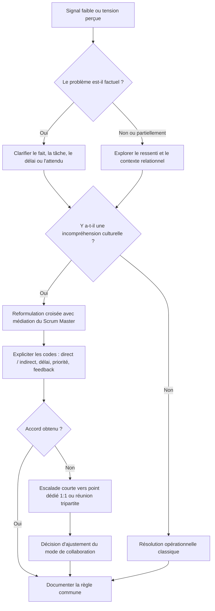
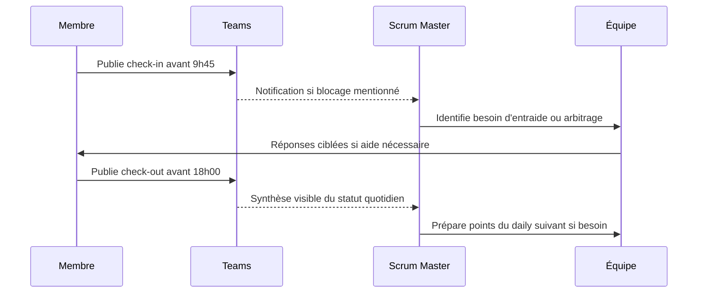
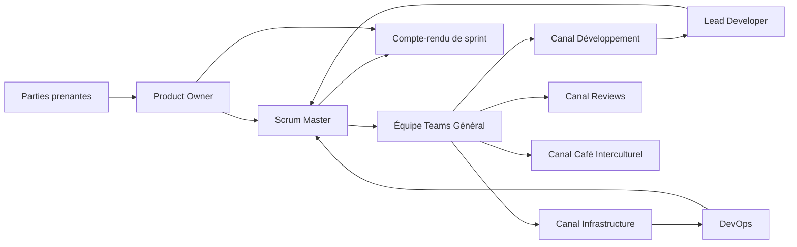
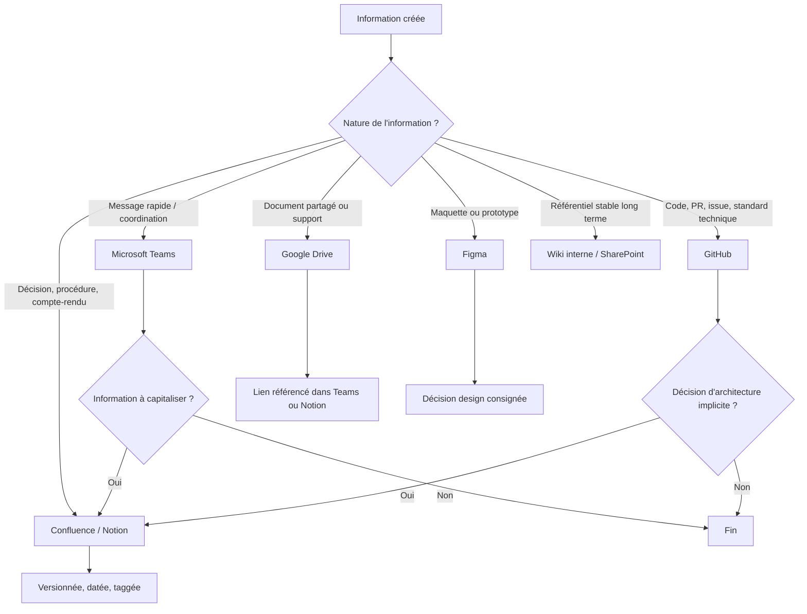
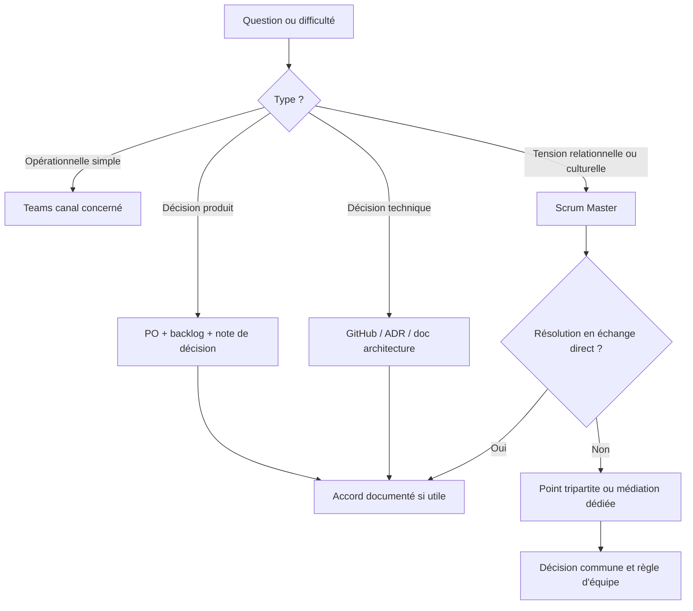
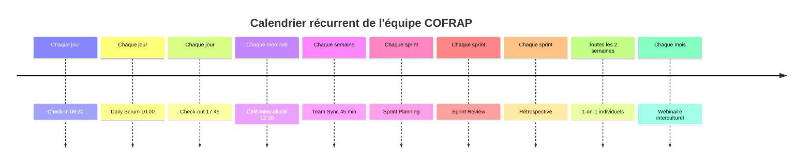
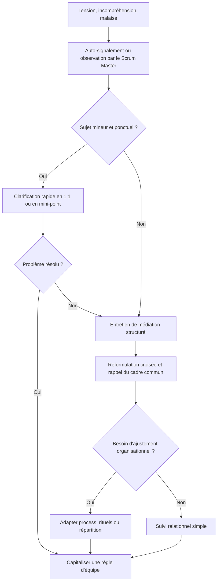

# Management d'Équipe Multiculturelle

## Projet

**COFRAP PoC Authentification**

Document de cadrage du management multiculturel couvrant les compétences **C6 à C12** au **niveau 3** de la grille d'évaluation.

---

## 1. Contexte général

### 1.1 Finalité du document

Ce document formalise l'organisation managériale, les pratiques agiles, les règles de communication, les mécanismes de prévention des conflits, les processus de partage d'information et les modalités de télétravail d'une équipe projet multiculturelle.

L'objectif est double :

- garantir la performance opérationnelle du projet ;
- démontrer une maîtrise avancée des pratiques de management en environnement international, hybride et multilingue.

### 1.2 Composition de l'équipe

| Membre | Rôle principal | Pays | Fuseau | Mode de travail principal |
|---|---|---|---|---|
| Mohamed CHAHOUR | Scrum Master | France | UTC+1 | Hybride / campus ou distanciel |
| Wassim LOMRI | Product Owner | France | UTC+1 | Hybride / campus ou distanciel |
| Samir FOUL | DevOps | Algérie | UTC+1 | Télétravail depuis l'Algérie |
| Akram KALAMI | Lead Developer | Maroc | UTC+1 | Télétravail depuis le Maroc |

### 1.3 Réalité multiculturelle de l'équipe

L'équipe est composée de :

- **2 membres français** ;
- **1 membre algérien** ;
- **1 membre marocain**.

Cette équipe fonctionne dans un contexte :

- **multiculturel** (France, Algérie, Maroc) ;
- **multilingue** (français, arabe, anglais) ;
- **hybride** (présentiel partiel et distanciel) ;
- **transnational** (travail réparti entre plusieurs pays) ;
- **interdisciplinaire** (pilotage, produit, développement, infrastructure).

### 1.4 Principes directeurs

Les principes de management retenus sont les suivants :

1. **Clarté des rôles** pour éviter les chevauchements et les angles morts.
2. **Transparence de l'information** pour sécuriser la continuité opérationnelle.
3. **Adaptabilité agile** pour absorber les changements et les urgences.
4. **Respect interculturel** pour transformer la diversité en levier de performance.
5. **Inclusion active** pour garantir l'accessibilité de l'organisation à tous les profils.
6. **Communication ritualisée** pour compenser la distance géographique.
7. **Prévention des risques humains** pour maintenir la cohésion et la motivation.

---

# COMPÉTENCE C6 : Conduire une équipe projet en diffusant les fondamentaux de l'agilité

## 2. Vision d'ensemble de l'organisation agile

L'équipe adopte un fonctionnement inspiré de **Scrum**, enrichi par des pratiques de **Kanban**, de **DevOps** et de **continuité de service**.

Le choix de ce cadre est justifié par :

- la taille réduite de l'équipe ;
- le besoin de synchronisation forte entre produit, développement et infrastructure ;
- la nécessité de gérer des changements fonctionnels rapides ;
- l'importance de sécuriser les livraisons malgré la distribution géographique.

## 3. Attribution détaillée des rôles à chaque acteur du projet

### 3.1 Mohamed CHAHOUR — Scrum Master

**Rôle attribué :** Scrum Master.

**Rationale :**

- rôle central de facilitation ;
- capacité à animer les rituels ;
- position adaptée pour coordonner les interactions entre membres situés dans différents pays ;
- responsabilité naturelle sur la résolution des obstacles humains et organisationnels.

**Responsabilités détaillées :**

- organiser et animer les cérémonies agiles ;
- protéger l'équipe des perturbations externes ;
- faire respecter les timeboxes ;
- suivre les blocages et piloter leur résolution ;
- assurer la qualité des interactions multiculturelles ;
- veiller à l'accessibilité des outils et des processus ;
- maintenir les indicateurs de sprint ;
- piloter les plans de continuité en cas d'aléa humain ou technique.

### 3.2 Wassim LOMRI — Product Owner

**Rôle attribué :** Product Owner.

**Rationale :**

- responsabilité sur la vision produit ;
- arbitrage fonctionnel ;
- priorisation du backlog ;
- interface avec les parties prenantes pédagogiques, métier et techniques.

**Responsabilités détaillées :**

- définir la vision produit ;
- rédiger et maintenir les user stories ;
- prioriser le backlog ;
- valider la valeur métier ;
- arbitrer les changements de périmètre ;
- accepter ou refuser les livrables ;
- clarifier les exigences avant et pendant le sprint ;
- produire les éléments de communication en français et en anglais pour les parties prenantes externes.

### 3.3 Samir FOUL — DevOps

**Rôle attribué :** Responsable DevOps.

**Rationale :**

- responsabilité sur les pipelines, l'infrastructure, l'observabilité et la stabilité d'exploitation ;
- rôle critique dans un contexte de livraison continue et de gestion d'incidents ;
- fonction transversale entre build, run et sécurité opérationnelle.

**Responsabilités détaillées :**

- configurer l'environnement d'intégration continue ;
- gérer les déploiements ;
- maintenir les scripts d'automatisation ;
- superviser la qualité technique en production ;
- assurer la gestion des secrets et des accès ;
- surveiller les performances et les logs ;
- participer à la stratégie de reprise sur incident ;
- documenter les procédures d'exploitation.

### 3.4 Akram KALAMI — Lead Developer

**Rôle attribué :** Lead Developer.

**Rationale :**

- responsabilité sur la cohérence technique ;
- référent sur l'architecture applicative ;
- accompagnement des choix d'implémentation ;
- rôle de relais technique en cas d'urgence.

**Responsabilités détaillées :**

- définir les orientations de développement ;
- découper techniquement les user stories ;
- valider les pull requests complexes ;
- faire respecter les standards de code ;
- accompagner la résolution des bugs critiques ;
- contribuer à la documentation d'architecture ;
- garantir la maintenabilité ;
- former les autres membres sur les zones complexes du code.

## 4. Répartition complémentaire des responsabilités

### 4.1 Principes de gouvernance

La gouvernance repose sur :

- **un pilotage produit** par le Product Owner ;
- **une facilitation de flux** par le Scrum Master ;
- **une autorité technique distribuée** entre Lead Developer et DevOps ;
- **une responsabilisation collective** sur la qualité et la continuité.

### 4.2 RACI des activités structurantes

| Activité | Mohamed | Wassim | Samir | Akram |
|---|---|---|---|---|
| Définition vision produit | C | A/R | I | C |
| Priorisation backlog | C | A/R | I | C |
| Animation sprint planning | A/R | C | C | C |
| Découpage technique des stories | C | C | C | A/R |
| Mise en place CI/CD | I | I | A/R | C |
| Déploiement production | I | I | A/R | C |
| Validation fonctionnelle | I | A/R | I | C |
| Revue de code avancée | I | I | C | A/R |
| Gestion incident critique | A | C | R | R |
| Documentation de continuité | A | C | R | R |
| Suivi des risques humains | A/R | C | I | I |

Légende :

- **A** = Accountable ;
- **R** = Responsible ;
- **C** = Consulted ;
- **I** = Informed.

## 5. RACI des cérémonies agiles

| Cérémonie | Mohamed | Wassim | Samir | Akram |
|---|---|---|---|---|
| Daily Scrum | A/R | C | R | R |
| Sprint Planning | A/R | A/R | C | C |
| Backlog Refinement | C | A/R | C | C |
| Sprint Review | A/R | A/R | C | C |
| Sprint Retrospective | A/R | C | C | C |
| Incident Review exceptionnelle | A/R | C | R | R |
| Point accessibilité / inclusion | A/R | C | C | C |

## 6. Processus agile proposé avec plusieurs scénarios possibles

## 6.1 Cadre nominal commun

Le cadre nominal de sprint est le suivant :

- sprint de **2 semaines** ;
- backlog raffiné une fois par semaine ;
- daily de **15 minutes** ;
- review et rétrospective en fin de sprint ;
- buffer d'ajustement intégré à la planification ;
- documentation continue dans Confluence / Notion ;
- gestion des tâches dans Jira ou GitHub Projects.

### 6.1.1 Étapes standard d'un sprint

1. Le Product Owner priorise le backlog.
2. Le Scrum Master prépare la Sprint Planning.
3. Le Lead Developer estime la complexité avec l'équipe.
4. Le DevOps vérifie les impacts d'environnement et de déploiement.
5. L'équipe s'engage sur un objectif de sprint réaliste.
6. Les tâches sont découpées et assignées.
7. Les daily assurent le suivi.
8. Les revues de code et tests sont réalisés en continu.
9. Le sprint se clôture par une Review.
10. Une Retrospective transforme les retours en actions concrètes.

## 6.2 Scénario nominal — Tout se passe bien

### 6.2.1 Situation

Le backlog est stable, les priorités sont claires, aucun incident majeur n'intervient, tous les membres sont disponibles.

### 6.2.2 Déroulé pas à pas

**Étape 1 — Préparation de sprint**

- Wassim met à jour le backlog 48 heures avant la Sprint Planning.
- Akram relit les stories techniquement.
- Samir identifie les dépendances d'infrastructure.
- Mohamed vérifie la charge disponible et prépare l'ordre du jour.

**Étape 2 — Sprint Planning**

- Wassim présente l'objectif métier du sprint.
- Akram découpe les stories en tâches techniques.
- Samir précise les tâches liées au pipeline, aux environnements et aux déploiements.
- Mohamed fait respecter le timeboxing et valide l'engagement final.

**Étape 3 — Exécution du sprint**

- Daily chaque matin.
- Développement en branches courtes.
- Pull requests revues en moins de 24 heures.
- Synchronisation technique ad hoc si une complexité apparaît.
- Documentation mise à jour au fil de l'eau.

**Étape 4 — Stabilisation**

- Samir vérifie le pipeline et les logs.
- Akram pilote la correction des défauts de fin de sprint.
- Wassim prépare les critères d'acceptation de la Review.

**Étape 5 — Sprint Review**

- démonstration de la fonctionnalité ;
- validation métier ;
- collecte des retours.

**Étape 6 — Rétrospective**

- Mohamed anime un tour de table ;
- l'équipe identifie ce qui a bien fonctionné ;
- une à trois actions d'amélioration sont décidées.

### 6.2.3 Qui fait quoi

- **Wassim** : porte la vision et valide la valeur.
- **Mohamed** : sécurise le cadre et les échanges.
- **Akram** : garantit la cohérence technique.
- **Samir** : sécurise le delivery et l'exploitation.

### 6.2.4 Résultat attendu

- objectif de sprint atteint ;
- charge maîtrisée ;
- dette technique contenue ;
- ambiance d'équipe préservée.

## 6.3 Scénario de changement de priorité en milieu de sprint

### 6.3.1 Situation

En milieu de sprint, le Product Owner reçoit une demande urgente : une nouvelle fonctionnalité est devenue prioritaire pour un démonstrateur ou pour un besoin critique de validation.

### 6.3.2 Principe de gestion

Le sprint n'est pas interrompu par défaut.

On applique une **procédure d'arbitrage en 6 temps**.

### 6.3.3 Déroulé pas à pas

**Étape 1 — Signalement du changement**

- Wassim formalise la demande.
- Il décrit l'urgence métier, l'impact et la date limite.
- Il publie la demande dans le canal Teams **Général** et dans l'outil de backlog.

**Étape 2 — Qualification rapide**

- Mohamed déclenche un point de 20 minutes maximum.
- Akram évalue l'impact technique.
- Samir mesure les impacts pipeline, sécurité, infra et déploiement.
- Wassim clarifie la valeur métier attendue.

**Étape 3 — Décision d'arbitrage**

Trois options sont étudiées :

1. intégrer la demande dans le sprint si elle tient dans le buffer ;
2. remplacer une story de valeur inférieure ;
3. repousser la demande au sprint suivant si le risque est trop élevé.

**Étape 4 — Réallocation**

- Si l'intégration est acceptée, Mohamed ajuste le plan de sprint.
- Akram redécoupe les tâches.
- Samir réserve le temps de stabilisation nécessaire.
- Wassim communique la décision aux parties prenantes.

**Étape 5 — Exécution ajustée**

- l'équipe réduit le work in progress ;
- certaines tâches non critiques sont reportées ;
- le suivi devient quotidien sur la demande urgente.

**Étape 6 — Capitalisation**

- à la rétrospective, l'équipe évalue si l'urgence était légitime ;
- si ce type de changement devient fréquent, une règle de gouvernance backlog est renforcée.

### 6.3.4 Qui fait quoi

- **Wassim** : justifie la priorité et arbitre la valeur.
- **Mohamed** : protège l'équipe et cadre la décision.
- **Akram** : estime l'effort et les impacts qualité.
- **Samir** : sécurise les risques d'intégration et de production.

### 6.3.5 Adaptation de l'équipe

L'adaptation repose sur :

- l'utilisation d'un **buffer de sprint** ;
- la possibilité de **désengager une tâche secondaire** ;
- une communication transparente ;
- l'acceptation explicite du compromis par tous.

## 6.4 Scénario d'urgence — Membre malade ou bug critique en production

### 6.4.1 Situation type A : un membre tombe malade

Exemple : Samir devient indisponible pendant 3 jours.

### 6.4.2 Situation type B : bug critique en production

Exemple : une régression bloque l'authentification des utilisateurs.

### 6.4.3 Déroulé pas à pas commun

**Étape 1 — Détection**

- l'indisponibilité ou l'incident est signalé immédiatement dans Teams ;
- le niveau de sévérité est évalué.

**Étape 2 — Activation du mode urgence**

- Mohamed active le protocole d'urgence ;
- un canal ou thread spécifique est ouvert ;
- le reste des travaux non critiques est gelé temporairement.

**Étape 3 — Désignation du pilote d'incident**

- si incident produit : Samir pilote la résolution si disponible ; sinon Akram prend le relais technique ;
- si indisponibilité humaine : le binôme relais prend en charge les activités urgentes.

**Étape 4 — Sécurisation de la communication**

- Wassim informe les parties prenantes du statut ;
- Mohamed évite les sollicitations parasites vers l'équipe ;
- l'information est centralisée dans un fil unique.

**Étape 5 — Résolution**

- Akram coordonne l'analyse racine côté code ;
- Samir ou son relais sécurise le déploiement ;
- les actions sont journalisées ;
- la correction est testée puis livrée.

**Étape 6 — Retour à la normale**

- le backlog est repriorisé ;
- les tâches suspendues sont réévaluées ;
- un mini post-mortem est organisé sous 48 heures.

### 6.4.4 Répartition détaillée en cas de membre malade

**Si Samir est absent :**

- Akram prend le relais sur les actions DevOps critiques documentées ;
- Mohamed suit la charge et protège le temps de relais ;
- Wassim ajuste les attentes fonctionnelles.

**Si Akram est absent :**

- Samir couvre les éléments techniques critiques liés à l'intégration et à la livraison ;
- Mohamed organise une revue de priorités ;
- Wassim retire les stories les plus complexes si nécessaire.

**Si Mohamed est absent :**

- Wassim anime les points de synchronisation essentiels ;
- Akram prend le relais sur la coordination technique quotidienne.

**Si Wassim est absent :**

- Mohamed protège la stabilité du sprint ;
- Akram applique les critères d'acceptation déjà documentés ;
- aucune nouvelle demande de priorité n'est acceptée sans justification écrite préalable.

### 6.4.5 Répartition détaillée en cas de bug critique en production

- **Mohamed** : coordonne le dispositif d'urgence et le rythme de communication.
- **Wassim** : informe les parties prenantes et arbitre les fonctionnalités non critiques.
- **Samir** : pilote l'observabilité, la rollback strategy, les logs et le déploiement.
- **Akram** : dirige le diagnostic applicatif et la correction du code.

### 6.4.6 Résultat attendu

- réduction du temps d'indisponibilité ;
- absence de confusion sur les responsabilités ;
- continuité de service assurée ;
- traçabilité des décisions.

## 7. Prise en compte des contraintes de temps et des événements exceptionnels

## 7.1 Gestion des buffers

Un sprint n'est pas planifié à 100 % de capacité.

La règle retenue est :

- **80 %** de la capacité sur des engagements fermes ;
- **20 %** de marge répartie entre imprévus, relectures, dette légère et micro-incidents.

### 7.1.1 Justification

Cette pratique :

- absorbe les changements de priorité ;
- permet de couvrir les ralentissements liés au distanciel ;
- réduit le stress induit par les aléas ;
- maintient la qualité de livraison.

## 7.2 Timeboxing des événements

| Événement | Durée cible | Objectif |
|---|---|---|
| Daily Scrum | 15 min | Synchroniser sans dériver |
| Sprint Planning | 90 min | S'engager sur un objectif réaliste |
| Backlog Refinement | 60 min | Clarifier et estimer |
| Sprint Review | 45 min | Démontrer et collecter le feedback |
| Rétrospective | 45 min | Améliorer le fonctionnement |
| Point d'urgence | 20 min | Qualifier et répartir l'action |

## 7.3 Processus de gestion des exceptions

Le processus est structuré en 5 niveaux.

### 7.3.1 Niveau 1 — Blocage individuel

- signalement dans le check-in ou dans le daily ;
- résolution dans la journée si possible.

### 7.3.2 Niveau 2 — Blocage technique significatif

- thread dédié ;
- intervention Akram + Samir ;
- arbitrage de priorité si besoin.

### 7.3.3 Niveau 3 — Glissement de charge

- Mohamed réévalue le sprint ;
- Wassim priorise ce qui doit être conservé.

### 7.3.4 Niveau 4 — Incident critique production

- activation du protocole urgence ;
- gel du non essentiel ;
- communication centralisée.

### 7.3.5 Niveau 5 — Indisponibilité humaine prolongée

- activation du buddy system ;
- redistribution de charge ;
- documentation renforcée ;
- arbitrage du périmètre.

## 8. Personne relais en cas de situation d'urgence : buddy system

## 8.1 Principe

Chaque membre dispose d'un **binôme relais**.

L'objectif est de garantir :

- la continuité opérationnelle ;
- l'absence de dépendance à une seule personne ;
- la reprise rapide d'une activité critique ;
- la préservation de la sérénité de l'équipe en cas d'absence.

## 8.2 Matrice de relais

| Membre principal | Relais principal | Relais secondaire | Domaine à couvrir |
|---|---|---|---|
| Mohamed | Wassim | Akram | Animation, coordination, suivi de sprint |
| Wassim | Mohamed | Akram | Priorisation, clarification, validation intermédiaire |
| Samir | Akram | Mohamed | Déploiement, scripts, supervision, rollback |
| Akram | Samir | Mohamed | Architecture, décisions techniques, revue critique |

## 8.3 Plan de transfert de connaissances

Le buddy system n'est crédible que s'il repose sur des preuves de transférabilité.

Chaque membre doit maintenir :

- une documentation de ses procédures critiques ;
- une check-list des actions fréquentes ;
- une cartographie des dépendances ;
- les accès nécessaires dans un coffre sécurisé ;
- un journal des décisions importantes.

## 8.4 Exigences documentaires pour la continuité

### 8.4.1 Pour le Scrum Master

- ordre du jour type des cérémonies ;
- trame de suivi des blocages ;
- registre des décisions d'équipe ;
- calendrier de rituels.

### 8.4.2 Pour le Product Owner

- backlog priorisé ;
- critères d'acceptation ;
- définition of done métier ;
- notes de cadrage et dépendances externes.

### 8.4.3 Pour le DevOps

- runbooks d'incident ;
- procédure de déploiement ;
- procédure de rollback ;
- architecture des environnements ;
- supervision et accès aux logs.

### 8.4.4 Pour le Lead Developer

- documentation d'architecture ;
- conventions de code ;
- hotspots techniques ;
- checklist de revue ;
- mapping des modules critiques.

## 9. Section inclusion / handicap

Le management agile n'est complet que s'il intègre les enjeux d'accessibilité et d'inclusion.

## 9.1 Accueil d'une personne avec déficience visuelle

Si une personne présentant une déficience visuelle rejoint l'équipe, le dispositif d'intégration comprend :

1. un entretien d'accueil individualisé ;
2. une évaluation des besoins matériels et logiciels ;
3. une adaptation des supports de travail ;
4. une sensibilisation de l'équipe ;
5. un suivi en lien avec le référent handicap.

## 9.2 Outils et exigences techniques d'accessibilité

### 9.2.1 Compatibilité lecteurs d'écran

Les outils sélectionnés doivent être compatibles avec :

- **NVDA** ;
- **JAWS** ;
- lecteurs d'écran natifs selon l'OS.

### 9.2.2 Exigences sur les outils de développement

- IDE avec navigation clavier complète ;
- thèmes à fort contraste ;
- linting d'accessibilité intégré ;
- documentation structurée avec titres lisibles ;
- tickets Jira/GitHub lisibles au clavier ;
- PR avec commentaires textuels explicites.

### 9.2.3 Outils de revue de code accessibles

- GitHub Pull Requests avec commentaires structurés ;
- Teams avec transcription automatique ;
- Confluence / Notion avec balisage hiérarchique ;
- Miro utilisé seulement en complément d'un compte-rendu textuel.

## 9.3 Adaptation de la charge de travail

Les adaptations possibles sont :

- délais de réalisation allongés pour certaines tâches fortement visuelles ;
- pair programming ciblé ;
- revue de code orale ou verbalisée ;
- priorisation de tâches compatibles avec les outils d'accessibilité ;
- support renforcé lors de la prise en main d'un nouvel outil.

## 9.4 Pair programming inclusif

Le pair programming est utilisé pour :

- partager la compréhension du code ;
- verbaliser les décisions techniques ;
- réduire l'isolement ;
- sécuriser la relecture ;
- accélérer l'intégration de pratiques accessibles.

## 9.5 Collaboration avec le référent handicap

Le référent handicap intervient sur :

- l'identification des aménagements raisonnables ;
- la coordination RH ;
- la sensibilisation de l'équipe ;
- l'ajustement des outils ;
- le suivi de l'efficacité des mesures.

## 9.6 Règles opérationnelles d'inclusion

- tout support visuel doit avoir un équivalent textuel ;
- toute animation interactive doit être accompagnée d'une alternative accessible ;
- aucune information clé ne doit être transmise uniquement par couleur ;
- les comptes-rendus doivent être disponibles sous 24 heures ;
- les réunions critiques doivent activer transcription et sous-titres.

---

# COMPÉTENCE C7 : Communiquer avec l'équipe en adoptant les modes de communication adéquats selon les cultures et la langue des collaborateurs

## 10. Principes de communication interculturelle retenus

La communication de l'équipe repose sur quatre règles :

1. **écoute active** ;
2. **reformulation fidèle** ;
3. **traduction culturelle des intentions** ;
4. **bilinguisme / trilinguisme pragmatique** selon le contexte.

## 11. Faire preuve d'écoute active

## 11.1 Définition

L'écoute active, au sens de **Carl Rogers**, consiste à :

- écouter sans interrompre ;
- suspendre l'interprétation prématurée ;
- vérifier la compréhension ;
- reconnaître l'émotion ou la contrainte exprimée ;
- reformuler sans juger ;
- créer un climat de sécurité psychologique.

## 11.2 Application au projet

Dans une équipe multiculturelle, l'écoute active est indispensable car :

- les non-dits n'ont pas la même signification selon les cultures ;
- certains membres formulent un désaccord de manière indirecte ;
- le distanciel réduit les signaux faibles ;
- les malentendus techniques peuvent être aggravés par la langue.

## 11.3 Exemple concret d'écoute active

### Situation

Samir indique en daily :

> "Le pipeline passe, mais je ne suis pas totalement rassuré sur la stabilité du déploiement de demain."

### Réaction managériale attendue

Mohamed ne répond pas immédiatement par :

> "Donc c'est bon, on peut livrer."

Il applique l'écoute active :

1. il laisse Samir finir ;
2. il pose une question ouverte ;
3. il vérifie la nature du risque ;
4. il reformule sans minimiser.

### Formulation adaptée

> "Si je comprends bien, le pipeline est vert, mais tu perçois encore un risque sur la fiabilité du déploiement réel. Est-ce que ton inquiétude porte sur l'environnement, sur la rollback strategy ou sur un point de configuration ?"

Cette réponse :

- reconnaît l'expertise de Samir ;
- évite le raccourci ;
- fait émerger la vraie nature du problème ;
- protège l'équipe d'une décision trop rapide.

## 12. Reformuler de façon fidèle sans interprétation

## 12.1 Principe

La reformulation fidèle consiste à redire l'essentiel de ce qui a été exprimé :

- sans ajouter d'intention supposée ;
- sans corriger implicitement la personne ;
- sans transformer un doute en certitude ;
- sans confondre besoin métier et solution technique.

## 12.2 Exemple 1 — Malentendu sur une exigence technique

### Propos initial d'Akram

> "Le mécanisme d'authentification proposé est faisable, mais si on garde ce niveau de journalisation, on risque de dégrader la lisibilité des traces de diagnostic."

### Mauvaise reformulation

> "Donc tu dis qu'il faut supprimer les logs."

### Bonne reformulation

> "Je reformule : l'authentification est réalisable, mais tu soulignes qu'avec le niveau actuel de logs, le diagnostic pourrait devenir moins lisible. Tu proposes donc de revoir la structure ou le niveau de journalisation, pas de supprimer toute traçabilité."

## 12.3 Exemple 2 — Clarification d'une user story

### Propos initial de Wassim

> "Je veux que l'utilisateur puisse se connecter rapidement, mais sans compromettre la sécurité ni créer une expérience trop lourde."

### Bonne reformulation par Akram

> "Si je reformule fidèlement, l'objectif n'est pas seulement d'accélérer la connexion ; il est d'obtenir un équilibre entre fluidité, sécurité et simplicité d'usage. Il faut donc qu'on évalue plusieurs options de parcours, pas uniquement la plus rapide techniquement."

## 13. S'appuyer sur des références culturelles adaptées au pays d'origine

## 13.1 Références théoriques mobilisées

### 13.1.1 Hofstede

Références mobilisées :

- **France** : distance hiérarchique 68, individualisme 71, évitement de l'incertitude 86 ;
- **Maroc** : distance hiérarchique 70, individualisme 46, évitement de l'incertitude 68 ;
- **Algérie** : profil proche du Maroc sur plusieurs dimensions, avec poids relationnel élevé et communication davantage contextualisée.

### 13.1.2 Edward T. Hall

L'équipe combine :

- une communication plutôt **low-context** côté français ;
- une communication plus **high-context** côté algérien et marocain.

Conséquence :

- les Français tendent à verbaliser directement le problème ;
- les membres maghrébins peuvent introduire davantage de contexte relationnel et moduler plus indirectement un désaccord.

## 13.2 Exemple avec Samir — Référence à la culture de travail algérienne

### Situation

Samir dit :

> "Je pense qu'on peut avancer, mais peut-être qu'il serait préférable de revoir calmement le séquencement avant d'ouvrir l'environnement demain."

### Lecture interculturelle

Dans une logique **high-context**, cette formulation peut signaler un désaccord plus fort qu'il n'y paraît.

Le manager doit entendre :

- la prudence technique ;
- la volonté de préserver la relation ;
- une réserve exprimée sans frontalité excessive.

### Reformulation adaptée

> "Samir, si je reprends ce que tu dis, tu proposes en réalité qu'on ne se contente pas d'avancer vite, mais qu'on sécurise d'abord la séquence de déploiement. Je comprends aussi que, dans une logique de travail où la relation et la prudence comptent, tu préfères alerter sans dramatiser. On va donc prendre ce signal comme un point sérieux à traiter avant ouverture."

## 13.3 Exemple avec Akram — Référence aux normes de communication marocaines

### Situation

Akram dit :

> "La solution est intéressante, mais il y a peut-être une autre manière de faire qui serait plus stable à long terme."

### Lecture interculturelle

Dans un cadre où la politesse et l'équilibre relationnel sont importants, un désaccord peut être introduit par une formule valorisante préalable.

### Reformulation adaptée

> "Akram, je reformule : tu reconnais la pertinence de la solution actuelle, mais tu exprimes une réserve de fond sur sa stabilité. Si je me base sur un mode de communication où le respect et la nuance priment, j'entends que ton point est important et qu'il mérite une vraie comparaison d'options, pas seulement une validation rapide."

## 13.4 Exemple de pont avec le style français plus direct

### Situation

Wassim déclare :

> "Cette solution ne répond pas au besoin métier, il faut la reprendre."

Pour Samir ou Akram, ce niveau de directivité peut être perçu comme abrupt s'il n'est pas contextualisé.

### Reformulation médiatrice par Mohamed

> "Je reformule pour tout le monde : Wassim ne remet pas en cause le travail fourni ; il signale que, du point de vue du besoin métier, la solution actuelle ne couvre pas encore l'attendu. Son style est direct parce qu'il cherche à clarifier vite la cible. Prenons donc ce retour comme un alignement produit, et voyons ensemble comment ajuster la solution."

## 13.5 Règles de traduction culturelle dans l'équipe

- expliciter l'intention avant de juger la forme ;
- distinguer désaccord et manque d'engagement ;
- vérifier si une réserve implicite masque un risque concret ;
- recontextualiser les messages directs pour préserver la relation ;
- recontextualiser les messages indirects pour éviter la sous-estimation du risque.

## 14. Traduire fidèlement son discours en anglais

## 14.1 Situation de référence

Le Product Owner doit communiquer un statut de projet à des parties prenantes internationales.

## 14.2 Message en français

> Bonjour à toutes et à tous,
>
> Voici le point d'avancement du sprint en cours sur le PoC d'authentification COFRAP.
>
> À ce stade, l'objectif principal du sprint est maintenu. L'équipe a finalisé l'implémentation du flux principal de connexion et a validé les premiers tests d'intégration. Nous avons également sécurisé la chaîne de déploiement sur l'environnement de démonstration.
>
> Deux points de vigilance restent ouverts. Le premier concerne la lisibilité des journaux applicatifs lors des erreurs d'authentification. Le second concerne un ajustement de priorité demandé cette semaine sur une fonctionnalité annexe. Cet ajustement est en cours d'évaluation afin de vérifier son impact sur le périmètre du sprint.
>
> À ce jour, aucun retard critique n'est identifié. En revanche, nous maintenons une surveillance renforcée sur la stabilité du déploiement et sur la charge de l'équipe en fin de sprint.
>
> La prochaine revue de sprint aura lieu vendredi à 14h00 CET. Nous y présenterons les fonctionnalités livrées, les arbitrages effectués et les recommandations pour la suite.
>
> Merci à tous pour votre confiance.

## 14.3 Traduction fidèle en anglais

> Hello everyone,
>
> Here is the status update for the current sprint on the COFRAP authentication proof of concept.
>
> At this stage, the main sprint goal remains on track. The team has completed the implementation of the main sign-in flow and has validated the first integration tests. We have also secured the deployment pipeline on the demonstration environment.
>
> Two attention points remain open. The first one concerns the readability of application logs when authentication errors occur. The second one relates to a priority adjustment requested this week for a secondary feature. This adjustment is currently being assessed in order to measure its impact on the sprint scope.
>
> As of today, no critical delay has been identified. However, we are maintaining increased monitoring on deployment stability and on team workload at the end of the sprint.
>
> The next sprint review will take place on Friday at 2:00 PM CET. During that session, we will present the delivered features, the trade-offs made, and our recommendations for the next steps.
>
> Thank you all for your trust.

## 14.4 Garanties de fidélité de traduction

La traduction conserve :

- le niveau de formalité ;
- la hiérarchie des informations ;
- le degré de prudence ;
- les nuances liées aux risques ;
- l'engagement réaliste sans surpromesse.

---

# COMPÉTENCE C8 : Proposer des solutions innovantes afin de favoriser les interactions et d'anticiper des conflits multiculturels

## 15. Principes d'innovation relationnelle

Dans une équipe multiculturelle, l'innovation ne concerne pas uniquement le produit.

Elle doit aussi porter sur :

- les modes d'interaction ;
- la création de confiance ;
- les routines de compréhension mutuelle ;
- la prévention des incompréhensions culturelles ;
- la construction d'un langage commun.

## 16. Solution innovante n°1 — Serious game à distance : "Culture Quest"

## 16.1 Concept général

**Culture Quest** est un serious game à distance organisé sur **Klaxoon** ou **QuizBreaker**.

Il vise à :

- faire découvrir les références culturelles des membres ;
- dédramatiser les différences ;
- créer des occasions de dialogue ;
- améliorer la compréhension des comportements en contexte projet.

## 16.2 Format

- durée : 45 minutes ;
- fréquence : une fois par mois ;
- participants : toute l'équipe ;
- animateur : Mohamed ;
- support : Klaxoon ou QuizBreaker ;
- restitution : mini synthèse des apprentissages dans Teams.

## 16.3 Règles du jeu

1. chaque membre propose 3 faits culturels vérifiés sur son pays ;
2. l'animateur transforme ces éléments en quiz ;
3. les questions portent à la fois sur la culture générale et les usages de travail ;
4. chaque réponse est suivie d'un échange bref ;
5. le but n'est pas la performance, mais la compréhension mutuelle.

## 16.4 Exemples de questions

### Algérie

- quelles fêtes nationales peuvent impacter la disponibilité ?
- dans quel contexte la relation interpersonnelle précède-t-elle parfois la confrontation directe d'un problème ?
- comment exprimer poliment un désaccord sans brusquer ?

### Maroc

- quelle place a la politesse rituelle dans les échanges professionnels ?
- comment la distance hiérarchique peut-elle influencer la prise de parole ?
- quels sont les effets possibles du mois de Ramadan sur l'énergie et l'organisation ?

### France

- pourquoi une communication directe peut-elle être perçue comme efficace en contexte français ?
- comment l'évitement de l'incertitude influence-t-il le besoin de cadrage ?
- pourquoi la réunion orientée décision rapide est-elle valorisée ?

## 16.5 Bénéfices attendus

- meilleure tolérance aux styles de communication différents ;
- réduction des interprétations négatives ;
- augmentation de la confiance interpersonnelle ;
- amélioration de la qualité de coopération à distance.

## 17. Solution innovante n°2 — Temps de partage informel : "Café Interculturel COFRAP"

## 17.1 Objectif

Créer un espace non productif au sens strict, mais hautement utile pour la cohésion.

## 17.2 Cadre

- fréquence : **chaque mercredi** ;
- durée : **30 minutes** ;
- créneau : **12h30–13h00 CET** ;
- canal Teams dédié : **Café Interculturel** ;
- participation : encouragée mais non coercitive.

## 17.3 Rythme de rotation

Semaine 1 : Mohamed.

Semaine 2 : Wassim.

Semaine 3 : Samir.

Semaine 4 : Akram.

Puis rotation.

## 17.4 Contenus possibles

- recette traditionnelle ;
- musique ou artiste du pays ;
- rituel social ;
- anecdote sur le monde du travail ;
- fête nationale ou religieuse ;
- expression idiomatique en français, arabe ou anglais.

## 17.5 Exemples de séances

### Séance 1

- présentation d'une pâtisserie marocaine ;
- discussion sur les temps festifs et la convivialité ;
- lien avec l'importance de la relation de confiance.

### Séance 2

- partage d'une musique algérienne ;
- discussion sur l'hospitalité et la communication ;
- lien avec la manière de formuler un désaccord avec respect.

### Séance 3

- comparaison France / Maghreb sur la ponctualité perçue ;
- lien avec Hall : polychronic vs monochronic.

## 17.6 Impact attendu

- humanisation des interactions ;
- réduction des stéréotypes ;
- création de souvenirs communs ;
- plus grande facilité à gérer les tensions futures.

## 18. Solution innovante n°3 — Webinaire mensuel : "Travailler ensemble au-delà des frontières"

## 18.1 Objectif

Professionnaliser la compétence interculturelle au lieu de la laisser au hasard.

## 18.2 Format

- fréquence : mensuelle ;
- durée : 1 heure ;
- animateur : Mohamed, avec rotation éventuelle de co-animation ;
- support : Teams + support Canva ou PowerPoint ;
- livrable : fiche synthèse partagée sur Confluence.

## 18.3 Programme thématique proposé

### Session 1 — Rapport à l'autorité

Contenu :

- distance hiérarchique selon Hofstede ;
- France vs Maroc vs Algérie ;
- effet sur la prise de parole ;
- techniques pour inviter explicitement au dissent constructif.

### Session 2 — Communication directe et indirecte

Contenu :

- modèle de Hall ;
- high-context vs low-context ;
- risques de sous-interprétation et sur-interprétation ;
- grille pratique de reformulation.

### Session 3 — Rapport au temps

Contenu :

- temps monochrone et polychrone ;
- respect des délais vs flexibilité relationnelle ;
- gestion des dépendances sans jugement culturel.

### Session 4 — Tabous et prudence relationnelle

Contenu :

- sujets sensibles à éviter ;
- humour et second degré ;
- politique, religion et stéréotypes ;
- bonnes pratiques de neutralité professionnelle.

### Session 5 — Éthique du travail et engagement visible

Contenu :

- différentes manières de montrer son implication ;
- présence, disponibilité, réactivité ;
- éviter l'équation erronée entre style de communication et niveau d'engagement.

### Session 6 — Collaboration en période particulière

Contenu :

- Ramadan ;
- fêtes nationales ;
- fatigue cognitive ;
- adaptation des créneaux et des attentes.

## 19. Matrice de prévention des conflits multiculturels

| Zone de conflit potentielle | Risque concret | Signaux faibles | Prévention spécifique | Responsable principal |
|---|---|---|---|---|
| Style de communication direct vs indirect | Perception d'agressivité ou d'évitement | réponses courtes, silence, tension latente | reformulation systématique, explicitation de l'intention | Mohamed |
| Rapport à la hiérarchie | auto-censure ou validation trop rapide | peu de contradiction en réunion | tour de parole obligatoire, vote anonyme si nécessaire | Mohamed |
| Rapport au temps | frustration sur la ponctualité ou le rythme | retards répétés, micro-irritations | charte d'équipe sur délais, buffer et confirmation écrite | Tous |
| Perception de la critique | critique vécue comme personnelle | baisse de participation après revue | feedback SBI, valorisation avant correction, focus sur l'objet | Akram |
| Disponibilité en télétravail | jugement sur l'engagement réel | messages hors horaires, attentes implicites | core hours, droit à la déconnexion, visibilité du planning | Mohamed |

## 20. Arbre de décision de prévention et traitement d'un risque multiculturel



---

# COMPÉTENCE C9 : Concevoir un processus de communication régulier

## 21. Outil collaboratif retenu : Microsoft Teams

## 21.1 Justification du choix

Microsoft Teams est retenu car il permet :

- la messagerie instantanée ;
- la visioconférence ;
- la transcription automatique ;
- le partage de fichiers ;
- les canaux thématiques ;
- l'intégration avec les autres outils Microsoft.

## 21.2 Configuration proposée

### Nom de l'équipe

**COFRAP PoC Authentification**

### Canaux

| Canal | Finalité | Règle d'usage |
|---|---|---|
| Général | annonces, décisions transverses, points de cadrage | réservé aux informations à portée d'équipe |
| Développement | questions de code, avancement des stories | threads obligatoires par sujet |
| Infrastructure | CI/CD, environnements, incidents techniques | journalisation des changements |
| Reviews | retours de review, préparation review/rétro | synthèses et supports de démonstration |
| Café Interculturel | échanges informels et culturels | espace non opérationnel mais fédérateur |

## 21.3 Paramètres de réunion

### Enregistrement

- activé pour Sprint Review ;
- activé pour webinaires culturels ;
- activé à la demande pour points critiques ;
- non systématique pour les daily afin de préserver la spontanéité.

### Transcription

- activée sur les réunions importantes ;
- utile pour accessibilité ;
- utile pour les membres non natifs ;
- utile pour les absents.

### Sous-titres

- activés par défaut en réunion formelle ;
- recommandés en contexte de forte densité technique.

## 22. Fil de discussion structuré : check-in / check-out

## 22.1 Objectifs du check-in

Le check-in de début de journée permet de partager :

- l'état d'esprit ;
- l'intention de la journée ;
- les priorités ;
- les blocages éventuels.

## 22.2 Objectifs du check-out

Le check-out de fin de journée permet de partager :

- ce qui a été accompli ;
- ce qui reste à faire ;
- le plan du lendemain ;
- ce qui a freiné ou ralenti.

## 22.3 Format du check-in

Chaque membre publie avant 9h45 CET un message dans un thread dédié.

### Structure du message

- humeur du jour ;
- intention du jour ;
- blocage éventuel ;
- besoin d'aide éventuel.

### Template check-in

```text
[CHECK-IN]
Humeur : 🙂 / 😐 / ⚠️
Priorité du jour :
Objectif principal :
Blocage éventuel :
Besoin d'aide : Oui / Non
```

## 22.4 Format du check-out

Chaque membre publie avant 18h00 CET un message dans le même thread.

### Structure du message

- ce que j'ai accompli ;
- ce que je ferai demain ;
- "unobstructed lemon" / ce qui m'a freiné ;
- besoin d'arbitrage éventuel.

### Template check-out

```text
[CHECK-OUT]
Accompli aujourd'hui :
Suite demain :
Ce qui m'a freiné :
Décision ou aide attendue :
```

## 22.5 Diagramme de séquence check-in / check-out



## 22.6 Bénéfices du protocole

- meilleure visibilité sur l'état réel du travail ;
- détection précoce des blocages ;
- cohésion renforcée en distanciel ;
- prévention des surcharges silencieuses ;
- traçabilité légère et utile.

## 23. Flux global de communication d'équipe



---

# COMPÉTENCE C10 : Animer des réunions à distance

## 24. Principes d'animation à distance

Une réunion distante efficace doit être :

- structurée ;
- rythmée ;
- inclusive ;
- participative ;
- documentée ;
- sensible aux différences de style culturel.

## 25. Séquence structurée d'une Sprint Review visio de 45 minutes

## 25.1 Vue d'ensemble

| Séquence | Durée | Responsable | Objectif |
|---|---|---|---|
| Icebreaker culturel | 5 min | Mohamed | créer de la présence et de l'écoute |
| Sprint overview | 10 min | Mohamed | rappeler l'objectif et le chemin parcouru |
| Démo interactive | 15 min | Akram + Samir + Wassim | montrer, expliquer, faire participer |
| Q&A stakeholders | 10 min | Wassim | recueillir questions et feedback |
| Preview sprint suivant | 5 min | Wassim + Mohamed | projeter la suite |

## 25.2 Détail des séquences

### 25.2.1 Icebreaker culturel — 5 minutes

Exemples de questions du jour :

- quelle habitude professionnelle de votre pays vous aide le plus en équipe ?
- quel mot de votre langue décrit bien la coopération ?
- quel rituel vous aide à bien commencer la journée ?

Objectifs :

- créer de l'engagement immédiat ;
- permettre à chacun de prendre la parole ;
- détendre l'atmosphère ;
- valoriser la diversité.

### 25.2.2 Sprint overview — 10 minutes

Mohamed présente :

- l'objectif de sprint ;
- ce qui a été engagé ;
- ce qui a été livré ;
- les écarts éventuels ;
- les arbitrages réalisés.

### 25.2.3 Démo interactive — 15 minutes

Principe de **classe inversée** :

- l'équipe ne se contente pas de montrer ;
- elle fait participer les parties prenantes ;
- elle invite à vérifier la valeur métier en direct.

Déroulé :

- Wassim rappelle le cas d'usage ;
- Akram montre le flux applicatif ;
- Samir explique les garanties techniques et le déploiement ;
- un stakeholder exécute ou guide un parcours de validation.

### 25.2.4 Questions / réponses — 10 minutes

Règles :

- questions prises dans le chat et à l'oral ;
- reformulation avant réponse si besoin ;
- réponses courtes puis approfondissement si nécessaire ;
- parking lot pour les sujets hors scope.

### 25.2.5 Next sprint preview — 5 minutes

Wassim et Mohamed présentent :

- le cap du sprint suivant ;
- les principaux risques ;
- les dépendances ;
- les besoins d'arbitrage ou de validation.

## 26. Séquences d'animation interactive

## 26.1 Live poll avec Mentimeter

Usage :

- mesurer le niveau de clarté ;
- prioriser les attentes ;
- évaluer la satisfaction de review.

Questions types :

- la démo vous paraît-elle claire ?
- quel sujet mérite d'être approfondi ?
- quel risque vous semble prioritaire ?

## 26.2 Whiteboard collaboratif avec Miro

Usage :

- cartographier un parcours utilisateur ;
- visualiser une architecture ;
- faire émerger des idées en groupe.

Précaution :

- toute production Miro est accompagnée d'une synthèse textuelle accessible.

## 26.3 Quiz live avec Kahoot

Usage :

- valider la compréhension du sprint ;
- ancrer les apprentissages ;
- renforcer le côté ludique.

Exemples :

- quelle fonctionnalité a changé de priorité ?
- quel risque a été levé pendant le sprint ?
- quelle action de rétrospective est reconduite ?

## 27. Plan d'usage approprié des outils digitaux d'animation

| Outil | Usage principal | Moment | Bénéfice |
|---|---|---|---|
| Padlet | board de rétrospective | fin de sprint | expression simple et visuelle |
| Kahoot | quiz de compréhension | review ou formation | mémorisation et énergie |
| Klaxoon | brainstorming / vote | refinement ou atelier | idéation structurée |
| Miro | architecture / parcours | ateliers techniques | visualisation collective |
| Mentimeter | sondage d'humeur / priorités | review ou sync | feedback rapide |

## 28. Exemple d'usage de Padlet en rétrospective

Colonnes :

- **What went well** ;
- **To improve** ;
- **Actions**.

Règles :

- 3 minutes de contribution silencieuse ;
- regroupement par thème ;
- vote dot voting ;
- une action prioritaire transformée en ticket d'amélioration.

---

# COMPÉTENCE C11 : Concevoir un processus de partage d'information

## 29. Objectif du processus de partage d'information

Le partage d'information doit permettre :

- l'accès rapide à la bonne information ;
- la réduction des dépendances individuelles ;
- la traçabilité des décisions ;
- la capitalisation ;
- la continuité en cas d'absence.

## 30. Outils numériques adaptés

## 30.1 Confluence ou Notion

Usage :

- documentation fonctionnelle ;
- documentation technique ;
- comptes-rendus ;
- procédures ;
- base de connaissances d'équipe.

## 30.2 GitHub

Usage :

- code source ;
- pull requests ;
- issues ;
- discussions techniques ;
- historique des modifications.

## 30.3 Google Drive

Usage :

- documents transverses ;
- supports de réunion ;
- exports ;
- fichiers partagés avec des interlocuteurs externes.

## 30.4 Figma

Usage :

- maquettes ;
- prototypes ;
- commentaires UX/UI ;
- validations visuelles.

## 30.5 Laravel / SharePoint / Wiki interne

Usage :

- documentation institutionnelle ;
- référentiels long terme ;
- procédures internes stabilisées ;
- politiques de gouvernance et accès.

## 31. Schéma d'utilisation des outils

## 31.1 Règle simple de routage de l'information

- **Information volatile et conversationnelle** → Teams.
- **Information de pilotage** → Confluence / Notion.
- **Information de code et décisions d'implémentation** → GitHub.
- **Documents bureautiques partagés** → Google Drive.
- **Éléments de design** → Figma.
- **Capitalisation long terme / référentiel institutionnel** → Wiki interne.

## 31.2 Mermaid flowchart de l'écosystème d'information



## 31.3 Cycle de vie de l'information

1. création ;
2. diffusion initiale ;
3. validation ou arbitrage ;
4. capitalisation ;
5. mise à jour ;
6. archivage.

## 31.4 Chemin d'escalade de l'information

- question simple → Teams ;
- décision d'équipe → Notion / Confluence ;
- impact code → GitHub ;
- impact produit → backlog + compte-rendu ;
- impact exploitation → runbook et canal Infrastructure.

## 32. Présentation du schéma d'organisation via Canva

## 32.1 Objectif de la présentation

Présenter à l'équipe et aux évaluateurs la stratégie de partage de l'information de manière visuelle, pédagogique et réutilisable.

## 32.2 Structure proposée de la présentation Canva

### Slide 1 — Titre

- Management de l'information dans l'équipe multiculturelle COFRAP.

### Slide 2 — Enjeux

- télétravail ;
- multi-pays ;
- continuité ;
- risque de silos.

### Slide 3 — Carte des outils

- Teams ;
- Confluence / Notion ;
- GitHub ;
- Google Drive ;
- Figma ;
- Wiki interne.

### Slide 4 — Règles de routage

- quel outil pour quelle information ;
- exemples concrets.

### Slide 5 — Cycle de vie de l'information

- création ;
- validation ;
- archivage ;
- mise à jour.

### Slide 6 — Continuité d'activité

- buddy system ;
- documentation minimale obligatoire ;
- relais en cas d'absence.

### Slide 7 — Accessibilité

- transcription ;
- lisibilité ;
- alternatives textuelles.

### Slide 8 — KPI de qualité documentaire

- délai de mise à jour ;
- taux de docs critiques à jour ;
- délai moyen de réponse ;
- taux de décisions capitalisées.

### Slide 9 — Engagement d'équipe

- charte d'usage ;
- responsabilités ;
- fréquence de revue documentaire.

### Slide 10 — Conclusion

- une information partagée est une information qui sécurise le projet.

## 33. Diagramme d'escalade pour les enjeux multiculturels et informationnels



---

# COMPÉTENCE C12 : Accompagner l'équipe dans l'appropriation du télétravail

## 34. Vision du télétravail dans l'équipe

Le télétravail n'est pas traité comme une simple contrainte logistique.

Il est conçu comme un **mode d'organisation durable** qui exige :

- des équipements adaptés ;
- des rituels clairs ;
- des règles explicites ;
- une attention active à la motivation et à la santé mentale ;
- une souplesse interculturelle.

## 35. Formulation des besoins et contraintes du service

## 35.1 Besoins matériels

Chaque membre doit disposer de :

- un ordinateur portable professionnel ;
- processeur moderne adapté au développement ;
- mémoire vive suffisante pour conteneurs, IDE et visioconférence ;
- double écran recommandé ;
- webcam et casque micro de qualité ;
- onduleur recommandé dans les zones à risque de microcoupures.

### Spécification minimale recommandée

- CPU : i5/Ryzen 5 ou supérieur ;
- RAM : 16 Go minimum ;
- SSD : 512 Go minimum ;
- connexion internet : **50 Mbps+** recommandés ;
- téléphone de secours pour partage de connexion.

## 35.2 Besoins d'environnement de travail

- espace calme ;
- chaise ergonomique ;
- éclairage correct ;
- capacité à tenir des réunions sans bruit excessif ;
- confidentialité minimale des échanges.

## 35.3 Besoins logiciels

- VPN ;
- Microsoft Teams ;
- GitHub ;
- outil de backlog ;
- IDE standardisé ;
- gestionnaire de secrets ou coffre ;
- accès documentation ;
- outils d'observabilité si pertinent.

## 35.4 Contraintes identifiées

- variabilité ponctuelle de la qualité réseau ;
- fatigue visio ;
- risque d'isolement ;
- frontières floues entre vie pro et vie perso ;
- éventuelles différences de rythme liées aux contextes nationaux et familiaux.

## 36. Structuration du contenu des points journaliers et hebdomadaires

## 36.1 Daily standup — 15 minutes

### Structure

1. ce que j'ai fait ;
2. ce que je fais aujourd'hui ;
3. ce qui me bloque ;
4. besoin d'aide ou de décision.

### Règles

- pas de résolution longue pendant le daily ;
- les deep dives sont déplacés en sortie ;
- rotation de l'ordre de parole ;
- attention à donner la parole aux profils plus réservés.

## 36.2 Weekly team sync — 45 minutes

### Structure proposée

1. météo de l'équipe ;
2. avancement global ;
3. risques ;
4. coordination interfonctionnelle ;
5. point télétravail / charge ;
6. point interculturel ou accessibilité si besoin.

## 36.3 Bi-weekly 1-on-1 — 30 minutes par membre

Objectifs :

- suivi individuel ;
- charge mentale ;
- feedback ;
- progression ;
- préoccupations non dites en groupe.

## 37. Calendrier des échanges tenant compte des décalages et organisations

## 37.1 Situation actuelle

Actuellement, tous les membres sont en **UTC+1**.

Cela simplifie la coordination.

Cependant, l'organisation documente une méthode extensible si l'équipe s'élargit.

## 37.2 Politique de core hours

Les **core hours** sont fixées à :

- **10h00–16h00 CET**.

Dans cette plage :

- les réunions principales sont autorisées ;
- chacun doit être joignable sauf exception connue ;
- la collaboration synchrone est privilégiée.

## 37.3 Règle pour une équipe élargie UTC+0 à UTC+3

Si l'équipe inclut demain des membres entre UTC+0 et UTC+3 :

- on conserve une plage commune minimale ;
- les points critiques sont positionnés dans l'overlap ;
- les informations doivent aussi exister en asynchrone ;
- aucune zone ne doit supporter seule les réunions tardives.

### Gabarit d'organisation

| Zone | Exemple | Disponibilité commune recommandée |
|---|---|---|
| UTC+0 | Portugal / UK | 10h–15h CET |
| UTC+1 | France / Algérie / Maroc | 10h–16h CET |
| UTC+2 | Europe de l'Est | 10h–15h CET locale ajustée |
| UTC+3 | Moyen-Orient | 10h–14h CET pour overlap |

## 37.4 Prise en compte du Ramadan

Pour Samir et Akram, le mois de Ramadan peut entraîner :

- une variation d'énergie ;
- un décalage de rythme ;
- une fatigue plus sensible en fin d'après-midi.

Mesures d'adaptation :

- éviter les réunions stratégiques longues en fin de journée ;
- privilégier les créneaux 10h–14h ;
- ajuster les attentes sur les tâches très cognitives ;
- faire preuve de flexibilité sans infantilisation.

## 37.5 Prise en compte des jours fériés

### France

- 1er mai ;
- 8 mai ;
- 14 juillet ;
- autres jours légaux selon calendrier.

### Algérie

- 1er novembre ;
- fêtes religieuses selon calendrier ;
- autres jours nationaux.

### Maroc

- Aïd el-Fitr ;
- Aïd al-Adha ;
- fêtes nationales ;
- autres jours officiels.

### Règle d'équipe

- calendrier partagé mis à jour en début de trimestre ;
- anticipation des absences culturelles et nationales ;
- aucun jugement normatif sur les jours d'indisponibilité liés aux contextes nationaux.

## 38. Stratégies de motivation à distance

## 38.1 Recognition board

Un tableau de reconnaissance est maintenu dans Teams ou Notion.

Exemples de catégories :

- merci du sprint ;
- coup de main discret mais précieux ;
- amélioration technique remarquable ;
- geste d'entraide interculturelle.

## 38.2 Plan de développement des compétences

Chaque membre dispose :

- d'un objectif de progression trimestriel ;
- d'un micro-plan de montée en compétence ;
- d'un temps identifié pour apprendre ;
- d'un partage de connaissances en équipe.

## 38.3 Gamification maîtrisée

Exemple : **Sprint Hero Badge**.

Le badge récompense :

- l'entraide ;
- la fiabilité ;
- la résolution d'un point critique ;
- la documentation utile ;
- la coopération multiculturelle exemplaire.

Principe :

- reconnaissance symbolique ;
- jamais utilisée pour mettre en concurrence négative.

## 39. Résilience, bien-être et prévention du burn-out

## 39.1 Wellness check-ins

Une question rapide peut être intégrée une fois par semaine :

- votre charge vous semble-t-elle soutenable ?
- avez-vous besoin d'aide ou de réajustement ?
- votre niveau d'énergie est-il stable, bas ou critique ?

## 39.2 Indicateurs faibles de surcharge

- baisse de participation ;
- retards inhabituels ;
- irritabilité ;
- messages tardifs répétitifs ;
- refus systématique de demander de l'aide ;
- accumulation de tâches ouvertes.

## 39.3 Réponses managériales

- réallocation de charge ;
- retrait temporaire d'une tâche non critique ;
- 1-on-1 de soutien ;
- clarification des priorités ;
- orientation vers ressources d'aide si nécessaire.

## 39.4 Ressources santé mentale

- rappel des interlocuteurs RH ;
- possibilité de point confidentiel ;
- droit de signaler une fatigue sans stigmatisation ;
- valorisation d'une culture de l'alerte précoce.

## 40. Équilibre vie professionnelle / vie personnelle

## 40.1 No-meeting Friday

Le vendredi sans réunion est privilégié, sauf urgence.

Objectifs :

- favoriser la concentration ;
- réduire la fatigue ;
- permettre la clôture propre des tâches.

## 40.2 Politique de core hours

- réunions entre 10h et 16h CET ;
- hors de cette plage : asynchrone privilégié.

## 40.3 Droit à la déconnexion

- pas d'attente de réponse après 18h CET ;
- aucun message tardif ne vaut exigence immédiate ;
- les urgences sont définies explicitement.

## 40.4 Charte d'usage des messages

- Teams pour coordination ;
- pas d'escalade émotionnelle par chat ;
- les sujets sensibles basculent en appel court ;
- les décisions doivent être tracées après échange oral.

## 41. Timeline des rituels d'équipe



## 42. Processus d'escalade pour les enjeux multiculturels



---

# Synthèse transversale des compétences C6 à C12

## 43. Ce qui démontre le niveau 3

Le niveau 3 est démontré car l'organisation proposée n'est pas seulement descriptive.

Elle est :

- structurée ;
- contextualisée ;
- multiculturelle ;
- opérationnelle ;
- inclusive ;
- outillée ;
- anticipative face aux risques.

## 44. Tableau de synthèse par compétence

| Compétence | Preuves de maîtrise niveau 3 |
|---|---|
| C6 | rôles détaillés, RACI, scénarios multiples, gestion des exceptions, buddy system, inclusion handicap |
| C7 | écoute active, reformulation fidèle, ponts interculturels, références Hofstede/Hall, traduction anglaise fidèle |
| C8 | 3 solutions innovantes détaillées, serious game, café interculturel, webinaire, matrice de prévention des conflits |
| C9 | processus régulier, Teams configuré, check-in/check-out structuré, diagrammes de flux |
| C10 | animation à distance structurée, séquences interactives, usage approprié de Padlet/Kahoot/Klaxoon/Miro/Mentimeter |
| C11 | écosystème documentaire cohérent, routage de l'information, schémas d'utilisation, présentation Canva structurée |
| C12 | accompagnement complet du télétravail, besoins formulés, rituels, horaires, motivation, résilience, équilibre de vie |

## 45. Charte d'équipe multiculturelle COFRAP

### 45.1 Engagements collectifs

- nous clarifions avant d'interpréter ;
- nous reformulons avant de contester ;
- nous respectons les différences de style ;
- nous documentons ce qui doit survivre à nos absences ;
- nous utilisons les outils selon leur finalité ;
- nous protégeons l'équilibre de chacun ;
- nous faisons de la diversité une compétence d'équipe.

### 45.2 Engagements managériaux

- garantir un cadre prévisible ;
- prévenir les tensions plutôt que les subir ;
- rendre visibles les arbitrages ;
- tenir compte des réalités culturelles et humaines ;
- sécuriser l'accessibilité et l'inclusion ;
- maintenir une communication juste, régulière et traçable.

## 46. Conclusion

Le management de cette équipe ne se limite pas à coordonner des tâches.

Il consiste à concevoir un système de coopération robuste entre personnes situées dans plusieurs pays, parlant plusieurs langues, ayant des références culturelles différentes, et travaillant en grande partie à distance.

L'approche proposée permet :

- d'assurer la performance agile ;
- de sécuriser la continuité opérationnelle ;
- de prévenir les conflits multiculturels ;
- de rendre la communication plus fidèle ;
- d'organiser un télétravail soutenable ;
- de garantir un haut niveau d'inclusion.

En ce sens, elle répond pleinement aux attendus des compétences **C6 à C12** au **niveau 3**, en combinant exigence méthodologique, intelligence relationnelle, pragmatisme opérationnel et sens de la responsabilité collective.

---

## Annexes opérationnelles

## Annexe A — Exemple de backlog d'amélioration d'équipe

- formaliser une charte de feedback interculturel ;
- tester un nouveau format de rétrospective visuelle ;
- ajouter un glossaire trilingue projet ;
- documenter les périodes de faible disponibilité prévisibles ;
- améliorer l'accessibilité des supports de review.

## Annexe B — Glossaire utile

- **Buddy system** : système de binôme relais.
- **Core hours** : plage commune de disponibilité.
- **High-context** : communication fortement contextualisée.
- **Low-context** : communication plus explicite et directe.
- **RACI** : Responsible, Accountable, Consulted, Informed.
- **Timeboxing** : limitation temporelle stricte d'un échange ou d'une activité.

## Annexe C — Exemple de message de médiation interculturelle

> Merci pour vos retours. Je propose qu'on fasse une pause sur la solution et qu'on revienne d'abord à la compréhension de ce que chacun a voulu dire. J'entends d'un côté une volonté d'aller vite et, de l'autre, une alerte sur la stabilité. Reformulons ensemble les deux points sans interprétation personnelle, puis décidons du meilleur compromis technique et relationnel.

## Annexe D — Exemple de règle d'équipe issue d'une rétrospective

Règle :

> Toute réserve exprimée de manière indirecte en réunion doit être clarifiée par une question ouverte, afin d'éviter qu'un risque important soit sous-estimé.

## Annexe E — KPI de pilotage humain et interculturel

- taux de participation aux rituels ;
- délai moyen de réponse sur blocage ;
- nombre d'incidents dus à un manque de transmission ;
- taux de documentation des procédures critiques ;
- score de climat d'équipe mensuel ;
- nombre de points culturels capitalisés en rétrospective.

## Annexe F — Exemple de mini-charte de réunion

Avant la réunion :

- ordre du jour envoyé ;
- objectif explicite ;
- documents partagés.

Pendant la réunion :

- caméra recommandée si contexte le permet ;
- prise de parole distribuée ;
- reformulation des points sensibles ;
- décision tracée.

Après la réunion :

- compte-rendu bref ;
- actions attribuées ;
- échéances visibles.

## Annexe G — Pratiques à éviter

- supposer qu'un silence vaut accord ;
- corriger une personne publiquement sans nécessité ;
- utiliser un seul canal pour toutes les informations ;
- saturer les soirées par des messages ;
- oublier les contraintes nationales ou religieuses ;
- faire reposer une compétence critique sur une seule personne.

## Annexe H — Pratiques à renforcer

- expliciter les priorités ;
- remercier les contributions invisibles ;
- ritualiser la reformulation ;
- documenter les décisions ;
- protéger les temps de concentration ;
- rendre l'inclusion concrète et non déclarative.
