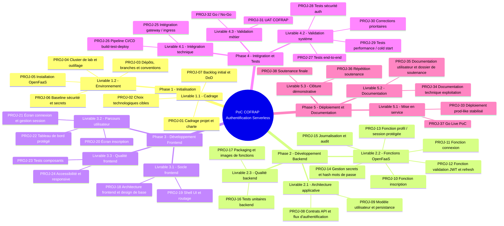
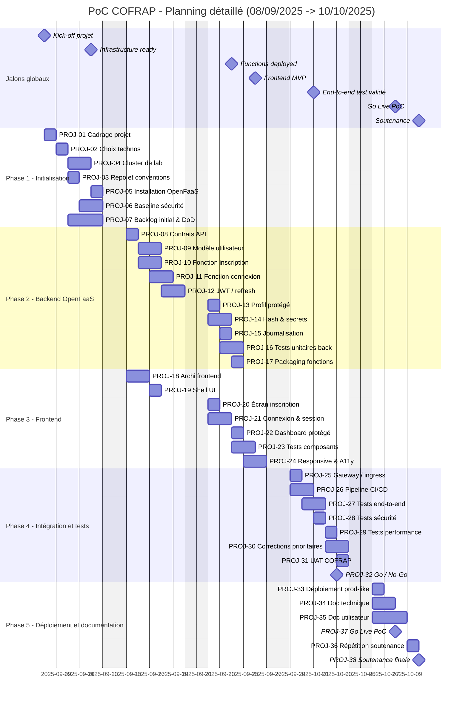
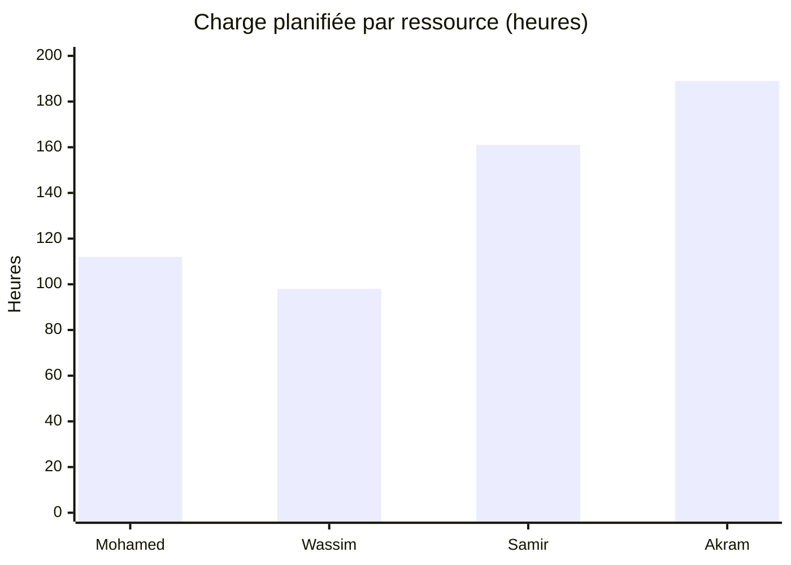
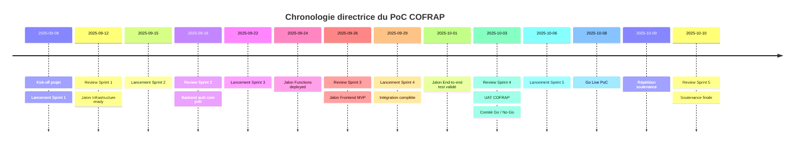
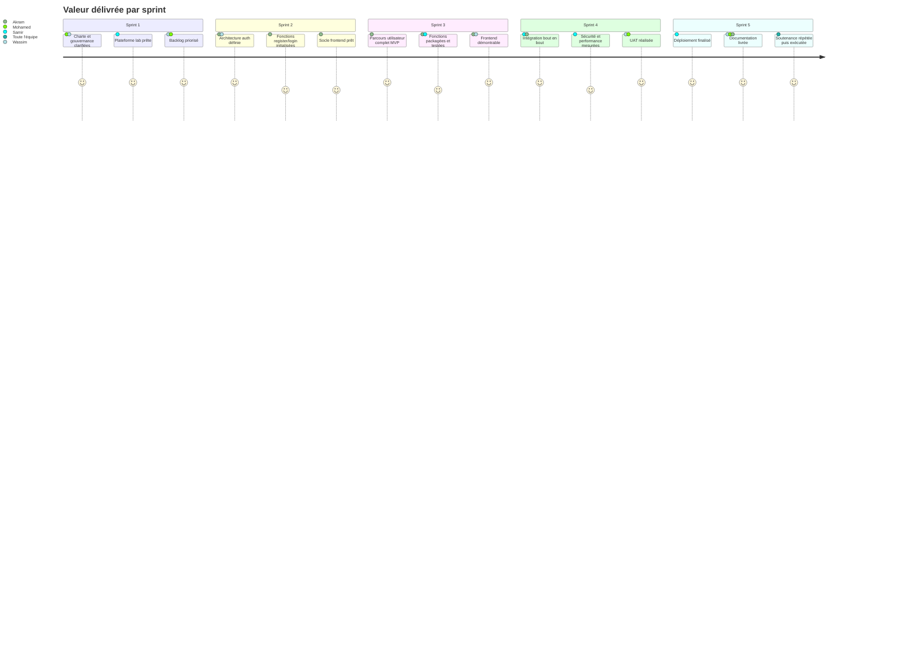
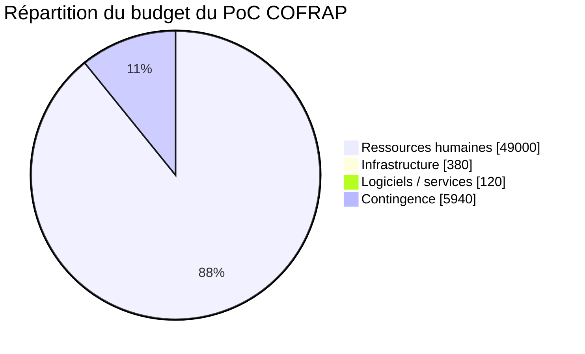
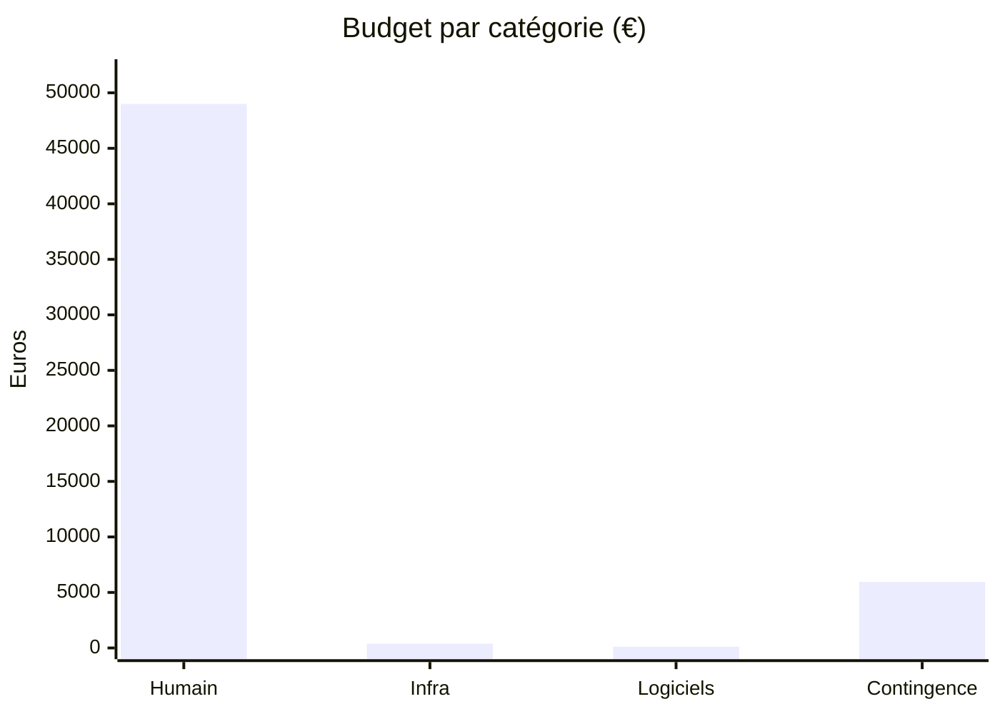

# Document d'organisation du projet

## PoC COFRAP - Authentification Serverless sur Kubernetes / OpenFaaS

**Projet :** PoC COFRAP Serverless Authentication on Kubernetes/OpenFaaS  
**Durée :** 5 semaines  
**Date de lancement :** 08/09/2025  
**Date de soutenance :** 10/10/2025  
**Cadence :** 5 sprints de 1 semaine  
**Référentiels mobilisés :** PMBOK 7 / PMBOK domaines Scope-Schedule-Cost, PRINCE2 7, Scrum  

| Membre | Rôle projet | Localisation | Fuseau | Positionnement budgétaire |
|---|---|---:|---:|---:|
| Mohamed CHAHOUR | Scrum Master | France | UTC+1 | Senior pilotage |
| Wassim LOMRI | Product Owner | France | UTC+1 | Confirmé pilotage métier |
| Samir FOUL | DevOps | Algérie | UTC+1 | Confirmé plateforme |
| Akram KALAMI | Lead Developer | Maroc | UTC+1 | Senior développement |

---

## 1. Finalité du document

Ce document constitue le **document d'organisation du projet** pour le PoC d'authentification serverless de COFRAP.  
Il est construit pour répondre au **niveau 3 de la compétence C1**, c'est-à-dire au niveau d'exigence le plus élevé :

- découpage complet du projet en activités et livrables ;
- enchaînement détaillé des tâches avec dépendances explicites ;
- affectation précise des ressources ;
- planification datée avec jalons, sprints et chemin critique ;
- budgétisation globale et par ressource ;
- mécanismes de pilotage, de contrôle et d'anticipation ;
- traçabilité méthodologique alignée avec **PMBOK** et **PRINCE2**.

Le document sert de **baseline projet** pour la maîtrise du périmètre, des délais, des coûts et des responsabilités.

---

## 2. Contexte et objectif du PoC

COFRAP souhaite valider la faisabilité d'une **architecture d'authentification serverless** reposant sur :

- **Kubernetes** pour l'orchestration ;
- **OpenFaaS** pour l'exécution serverless ;
- un **backend d'authentification** sous forme de fonctions ;
- un **frontend web** consommant les fonctions ;
- une chaîne CI/CD, des tests, une documentation et un déploiement démontrable.

L'objectif du PoC n'est pas de livrer une usine logicielle complète, mais de démontrer de manière crédible que :

1. l'authentification peut être implémentée sous forme de fonctions OpenFaaS ;
2. l'intégration Kubernetes/OpenFaaS est exploitable dans un contexte COFRAP ;
3. les exigences minimales de sécurité, traçabilité, exploitabilité et démonstration sont tenues ;
4. le dispositif peut être présenté à la soutenance comme un **prototype gouverné, planifié et budgété**.

---

## 3. Cadre méthodologique retenu

### 3.1 Référence PMBOK

Le pilotage mobilise plusieurs concepts structurants du PMBOK :

- **WBS / Work Breakdown Structure** (chapitre gestion du périmètre) pour découper le projet jusqu'au niveau des tâches atomiques ;
- **PDM / Precedence Diagramming Method** (gestion des délais) pour formaliser les dépendances ;
- **Schedule Baseline** pour verrouiller la trajectoire de délai ;
- **Cost Baseline** pour verrouiller la trajectoire budgétaire ;
- **Earned Value Management** (gestion des coûts) pour suivre coût, valeur acquise et performance ;
- **Stakeholder Register** (gestion des parties prenantes) pour cadrer les besoins de décision et de validation.

### 3.2 Référence PRINCE2

L'organisation du projet reprend des principes PRINCE2 :

- **management par séquences** : ici, les 5 sprints jouent le rôle de mini-stages ;
- **management par exception** : tolérances de délai et de charge définies par sprint ;
- **focalisation produit** : chaque livrable est relié à une sortie démontrable ;
- **rôles et responsabilités définis** : via le RACI et la gouvernance projet ;
- **apprentissage par retour d'expérience** : Sprint Review et rétrospective chaque semaine.

### 3.3 Référence Scrum

L'exécution opérationnelle suit Scrum :

- Sprint Planning hebdomadaire ;
- Daily de 15 minutes ;
- Sprint Review tous les vendredis ;
- Rétrospective de sprint ;
- backlog priorisé par le Product Owner ;
- animation et levée des impediments par le Scrum Master.

---

## 4. Registre des parties prenantes (Stakeholder Register)

| Partie prenante | Type | Attente principale | Niveau d'influence | Modalité de pilotage |
|---|---|---|---|---|
| COFRAP - sponsor pédagogique / commanditaire | Externe | Validation de la valeur du PoC | Très fort | Revue des jalons, arbitrages périmètre |
| Jury / évaluateurs | Externe | Cohérence méthodologique et résultats démontrables | Fort | Soutenance, livrables formels |
| Wassim LOMRI | Interne / PO | Priorisation valeur métier et arbitrage backlog | Très fort | Comité hebdo, validation incréments |
| Mohamed CHAHOUR | Interne / SM | Maîtrise délai, coordination, risques | Fort | Suivi quotidien, reporting sprint |
| Samir FOUL | Interne / DevOps | Disponibilité plateforme, CI/CD, déploiement | Fort | Stand-up, revue technique |
| Akram KALAMI | Interne / Lead Dev | Qualité logicielle et cohérence technique | Très fort | Revue de code, décisions techniques |
| Utilisateurs démonstrateurs COFRAP | Externe | Parcours de connexion lisible et fiable | Moyen | UAT, démonstration Sprint 4-5 |

---

## 5. Hypothèses d'organisation

1. Le projet dure **25 jours ouvrés** effectifs.
2. L'équipe travaille dans le même fuseau **UTC+1**, ce qui réduit le risque de synchronisation.
3. Les briques majeures sont basées sur des technologies open source.
4. Le cluster et l'environnement de démonstration sont de type **lab / prod-like**, pas production critique.
5. Les sprints sont **non chevauchants** et se terminent chaque vendredi par une review.
6. La soutenance du **10/10/2025** est considérée comme un **jalon contractuel non compressible**.
7. Les exigences de sécurité du PoC incluent a minima : gestion des secrets, hash de mots de passe, JWT, journalisation, tests de non-régression, durcissement minimum d'exposition.

---

## 6. Découpage du projet en actions à entreprendre / activités

## 6.1 Structure WBS retenue

Le découpage ci-dessous suit un principe **Phase -> Livrable -> Tâche atomique**, soit un **WBS niveau 3** au sens PMBOK.

## 6.2 Diagramme WBS (Mermaid)

## 6.3 WBS détaillé niveau 3

| Phase | Livrable | ID tâche | Tâche atomique | Résultat attendu |
|---|---|---|---|---|
| Phase 1 | 1.1 Cadrage | PROJ-01 | Cadrer le projet, la charte et les objectifs | Charte projet validée |
| Phase 1 | 1.1 Cadrage | PROJ-02 | Choisir les technologies cibles | Décisions techniques actées |
| Phase 1 | 1.2 Environnement | PROJ-03 | Initialiser dépôts, branches, conventions | Repo opérationnel |
| Phase 1 | 1.2 Environnement | PROJ-04 | Préparer cluster de lab et outillage | Cluster accessible |
| Phase 1 | 1.2 Environnement | PROJ-05 | Installer OpenFaaS | OpenFaaS disponible |
| Phase 1 | 1.2 Environnement | PROJ-06 | Mettre en place secrets et baseline sécurité | Socle sécurisé minimal |
| Phase 1 | 1.1 Cadrage | PROJ-07 | Construire backlog initial et Definition of Done | Backlog priorisé |
| Phase 2 | 2.1 Architecture | PROJ-08 | Définir contrats API et flux d'authentification | Spécification API |
| Phase 2 | 2.1 Architecture | PROJ-09 | Définir modèle utilisateur et persistance | Schéma technique validé |
| Phase 2 | 2.2 Fonctions | PROJ-10 | Développer fonction d'inscription | Fonction register livrée |
| Phase 2 | 2.2 Fonctions | PROJ-11 | Développer fonction de connexion | Fonction login livrée |
| Phase 2 | 2.2 Fonctions | PROJ-12 | Développer validation JWT et refresh | Gestion token opérationnelle |
| Phase 2 | 2.2 Fonctions | PROJ-13 | Développer accès profil / session protégée | Endpoint protégé |
| Phase 2 | 2.2 Fonctions | PROJ-14 | Intégrer hash, secrets et variables sécurisées | Secrets industrialisés |
| Phase 2 | 2.2 Fonctions | PROJ-15 | Mettre en place logs et audit | Traçabilité disponible |
| Phase 2 | 2.3 Qualité | PROJ-16 | Écrire tests unitaires backend | Couverture minimale acquise |
| Phase 2 | 2.3 Qualité | PROJ-17 | Packager fonctions et images | Artifacts versionnés |
| Phase 3 | 3.1 Socle frontend | PROJ-18 | Définir architecture frontend et style guide minimal | Structure frontend prête |
| Phase 3 | 3.1 Socle frontend | PROJ-19 | Construire shell UI et routage | Navigation de base disponible |
| Phase 3 | 3.2 Parcours | PROJ-20 | Développer écran inscription | Parcours d'inscription complet |
| Phase 3 | 3.2 Parcours | PROJ-21 | Développer écran connexion et session | Connexion côté client opérationnelle |
| Phase 3 | 3.2 Parcours | PROJ-22 | Développer tableau de bord protégé | Zone authentifiée visible |
| Phase 3 | 3.3 Qualité | PROJ-23 | Écrire tests composants frontend | Non-régression UI minimale |
| Phase 3 | 3.3 Qualité | PROJ-24 | Corriger accessibilité et responsive | UI démontrable multi-format |
| Phase 4 | 4.1 Intégration | PROJ-25 | Intégrer gateway / ingress / routage | Chaîne frontend-backend exposée |
| Phase 4 | 4.1 Intégration | PROJ-26 | Construire pipeline CI/CD | Déploiement automatisé |
| Phase 4 | 4.2 Validation | PROJ-27 | Exécuter tests end-to-end | Parcours complet validé |
| Phase 4 | 4.2 Validation | PROJ-28 | Exécuter tests sécurité auth | Risques majeurs couverts |
| Phase 4 | 4.2 Validation | PROJ-29 | Exécuter tests performance / cold start | Comportement serverless mesuré |
| Phase 4 | 4.2 Validation | PROJ-30 | Corriger anomalies prioritaires | Version stabilisée |
| Phase 4 | 4.3 Validation métier | PROJ-31 | Réaliser UAT COFRAP | Validation d'usage obtenue |
| Phase 4 | 4.3 Validation métier | PROJ-32 | Tenir comité Go / No-Go | Décision de déploiement |
| Phase 5 | 5.1 Mise en service | PROJ-33 | Déployer version prod-like stabilisée | Environnement de démo final |
| Phase 5 | 5.2 Documentation | PROJ-34 | Rédiger documentation technique exploitation | Runbook et architecture prêts |
| Phase 5 | 5.2 Documentation | PROJ-35 | Rédiger documentation utilisateur et dossier soutenance | Livrables de soutenance prêts |
| Phase 5 | 5.3 Clôture | PROJ-36 | Répéter la soutenance | Démo fluide et scriptée |
| Phase 5 | 5.1 Mise en service | PROJ-37 | Go Live du PoC | PoC officiellement présenté comme livré |
| Phase 5 | 5.3 Clôture | PROJ-38 | Soutenance finale | Clôture du projet |

---

## 7. Organisation des tâches et enchaînement

## 7.1 Logique d'enchaînement (PDM - Precedence Diagramming Method)

Le réseau des tâches suit les principes suivants :

- les tâches d'initialisation conditionnent la disponibilité technique ;
- le backend et le frontend démarrent en parallèle après le cadrage et le socle de plateforme ;
- l'intégration ne démarre qu'après disponibilité d'un socle fonctionnel des deux côtés ;
- les tests système et les corrections conditionnent le Go / No-Go ;
- la documentation finale et la soutenance dépendent d'une version stabilisée.

Les quatre types de liens PDM utilisés sont :

- **FS - Finish-to-Start** : la tâche suivante démarre quand la précédente est terminée ;
- **SS - Start-to-Start** : la tâche suivante peut commencer en parallèle à partir du démarrage de la précédente ;
- **FF - Finish-to-Finish** : la tâche suivante doit finir en même temps ou après la précédente ;
- **SF - Start-to-Finish** : non retenu ici car peu pertinent pour un PoC court.

## 7.2 Registre détaillé des tâches, dépendances et ressources

| ID | Phase | Sprint | Tâche | Début | Fin | Durée | Dépendances | Type | Ressource(s) affectée(s) | Compétences clés | Charge (h) |
|---|---|---|---|---|---|---:|---|---|---|---|---:|
| PROJ-01 | Initialisation | S1 | Cadrage projet et charte | 08/09 | 08/09 | 1 j | - | - | Mohamed, Wassim | cadrage, gouvernance, objectifs | 8 |
| PROJ-02 | Initialisation | S1 | Choix technologiques cibles | 09/09 | 09/09 | 1 j | PROJ-01 | FS | Akram, Samir, Wassim | architecture, benchmark, décision | 8 |
| PROJ-03 | Initialisation | S1 | Dépôts, branches, conventions | 10/09 | 10/09 | 1 j | PROJ-02 | FS | Akram, Samir | Git, normes de dev | 7 |
| PROJ-04 | Initialisation | S1 | Cluster de lab et outillage | 09/09 | 10/09 | 2 j | PROJ-02 | FS | Samir | Kubernetes, réseau, outillage | 14 |
| PROJ-05 | Initialisation | S1 | Installation OpenFaaS | 11/09 | 11/09 | 1 j | PROJ-04 | FS | Samir | OpenFaaS, Kubernetes | 7 |
| PROJ-06 | Initialisation | S1 | Baseline sécurité et secrets | 11/09 | 12/09 | 2 j | PROJ-04 | SS | Samir, Akram | secrets, sécurité, config | 10 |
| PROJ-07 | Initialisation | S1 | Backlog initial et DoD | 10/09 | 12/09 | 3 j | PROJ-01 | SS | Wassim, Mohamed | backlog, qualité, user stories | 9 |
| PROJ-08 | Backend | S2 | Contrats API et flux d'authentification | 15/09 | 15/09 | 1 j | PROJ-05, PROJ-07 | FS | Akram, Wassim | API design, auth flows | 8 |
| PROJ-09 | Backend | S2 | Modèle utilisateur et persistance | 15/09 | 16/09 | 2 j | PROJ-08 | FS | Akram | modélisation, persistance | 12 |
| PROJ-10 | Backend | S2 | Fonction inscription | 16/09 | 17/09 | 2 j | PROJ-09 | FS | Akram | OpenFaaS, validation, CRUD | 14 |
| PROJ-11 | Backend | S2 | Fonction connexion | 17/09 | 18/09 | 2 j | PROJ-09 | SS | Akram | auth, token, sécurité | 14 |
| PROJ-12 | Backend | S2 | Validation JWT et refresh | 18/09 | 19/09 | 2 j | PROJ-11 | FS | Akram | JWT, refresh token, middleware | 12 |
| PROJ-13 | Backend | S3 | Profil / session protégée | 22/09 | 22/09 | 1 j | PROJ-12 | FS | Akram | routes protégées, autorisation | 7 |
| PROJ-14 | Backend | S3 | Hash, secrets, variables sécurisées | 22/09 | 23/09 | 2 j | PROJ-06, PROJ-10 | FS | Akram, Samir | hash, secrets, secure config | 10 |
| PROJ-15 | Backend | S3 | Journalisation et audit | 23/09 | 23/09 | 1 j | PROJ-13 | FS | Akram, Samir | logs, observabilité, audit | 7 |
| PROJ-16 | Backend | S3 | Tests unitaires backend | 23/09 | 24/09 | 2 j | PROJ-10, PROJ-11, PROJ-12 | FS | Akram | tests, assertions, couverture | 12 |
| PROJ-17 | Backend | S3 | Packaging et images de fonctions | 24/09 | 24/09 | 1 j | PROJ-16 | FS | Samir, Akram | build, images, registry | 7 |
| PROJ-18 | Frontend | S2 | Architecture frontend et design de base | 15/09 | 16/09 | 2 j | PROJ-03, PROJ-07 | FS | Akram, Wassim | UX, architecture UI | 10 |
| PROJ-19 | Frontend | S2 | Shell UI et routage | 17/09 | 17/09 | 1 j | PROJ-18 | FS | Akram | routing, structure UI | 7 |
| PROJ-20 | Frontend | S3 | Écran inscription | 22/09 | 22/09 | 1 j | PROJ-19, PROJ-10 | FS | Akram | formulaires, validation | 7 |
| PROJ-21 | Frontend | S3 | Écran connexion et session | 22/09 | 23/09 | 2 j | PROJ-19, PROJ-11 | FS | Akram | login flow, session client | 10 |
| PROJ-22 | Frontend | S3 | Tableau de bord protégé | 24/09 | 24/09 | 1 j | PROJ-21, PROJ-13 | FS | Akram | route guard, UI protégée | 7 |
| PROJ-23 | Frontend | S3 | Tests composants | 24/09 | 25/09 | 2 j | PROJ-20, PROJ-21, PROJ-22 | FS | Akram | tests UI, composants | 10 |
| PROJ-24 | Frontend | S3 | Accessibilité et responsive | 25/09 | 26/09 | 2 j | PROJ-22 | FF | Akram, Wassim | accessibilité, responsive | 8 |
| PROJ-25 | Intégration | S4 | Intégration gateway / ingress | 29/09 | 29/09 | 1 j | PROJ-17, PROJ-22 | FS | Samir, Akram | ingress, routage, intégration | 8 |
| PROJ-26 | Intégration | S4 | Pipeline CI/CD build-test-deploy | 29/09 | 30/09 | 2 j | PROJ-17 | FS | Samir | CI/CD, qualité, release | 12 |
| PROJ-27 | Intégration | S4 | Tests end-to-end | 30/09 | 01/10 | 2 j | PROJ-25 | FS | Akram, Wassim | parcours métier, tests E2E | 12 |
| PROJ-28 | Intégration | S4 | Tests sécurité auth | 01/10 | 01/10 | 1 j | PROJ-25, PROJ-14 | FS | Samir, Akram | sécurité auth, secret scan | 8 |
| PROJ-29 | Intégration | S4 | Tests performance / cold start | 02/10 | 02/10 | 1 j | PROJ-25 | FS | Samir | performance, mesure, serverless | 7 |
| PROJ-30 | Intégration | S4 | Corrections prioritaires | 02/10 | 03/10 | 2 j | PROJ-27, PROJ-28, PROJ-29 | FS | Akram, Samir | debug, hardening, stabilisation | 14 |
| PROJ-31 | Intégration | S4 | UAT COFRAP | 03/10 | 03/10 | 1 j | PROJ-30 | FS | Wassim, Mohamed | validation, démonstration | 6 |
| PROJ-32 | Intégration | S4 | Comité Go / No-Go | 03/10 | 03/10 | 0,5 j | PROJ-31 | FS | Mohamed, Wassim, Samir, Akram | décision, arbitrage | 4 |
| PROJ-33 | Déploiement | S5 | Déploiement prod-like stabilisé | 06/10 | 06/10 | 1 j | PROJ-32 | FS | Samir | déploiement, configuration | 7 |
| PROJ-34 | Déploiement | S5 | Documentation technique exploitation | 06/10 | 07/10 | 2 j | PROJ-33 | SS | Samir, Akram | runbook, architecture, ops | 10 |
| PROJ-35 | Déploiement | S5 | Documentation utilisateur et dossier soutenance | 06/10 | 08/10 | 3 j | PROJ-31 | SS | Wassim, Mohamed | synthèse, support, pédagogie | 12 |
| PROJ-36 | Déploiement | S5 | Répétition soutenance | 09/10 | 09/10 | 1 j | PROJ-34, PROJ-35 | FS | Toute l'équipe | démonstration, argumentaire | 7 |
| PROJ-37 | Déploiement | S5 | Go Live du PoC | 08/10 | 08/10 | 0,5 j | PROJ-33 | FS | Samir, Mohamed | mise en service, communication | 4 |
| PROJ-38 | Déploiement | S5 | Soutenance finale | 10/10 | 10/10 | 1 j | PROJ-36 | FS | Toute l'équipe | présentation, défense du projet | 7 |

## 7.3 Diagramme de Gantt détaillé

## 7.4 Analyse du chemin critique

Le **chemin critique** est la séquence de tâches ne disposant pas ou très peu de marge, c'est-à-dire celles dont tout retard se répercute directement sur la date de soutenance.

### Chemin critique principal retenu

1. PROJ-01 - Cadrage projet  
2. PROJ-02 - Choix technologiques  
3. PROJ-04 - Cluster de lab  
4. PROJ-05 - Installation OpenFaaS  
5. PROJ-08 - Contrats API  
6. PROJ-09 - Modèle utilisateur  
7. PROJ-10 - Fonction inscription  
8. PROJ-11 - Fonction connexion  
9. PROJ-12 - JWT / refresh  
10. PROJ-13 - Profil protégé  
11. PROJ-17 - Packaging fonctions  
12. PROJ-25 - Intégration gateway / ingress  
13. PROJ-27 - Tests end-to-end  
14. PROJ-30 - Corrections prioritaires  
15. PROJ-31 - UAT COFRAP  
16. PROJ-32 - Go / No-Go  
17. PROJ-33 - Déploiement prod-like  
18. PROJ-34 - Documentation technique  
19. PROJ-36 - Répétition soutenance  
20. PROJ-38 - Soutenance finale

### Tâches à marge faible

- PROJ-14 Hash & secrets : marge faible car conditionne la sécurité des tests.
- PROJ-21 Connexion & session : marge faible car conditionne le test complet du parcours.
- PROJ-35 Documentation utilisateur : marge faible car nécessaire à la soutenance.

### Tâches à marge plus confortable

- PROJ-03 Repo et conventions ;
- PROJ-07 Backlog initial ;
- PROJ-23 Tests composants ;
- PROJ-24 Accessibilité et responsive ;
- PROJ-29 Tests performance.

### Conséquence managériale

Le Scrum Master doit surveiller en priorité les tâches du chemin critique lors des daily et du suivi d'avancement. Toute dérive supérieure à :

- **0,5 jour** sur une tâche critique ;
- **1 jour** sur un lot non critique ;

déclenche un arbitrage immédiat avec le Product Owner et le Lead Developer.

## 7.5 Registre des dépendances significatives

| Dépendance | Justification | Risque si non tenue | Action de maîtrise |
|---|---|---|---|
| PROJ-02 -> PROJ-04 | Les choix technos conditionnent le setup cluster | Rework infra | Décision figée en fin J2 |
| PROJ-04 -> PROJ-05 | OpenFaaS nécessite cluster accessible | Blocage backend | Check-list infra préalable |
| PROJ-08 -> PROJ-09 | Le modèle dépend des contrats API | Dérive de structure | Validation conjointe PO/Lead Dev |
| PROJ-09 -> PROJ-10/11 | Les fonctions dépendent du modèle de persistance | Recode backend | Spécification figée Sprint 2 |
| PROJ-11 -> PROJ-12 | Les tokens dépendent du login | Auth incomplète | Démo intermédiaire backend |
| PROJ-10/11 -> PROJ-20/21 | Le frontend consomme les fonctions | Blocage UI | Mock ou stub si retard |
| PROJ-17 + PROJ-22 -> PROJ-25 | L'intégration requiert backend packagé et frontend prêt | Intégration impossible | Point de contrôle fin Sprint 3 |
| PROJ-25 -> PROJ-27 | E2E impossible sans routage complet | Tests décalés | Préparer scripts à l'avance |
| PROJ-27/28/29 -> PROJ-30 | Les corrections dépendent des résultats de validation | Stabilisation tardive | Buffer Sprint 4 |
| PROJ-31 -> PROJ-32 | La décision Go/No-Go s'appuie sur l'UAT | Mauvaise décision | PV de validation formel |
| PROJ-32 -> PROJ-33 | Le déploiement final dépend de la décision de passage | Risque de version non validée | Go/No-Go documenté |
| PROJ-34/35 -> PROJ-36 | Répétition impossible sans support définitif | Soutenance fragile | Gel documentaire J-1 |

---

## 8. Ressources à affecter pour chacune des tâches

## 8.1 Profils, compétences et disponibilité cible

| Ressource | Rôle | Compétences dominantes | Disponibilité cible | Taux journalier retenu |
|---|---|---|---:|---:|
| Mohamed CHAHOUR | Scrum Master | pilotage, facilitation, planification, gestion des risques, coordination | 16 j.h | 650 € / j |
| Wassim LOMRI | Product Owner | cadrage métier, backlog, priorisation, validation, support soutenance | 14 j.h | 600 € / j |
| Samir FOUL | DevOps | Kubernetes, OpenFaaS, CI/CD, sécurité plateforme, déploiement | 23 j.h | 550 € / j |
| Akram KALAMI | Lead Developer | architecture, backend functions, frontend, tests, intégration | 27 j.h | 650 € / j |

> Hypothèse de conversion : **1 jour-homme = 7 heures productives**.

## 8.2 Synthèse de charge par ressource

| Ressource | Charge (h) | Charge (j.h) | Taux de mobilisation sur 25 jours | Commentaire |
|---|---:|---:|---:|---|
| Mohamed CHAHOUR | 112 h | 16 j.h | 64 % | Pilotage et soutenance fortement mobilisateurs |
| Wassim LOMRI | 98 h | 14 j.h | 56 % | Priorisation, UAT et documentation |
| Samir FOUL | 161 h | 23 j.h | 92 % | Ressource critique plateforme / déploiement |
| Akram KALAMI | 189 h | 27 j.h | 108 % | Ressource la plus chargée, nécessite vigilance |

### Lecture managériale

- **Samir FOUL** est la ressource critique côté plateforme ;
- **Akram KALAMI** dépasse légèrement la capacité nominale, ce qui justifie :
  - l'anticipation des tests ;
  - la simplification des choix UI non essentiels ;
  - la priorisation stricte des anomalies Sprint 4 ;
- **Mohamed** et **Wassim** portent davantage les tâches transverses, validations et livrables de soutenance.

## 8.3 Histogramme d'allocation des ressources

## 8.4 Matrice RACI complète

**Légende :**  
**R** = Responsible (réalise)  
**A** = Accountable (rend compte / arbitre)  
**C** = Consulted (consulté)  
**I** = Informed (informé)

| ID | Tâche | Mohamed (SM) | Wassim (PO) | Samir (DevOps) | Akram (Lead Dev) |
|---|---|---|---|---|---|
| PROJ-01 | Cadrage projet et charte | R | A | I | C |
| PROJ-02 | Choix technologiques cibles | C | C | R | A |
| PROJ-03 | Dépôts, branches, conventions | I | I | R | A |
| PROJ-04 | Cluster de lab et outillage | I | I | A/R | C |
| PROJ-05 | Installation OpenFaaS | I | I | A/R | C |
| PROJ-06 | Baseline sécurité et secrets | I | I | R | A |
| PROJ-07 | Backlog initial et DoD | R | A | I | C |
| PROJ-08 | Contrats API et flux d'authentification | I | C | I | A/R |
| PROJ-09 | Modèle utilisateur et persistance | I | I | C | A/R |
| PROJ-10 | Fonction inscription | I | I | C | A/R |
| PROJ-11 | Fonction connexion | I | I | C | A/R |
| PROJ-12 | Validation JWT et refresh | I | I | C | A/R |
| PROJ-13 | Profil / session protégée | I | I | C | A/R |
| PROJ-14 | Hash, secrets, variables sécurisées | I | I | R | A |
| PROJ-15 | Journalisation et audit | I | I | R | A |
| PROJ-16 | Tests unitaires backend | I | I | C | A/R |
| PROJ-17 | Packaging et images de fonctions | I | I | R | A |
| PROJ-18 | Architecture frontend et design de base | I | C | I | A/R |
| PROJ-19 | Shell UI et routage | I | I | I | A/R |
| PROJ-20 | Écran inscription | I | C | I | A/R |
| PROJ-21 | Écran connexion et session | I | C | I | A/R |
| PROJ-22 | Tableau de bord protégé | I | C | I | A/R |
| PROJ-23 | Tests composants | I | I | I | A/R |
| PROJ-24 | Accessibilité et responsive | I | C | I | A/R |
| PROJ-25 | Intégration gateway / ingress | I | I | R | A |
| PROJ-26 | Pipeline CI/CD build-test-deploy | I | I | A/R | C |
| PROJ-27 | Tests end-to-end | I | C | I | A/R |
| PROJ-28 | Tests sécurité auth | I | I | R | A |
| PROJ-29 | Tests performance / cold start | I | I | A/R | C |
| PROJ-30 | Corrections prioritaires | I | C | R | A |
| PROJ-31 | UAT COFRAP | R | A | I | C |
| PROJ-32 | Comité Go / No-Go | R | A | C | C |
| PROJ-33 | Déploiement prod-like stabilisé | I | I | A/R | C |
| PROJ-34 | Documentation technique exploitation | I | I | R | A |
| PROJ-35 | Documentation utilisateur et dossier soutenance | R | A | I | C |
| PROJ-36 | Répétition soutenance | R | A | C | C |
| PROJ-37 | Go Live du PoC | A | I | R | C |
| PROJ-38 | Soutenance finale | R | A | C | C |

## 8.5 Lecture de la matrice RACI

La matrice montre :

- une **responsabilité d'exécution concentrée** sur Akram pour les développements et sur Samir pour la plateforme ;
- une **redevabilité métier** fortement portée par Wassim ;
- une **redevabilité de coordination** portée par Mohamed sur les validations et la soutenance ;
- un modèle adapté à un **PoC court**, avec peu d'intermédiaires et des responsabilités claires.

---

## 9. Objectifs délais : dates de début, lancement, jalons

## 9.1 Cadence des sprints

| Sprint | Période | Objectif principal | Review | Rétrospective |
|---|---|---|---|---|
| Sprint 1 | 08/09/2025 -> 12/09/2025 | Cadrage, environnement, OpenFaaS, backlog | 12/09/2025 | 12/09/2025 |
| Sprint 2 | 15/09/2025 -> 19/09/2025 | Architecture auth + premières fonctions backend + socle frontend | 19/09/2025 | 19/09/2025 |
| Sprint 3 | 22/09/2025 -> 26/09/2025 | Fonctions backend complètes + frontend MVP | 26/09/2025 | 26/09/2025 |
| Sprint 4 | 29/09/2025 -> 03/10/2025 | Intégration, tests, corrections, UAT | 03/10/2025 | 03/10/2025 |
| Sprint 5 | 06/10/2025 -> 10/10/2025 | Déploiement final, documentation, répétition, soutenance | 10/10/2025 | 10/10/2025 |

## 9.2 Jalons majeurs

| Jalon | Date | Critère d'atteinte |
|---|---|---|
| Kick-off projet | 08/09/2025 | Charte et organisation lancées |
| Infrastructure ready | 12/09/2025 | Cluster + OpenFaaS + secrets disponibles |
| Backend auth core prêt | 19/09/2025 | register/login/JWT disponibles |
| Functions deployed | 24/09/2025 | images packagées et déployables |
| Frontend MVP | 26/09/2025 | écrans inscription, connexion, dashboard |
| Intégration complète | 29/09/2025 | frontend-backend routés via gateway |
| End-to-end test validé | 01/10/2025 | scénario utilisateur complet vert |
| UAT COFRAP | 03/10/2025 | usage validé / anomalies arbitrées |
| Go Live PoC | 08/10/2025 | version de démonstration finalisée |
| Soutenance | 10/10/2025 | présentation finale réalisée |

## 9.3 Chronologie directrice (Mermaid timeline)

## 9.4 Vision par sprint (Mermaid journey)

## 9.5 Objectif de délai et tolérances

| Élément | Objectif | Tolérance acceptable | Action si dépassement |
|---|---|---|---|
| Tâche critique | Respect date au jour près | +0,5 j | Arbitrage immédiat |
| Sprint | Livraison des items engagés | -10 % de périmètre max | Repriorisation PO |
| Revue de sprint | Vendredi | 0 j | Non négociable |
| Soutenance | 10/10/2025 | 0 j | Jalon fixe |

---

## 10. Objectifs coûts : budget alloué globalement et par ressource

## 10.1 Hypothèses budgétaires

Le budget prend en compte :

- les **coûts humains** calculés en jours-homme ;
- les **coûts d'infrastructure** nécessaires au lab et à la démonstration ;
- les **coûts logiciels / licences** non couverts par les solutions open source ;
- une **réserve pour aléas** de **12 %** ;
- un pilotage par **EVM - Earned Value Management**.

## 10.2 Budget humain détaillé

| Ressource | Rôle | Jours-homme | Taux journalier | Coût total |
|---|---|---:|---:|---:|
| Mohamed CHAHOUR | Scrum Master | 16 j.h | 650 € | 10 400 € |
| Wassim LOMRI | Product Owner | 14 j.h | 600 € | 8 400 € |
| Samir FOUL | DevOps | 23 j.h | 550 € | 12 650 € |
| Akram KALAMI | Lead Developer | 27 j.h | 650 € | 17 550 € |
| **Sous-total humain** |  | **80 j.h** |  | **49 000 €** |

### Lecture budgétaire

- le coût dominant est le **coût humain**, logique pour un PoC d'ingénierie ;
- le **Lead Developer** et le **DevOps** concentrent la majorité du coût car ils portent les tâches techniques critiques ;
- la densité du budget humain confirme que la réussite du PoC dépend davantage de l'expertise que du matériel.

## 10.3 Budget infrastructure détaillé

| Poste infrastructure | Hypothèse | Coût estimé |
|---|---|---:|
| 3 VM de lab / nœuds Kubernetes | 3 x 49 € / mois x 1,25 mois | 184 € |
| VM runner / bastion CI | 35 € / mois x 1,25 mois | 44 € |
| IP publique / équilibrage / exposition | forfait 5 semaines | 32 € |
| Stockage persistant / sauvegarde | forfait 5 semaines | 28 € |
| Nom de domaine de démo | 1 an | 14 € |
| Certificats TLS | Let's Encrypt | 0 € |
| Observabilité / traces / service annexe | enveloppe de tests | 78 € |
| **Sous-total infrastructure** |  | **380 €** |

## 10.4 Budget logiciels et services

| Poste logiciel / service | Nature | Coût |
|---|---|---:|
| Kubernetes | Open source | 0 € |
| OpenFaaS CE | Open source | 0 € |
| Git / GitHub / GitLab selon environnement académique | Outillage standard | 0 € |
| Prometheus / Grafana | Open source | 0 € |
| Postman / outils de test open source | Open source / free tier | 0 € |
| Outil collaboratif ponctuel (board, design, partage) | Enveloppe de confort | 120 € |
| **Sous-total logiciels / services** |  | **120 €** |

## 10.5 Réserve de contingence

Réserve retenue : **12 %** sur les coûts directs (humains + infrastructure + logiciels).

| Base de calcul | Montant |
|---|---:|
| Coût humain | 49 000 € |
| Coût infrastructure | 380 € |
| Coût logiciels / services | 120 € |
| **Total direct** | **49 500 €** |
| **Contingence 12 %** | **5 940 €** |

## 10.6 Synthèse budgétaire globale

| Catégorie | Montant | Part du total |
|---|---:|---:|
| Ressources humaines | 49 000 € | 88,38 % |
| Infrastructure | 380 € | 0,69 % |
| Logiciels / services | 120 € | 0,22 % |
| Contingence | 5 940 € | 10,71 % |
| **Grand total budget projet** | **55 440 €** | **100 %** |

## 10.7 Diagramme budget - répartition par catégorie

## 10.8 Diagramme budget - comparaison des catégories

## 10.9 Suivi des coûts par Earned Value Management (EVM)

### Baselines EVM

- **BAC (Budget at Completion)** = 55 440 €
- **PV (Planned Value)** = valeur planifiée cumulée à date
- **EV (Earned Value)** = valeur acquise réellement produite
- **AC (Actual Cost)** = coût réellement consommé

### Indicateurs suivis

| Indicateur | Formule | Interprétation |
|---|---|---|
| CV - Cost Variance | EV - AC | > 0 = sous budget ; < 0 = surcoût |
| SV - Schedule Variance | EV - PV | > 0 = en avance ; < 0 = en retard |
| CPI - Cost Performance Index | EV / AC | > 1 = performance coût favorable |
| SPI - Schedule Performance Index | EV / PV | > 1 = performance délai favorable |
| EAC - Estimate at Completion | BAC / CPI | prévision du coût final |
| ETC - Estimate to Complete | EAC - AC | reste à dépenser |

### Règles de pilotage EVM

| Seuil | Action |
|---|---|
| CPI < 0,95 | Analyse de surcoût et gel des ajouts de périmètre |
| SPI < 0,95 | Arbitrage immédiat du backlog sprint suivant |
| CV < -1 500 € | Révision des allocations et utilisation de contingence |
| SV < -2 jours équivalent | Escalade sponsor / priorisation minimale viable |

### Répartition planifiée de la valeur par sprint

| Sprint | % valeur planifiée | PV cumulé sur BAC |
|---|---:|---:|
| Sprint 1 | 15 % | 8 316 € |
| Sprint 2 | 20 % | 19 404 € |
| Sprint 3 | 25 % | 33 264 € |
| Sprint 4 | 25 % | 47 124 € |
| Sprint 5 | 15 % | 55 440 € |

Cette répartition est cohérente avec un projet où la valeur maximale est acquise au moment où le backend, le frontend et l'intégration bout-en-bout deviennent démontrables.

---

## 11. Gouvernance de pilotage

## 11.1 Instances de gouvernance

| Instance | Fréquence | Participants | Objet |
|---|---|---|---|
| Daily Scrum | Quotidien | Toute l'équipe | Synchronisation, blocages, focus 24 h |
| Sprint Planning | Hebdomadaire | Toute l'équipe | Engagement de sprint |
| Sprint Review | Hebdomadaire | Équipe + parties prenantes utiles | Démonstration, validation |
| Rétrospective | Hebdomadaire | Équipe interne | Amélioration continue |
| Comité Go / No-Go | Fin Sprint 4 | Toute l'équipe + sponsor si requis | Décision de passage en mise en service |
| Répétition soutenance | S5 | Toute l'équipe | Mise au point finale |

## 11.2 Plan de communication projet

| Support | Émetteur | Destinataires | Fréquence | Contenu |
|---|---|---|---|---|
| Compte-rendu daily | Mohamed | Équipe | Quotidien | avancement, blocages, décisions |
| Burndown / tableau sprint | Mohamed | Équipe, PO | Quotidien | statut des tâches |
| Sprint backlog mis à jour | Wassim | Équipe | Hebdomadaire | priorités et reste à faire |
| Revue démonstrative | Akram / Samir | PO, sponsor | Hebdomadaire | incrément visible |
| Rapport jalon | Mohamed | Sponsor / jury si requis | aux jalons | délai, coût, risque |
| Dossier de soutenance | Wassim | Jury | fin projet | synthèse finale |

## 11.3 Gestion des décisions

| Domaine | Décideur principal | Consultation requise |
|---|---|---|
| Priorisation backlog | Product Owner | Scrum Master, Lead Dev |
| Choix architecture / stack | Lead Developer | DevOps, PO |
| Décision plateforme / déploiement | DevOps | Lead Dev, SM |
| Arbitrage délai / périmètre | Scrum Master + Product Owner | Toute l'équipe |
| Go / No-Go | Product Owner + Scrum Master | DevOps, Lead Dev |

---

## 12. Gestion des risques et mesures préventives

## 12.1 Registre des risques principaux

| ID risque | Risque | Probabilité | Impact | Criticité | Réponse prévue | Propriétaire |
|---|---|---|---|---|---|---|
| R1 | Retard de mise en place Kubernetes/OpenFaaS | Moyenne | Fort | Élevée | préparer scripts d'installation, environnement de secours | Samir |
| R2 | Sous-estimation de la complexité JWT / refresh | Moyenne | Fort | Élevée | simplifier le périmètre refresh si besoin | Akram |
| R3 | Charge trop élevée sur le Lead Developer | Forte | Fort | Très élevée | prioriser MVP, réduire cosmétique frontend | Mohamed |
| R4 | Problème d'intégration frontend/backend | Moyenne | Fort | Élevée | définir contrats API tôt, mocks, tests E2E rapides | Akram |
| R5 | Difficulté de sécurisation des secrets | Faible | Fort | Moyenne | secret store simple, check-list de sécurité | Samir |
| R6 | Anomalies critiques détectées trop tard | Moyenne | Fort | Élevée | tests dès Sprint 3, buffer Sprint 4 | Mohamed |
| R7 | Documentation retardée au profit du développement | Forte | Moyen | Élevée | documentation en flux, non en fin de projet | Wassim |
| R8 | Démonstration instable le jour J | Moyenne | Très fort | Très élevée | répétition générale + scénario dégradé | Toute l'équipe |
| R9 | Dépassement budgétaire temps passé | Faible | Moyen | Moyenne | suivi EVM hebdo | Mohamed |
| R10 | Changement tardif de besoin métier | Moyenne | Moyen | Moyenne | gel fonctionnel après Sprint 3 | Wassim |

## 12.2 Stratégie de réponse aux risques

- **Éviter** : figer les décisions d'architecture en Sprint 1.
- **Réduire** : tester tôt, documenter tôt, intégrer tôt.
- **Transférer** : non pertinent à cette échelle de PoC.
- **Accepter avec réserve** : écarts mineurs d'esthétique UI, sous réserve de préserver le parcours d'authentification.

## 12.3 Réserve de management et contingence

La contingence de **5 940 €** couvre prioritairement :

1. surconsommation de charge sur Akram ou Samir ;
2. coût additionnel d'environnement de démonstration ;
3. itérations supplémentaires de stabilisation avant soutenance.

---

## 13. Qualité, contrôle et critères d'acceptation

## 13.1 Definition of Done projet

Une tâche est terminée uniquement si :

- son résultat attendu est produit ;
- le code est versionné ;
- les tests associés existent ou sont tracés comme N/A ;
- la documentation minimale est mise à jour ;
- le responsable et l'accountable valident la fermeture.

## 13.2 Critères de qualité minimaux du PoC

| Domaine | Critère |
|---|---|
| Backend | fonctions deployables, logs exploitables, auth cohérente |
| Sécurité | secrets externalisés, mots de passe hashés, routes protégées |
| Frontend | parcours inscription/connexion lisible et stable |
| Intégration | flux bout-en-bout démontrable |
| Déploiement | procédure de déploiement reproductible |
| Documentation | architecture, runbook, support soutenance disponibles |

## 13.3 Quality gates par sprint

| Sprint | Quality gate de sortie |
|---|---|
| S1 | plateforme et backlog prêts |
| S2 | auth core designée et fonctions initiales disponibles |
| S3 | MVP démontrable frontend + backend |
| S4 | tests majeurs passés et UAT réalisée |
| S5 | documentation finalisée, déploiement stable, soutenance répétée |

---

## 14. Contrôle du changement

Toute demande de changement tardive est classée dans l'une des catégories suivantes :

| Catégorie | Exemple | Décision |
|---|---|---|
| Mineure | ajustement libellé UI | intégrée si effort < 2 h |
| Moyenne | ajout d'un champ utilisateur | arbitrage PO + Lead Dev |
| Majeure | changement de mécanisme auth | reportée sauf impact pédagogique impératif |

### Règle de gel

- **Gel d'architecture** : fin Sprint 1  
- **Gel fonctionnel MVP** : fin Sprint 3  
- **Gel de contenu soutenance** : fin journée du 08/10/2025

---

## 15. Suivi opérationnel hebdomadaire

## 15.1 Tableau de bord de pilotage

| KPI | Cible | Seuil d'alerte | Responsable |
|---|---:|---:|---|
| % tâches du sprint terminées | 100 % | < 85 % | Mohamed |
| SPI | >= 1,00 | < 0,95 | Mohamed |
| CPI | >= 1,00 | < 0,95 | Mohamed |
| Défauts critiques ouverts | 0 | > 2 | Akram |
| Disponibilité environnement de démo | >= 95 % | < 90 % | Samir |
| Couverture des scénarios E2E critiques | 100 % | < 80 % | Akram |
| Jalons tenus | 100 % | tout jalon glissant | Mohamed |

## 15.2 Rituel de revue hebdomadaire

Chaque review de sprint couvre systématiquement :

1. rappel de l'objectif de sprint ;
2. démonstration des éléments terminés ;
3. état des écarts vs baseline ;
4. mise à jour des risques ;
5. décision sur le backlog du sprint suivant.

---

## 16. Lecture synthétique par phase

## 16.1 Phase 1 - Initialisation

**But :** sécuriser les décisions fondatrices du projet.  
**Livrables clés :** charte, stack, environnement, backlog.  
**Point de contrôle :** Infrastructure ready le 12/09/2025.

## 16.2 Phase 2 - Développement Backend

**But :** rendre disponible le cœur de l'authentification sous forme de fonctions OpenFaaS.  
**Livrables clés :** register, login, JWT, route protégée, logs, tests, packaging.  
**Point de contrôle :** Functions deployed le 24/09/2025.

## 16.3 Phase 3 - Développement Frontend

**But :** rendre visible et testable le parcours utilisateur d'authentification.  
**Livrables clés :** écrans inscription/connexion, dashboard, tests composants.  
**Point de contrôle :** Frontend MVP le 26/09/2025.

## 16.4 Phase 4 - Intégration et Tests

**But :** prouver le fonctionnement complet et mesurer les risques techniques.  
**Livrables clés :** routage, CI/CD, E2E, sécurité, performance, corrections, UAT.  
**Point de contrôle :** UAT + Go/No-Go le 03/10/2025.

## 16.5 Phase 5 - Déploiement et Documentation

**But :** transformer le prototype en démonstrateur fiable et soutenable.  
**Livrables clés :** déploiement final, documentation, répétition, soutenance.  
**Point de contrôle :** Soutenance le 10/10/2025.

---

## 17. Ce qui démontre explicitement le niveau 3 de la compétence C1

Le présent document atteint le niveau le plus élevé de la compétence C1 car il fournit :

1. un **découpage exhaustif** du projet en 5 phases, livrables et 38 tâches atomiques ;
2. un **enchaînement complet** des tâches avec dépendances, type de lien et chemin critique ;
3. une **affectation nominative des ressources** avec compétences, charges et RACI ;
4. une **planification datée** avec kick-off, sprints, reviews, jalons et soutenance ;
5. une **budgétisation détaillée** par ressource et par catégorie de coût ;
6. un **mécanisme de contrôle** par EVM, tolérances, risques, quality gates et gouvernance ;
7. une articulation cohérente entre **Scrum, PMBOK et PRINCE2**.

Autrement dit, ce document ne se limite pas à lister des tâches : il constitue une **véritable baseline de management de projet**.

---

## 18. Conclusion opérationnelle

Le PoC COFRAP est planifié comme un projet court mais fortement structuré.  
Le succès repose sur trois conditions majeures :

- sécuriser l'environnement dès la première semaine ;
- converger rapidement vers un **MVP authentification démontrable** à la fin de Sprint 3 ;
- préserver la semaine 5 pour la stabilisation, la documentation et la soutenance.

La trajectoire proposée est **réaliste, pilotable et démontrable**. Elle offre à COFRAP une visibilité claire sur :

- **ce qui doit être fait** ;
- **dans quel ordre** ;
- **par qui** ;
- **à quel coût** ;
- **avec quels jalons de décision**.

Ce document peut donc servir de référence officielle pour l'organisation et le suivi du projet sur toute sa durée.
