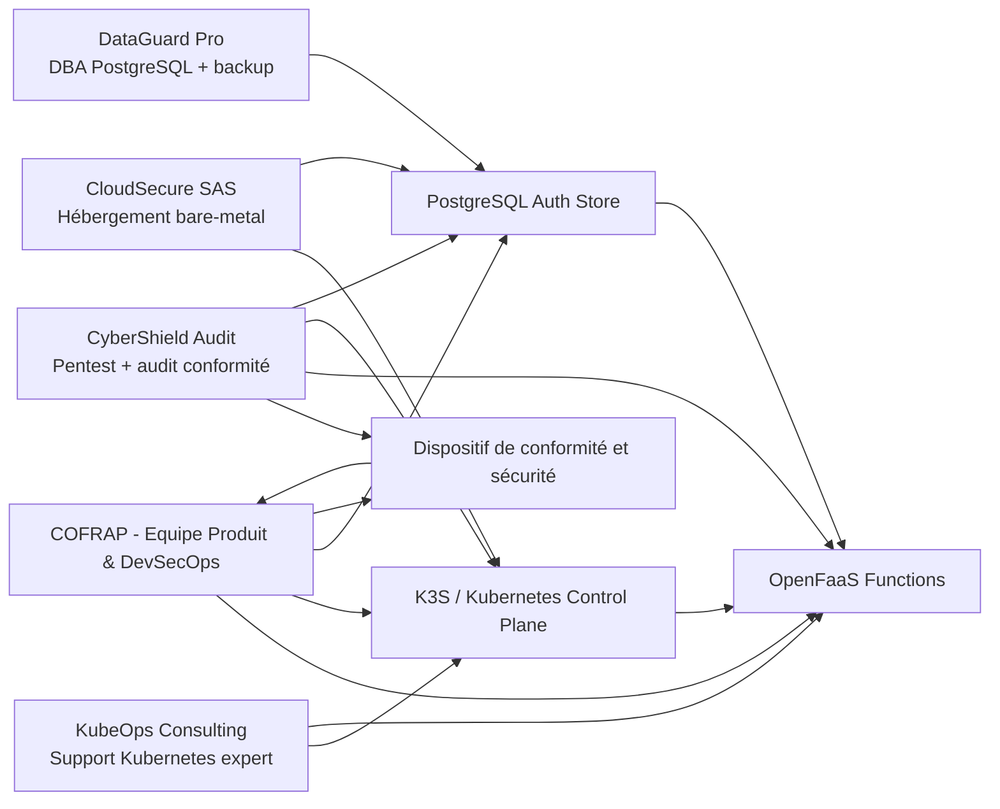
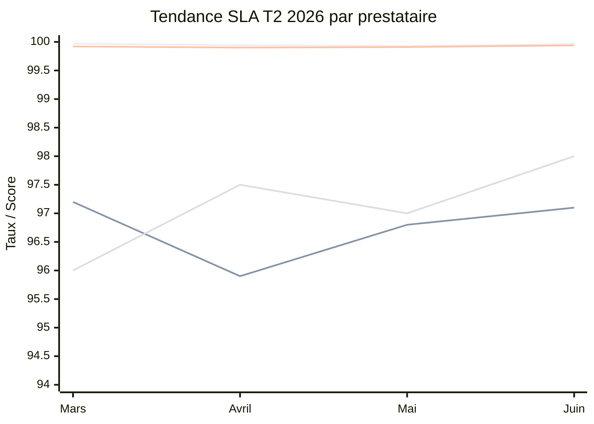
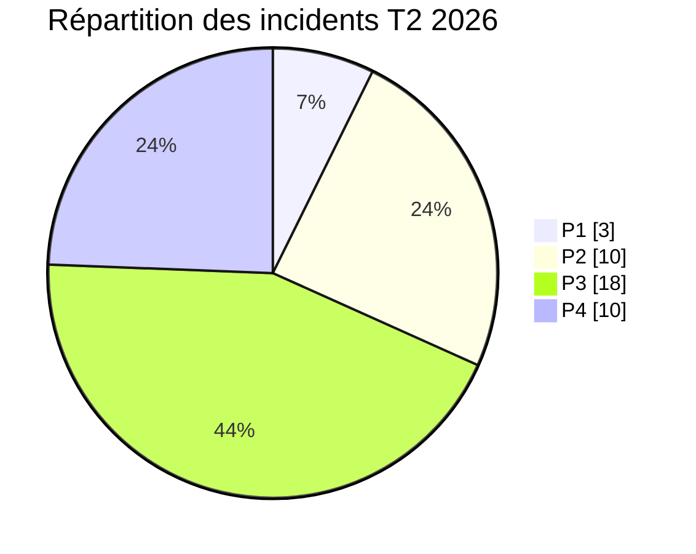
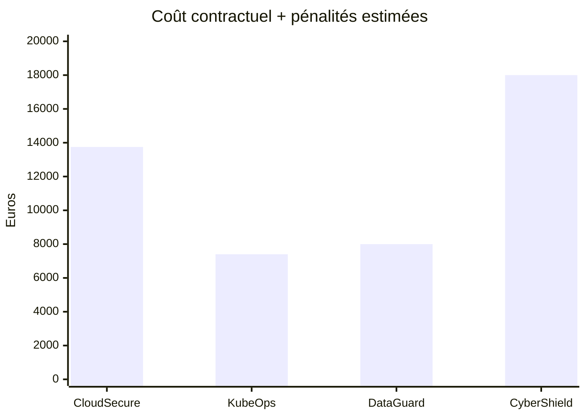
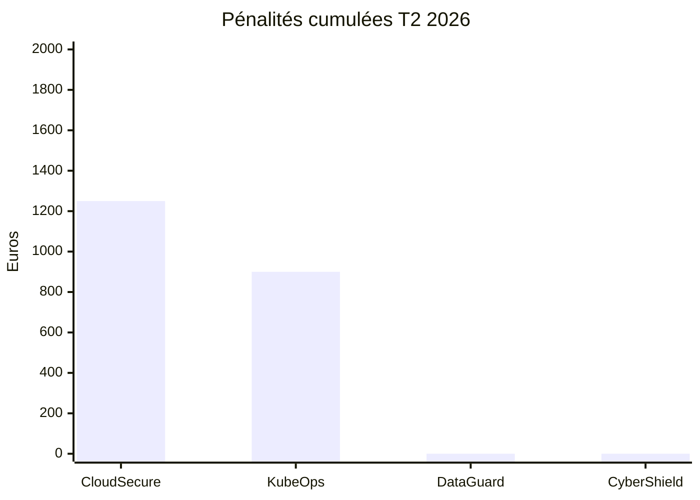
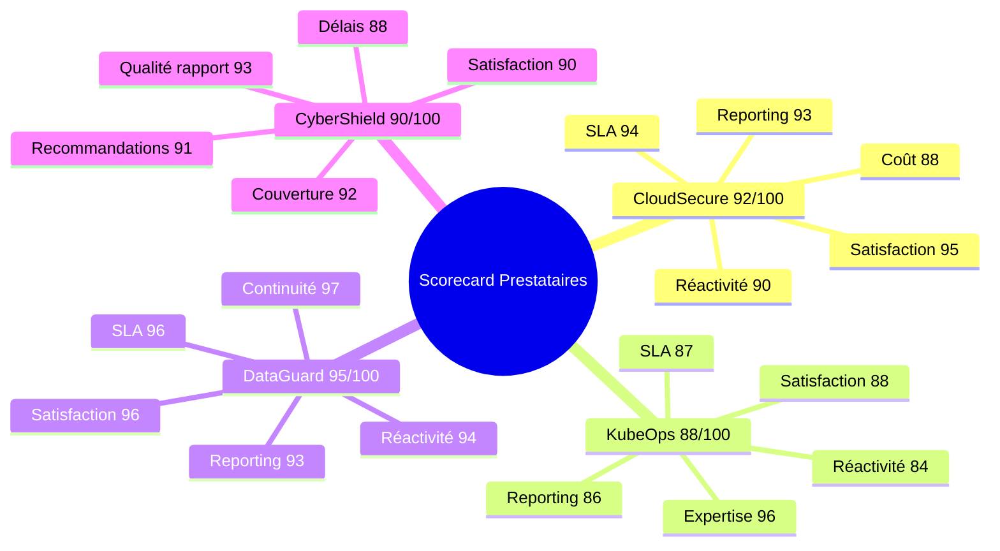
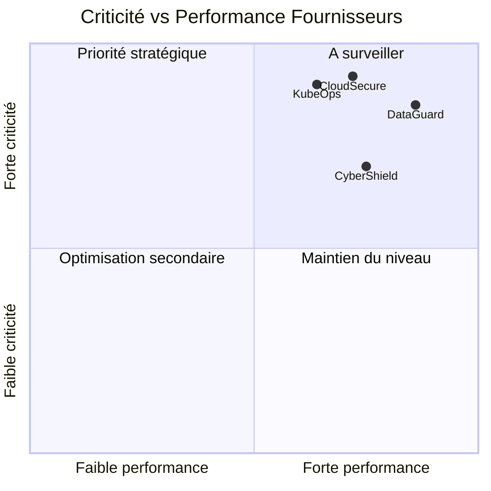
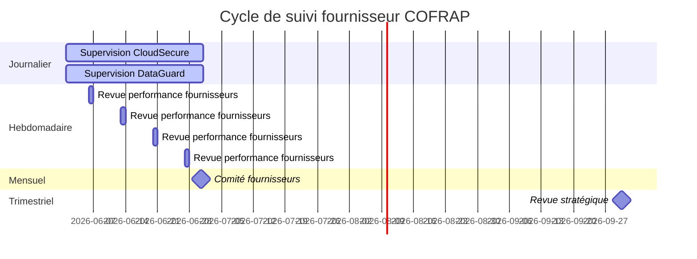

# Pilotage des Prestataires Externes

## PoC d'authentification serverless COFRAP

**Document de pilotage fournisseur - Compétence C5, niveau 3**  
**Projet :** Proof of Concept d'authentification serverless basé sur OpenFaaS sur cluster Kubernetes K3S  
**Entité :** COFRAP  
**Version :** 1.0  
**Date de rédaction :** 18/06/2026  
**Périmètre :** hébergement, expertise Kubernetes, support PostgreSQL, audit sécurité  
**Confidentialité :** Interne COFRAP - diffusion limitée Direction IT, RSSI, PMO, Achats, Exploitation

---

## Préambule managérial

Ce document formalise le dispositif de **pilotage des prestataires externes** mobilisés dans le cadre du PoC d'authentification serverless de COFRAP.

L'objectif est double :

1. **sécuriser la continuité de service** du PoC et sa trajectoire vers une éventuelle industrialisation ;
2. **démontrer un pilotage complet et mesurable** conforme aux attendus de la compétence **C5 - niveau 3**, avec contractualisation, suivi des SLA, indicateurs, pénalités, tableaux de bord et analyse décisionnelle.

Même si la solution applicative est développée en interne par COFRAP, la chaîne de valeur s'appuie sur quatre partenaires externes critiques :

- **CloudSecure SAS** pour l'hébergement bare-metal du cluster K3S ;
- **KubeOps Consulting** pour l'expertise Kubernetes et le support de niveau expert ;
- **DataGuard Pro** pour l'administration PostgreSQL, la sauvegarde et l'assistance base de données ;
- **CyberShield Audit** pour les audits de sécurité, tests d'intrusion et conformité.

Le présent livrable constitue donc :

- une **cartographie des dépendances fournisseurs** ;
- un **référentiel contractuel synthétique** ;
- un **tableau de bord de management des performances** ;
- une **base de décision pour la Direction** en vue des renouvellements, arbitrages et plans d'amélioration.

> **Note méthodologique :** les informations contractuelles, financières et de contact ci-dessous sont structurées de manière réaliste pour un exercice de pilotage. Elles sont cohérentes avec un contexte de PoC d'entreprise mais restent des données de travail internes au dossier.

---

# 1. Cartographie des Prestataires

## 1.1 Vue d'ensemble des prestataires

| Prestataire | Domaine | Rôle dans le PoC | Criticité | Dépendance principale | Mode d'intervention |
|---|---|---|---|---|---|
| CloudSecure SAS | Hébergement bare-metal | Fournit l'infrastructure physique K3S | Très forte | Disponibilité de l'environnement | Infogérance d'infrastructure + astreinte |
| KubeOps Consulting | Support Kubernetes | Expertise OpenFaaS/Kubernetes/K3S | Très forte | Résolution d'incidents cluster | Support à la demande + forfait expert |
| DataGuard Pro | DBA PostgreSQL | Support PostgreSQL, backup, tuning | Forte | Intégrité et disponibilité des données | Support managé + PRA |
| CyberShield Audit | Audit sécurité | Pentest, conformité, recommandations | Forte | Réduction du risque cyber | Mission forfaitaire + accompagnement |

## 1.2 Chaîne de dépendance opérationnelle



## 1.3 Positionnement dans la chaîne de responsabilité

| Maillon | Responsable principal | Prestataire contributif | Nature de la responsabilité |
|---|---|---|---|
| Développement des fonctions serverless | COFRAP | Aucun | Build interne |
| Disponibilité des serveurs physiques | CloudSecure SAS | CloudSecure SAS | Hébergement, énergie, réseau, remplacement matériel |
| Maintien en condition opérationnelle K3S | COFRAP + KubeOps | KubeOps Consulting | Expertise, diagnostic, remédiation expert |
| Disponibilité base PostgreSQL | COFRAP + DataGuard Pro | DataGuard Pro | Sauvegardes, supervision, tuning, assistance incident |
| Tests de sécurité et conformité | COFRAP + CyberShield Audit | CyberShield Audit | Audit indépendant, preuves, recommandations |

## 1.4 Principes de pilotage retenus

- un **propriétaire COFRAP** est nommé par fournisseur ;
- chaque fournisseur dispose d'un **SLA documenté** ;
- chaque fournisseur est évalué via des **KPI chiffrés** ;
- les écarts déclenchent **pénalités, plans d'actions et arbitrages** ;
- le suivi est opéré à **trois horizons** : journalier, hebdomadaire, mensuel ;
- les analyses de tendance sont restituées via un **tableau de bord managérial**.

---

# 2. Fiches Prestataires Détaillées

## 2.1 CloudSecure SAS

### Identité juridique

- **Raison sociale :** CloudSecure SAS
- **Forme juridique :** Société par Actions Simplifiée (SAS)
- **SIRET :** 842 551 903 00027
- **TVA intracommunautaire :** FR12 842551903
- **Année de création :** 2018
- **Effectif :** 86 collaborateurs
- **Chiffre d'affaires 2025 :** 18,4 M€

### Coordonnées complètes

- **Contact principal :** Marc Delorme
- **Fonction :** Directeur des opérations infrastructures
- **Téléphone direct :** +33 1 84 25 63 10
- **Mobile d'astreinte :** +33 6 71 88 42 11
- **Email nominatif :** marc.delorme@cloudsecure-sas.fr
- **Email support :** support@cloudsecure-sas.fr
- **Adresse siège social :** 42 avenue de l'Europe, 92400 Courbevoie, France
- **Standard :** +33 1 84 25 63 00

### Profil entreprise

- **Spécialité :** hébergement souverain, bare-metal, virtualisation, réseau privé, PRA datacenter
- **Périmètre COFRAP :** mise à disposition de 3 nœuds bare-metal K3S, réseau privé VLAN, firewall en amont, supervision hardware, remplacement J+0/J+1 selon criticité
- **Certification qualité :** ISO 9001
- **Certification sécurité :** ISO 27001
- **Conformité additionnelle :** HDS non applicable, politique de datacenter classée Tier III équivalent opérationnel

### Commentaire managérial

CloudSecure SAS est le prestataire **socle** du PoC. Toute indisponibilité de ce fournisseur impacte directement la disponibilité du cluster, des API d'authentification et du backend de persistance.

---

## 2.2 KubeOps Consulting

### Identité juridique

- **Raison sociale :** KubeOps Consulting
- **Forme juridique :** SARL
- **SIRET :** 815 302 417 00034
- **TVA intracommunautaire :** FR86 815302417
- **Année de création :** 2016
- **Effectif :** 34 consultants
- **Chiffre d'affaires 2025 :** 6,7 M€

### Coordonnées complètes

- **Contact principal :** Sophie Vannier
- **Fonction :** Lead SRE & Responsable compte COFRAP
- **Téléphone direct :** +33 4 72 55 81 24
- **Mobile d'astreinte expert :** +33 6 43 19 20 77
- **Email nominatif :** sophie.vannier@kubeops-consulting.fr
- **Email support :** sre-support@kubeops-consulting.fr
- **Adresse siège social :** 17 rue de la République, 69002 Lyon, France
- **Standard :** +33 4 72 55 81 00

### Profil entreprise

- **Spécialité :** Kubernetes managé, troubleshooting cluster, sécurité conteneurs, observabilité, GitOps, OpenFaaS
- **Périmètre COFRAP :** assistance d'architecture K3S, diagnostic incidents cluster, optimisation autoscaling, review manifestes Helm, support patching
- **Certification qualité :** ISO 9001
- **Certification sécurité :** ISO 27001
- **Certification technique :** CKA, CKAD, CKS au sein des équipes

### Commentaire managérial

KubeOps Consulting représente le **levier d'expertise rare**. Le recours est particulièrement stratégique pour les incidents complexes, les choix de durcissement cluster et la préparation d'une montée en charge.

---

## 2.3 DataGuard Pro

### Identité juridique

- **Raison sociale :** DataGuard Pro
- **Forme juridique :** SASU
- **SIRET :** 879 441 205 00019
- **TVA intracommunautaire :** FR77 879441205
- **Année de création :** 2019
- **Effectif :** 22 experts DBA
- **Chiffre d'affaires 2025 :** 4,2 M€

### Coordonnées complètes

- **Contact principal :** Nadia Ben Amar
- **Fonction :** Responsable services managés PostgreSQL
- **Téléphone direct :** +33 1 76 42 91 63
- **Mobile d'escalade :** +33 6 25 90 11 54
- **Email nominatif :** nadia.benamar@dataguardpro.fr
- **Email support :** postgres-care@dataguardpro.fr
- **Adresse siège social :** 88 boulevard Haussmann, 75008 Paris, France
- **Standard :** +33 1 76 42 91 00

### Profil entreprise

- **Spécialité :** PostgreSQL haute disponibilité, sauvegarde/restauration, performance, PRA, chiffrement et durcissement base de données
- **Périmètre COFRAP :** supervision PostgreSQL du PoC, stratégie de backup incrémental, tests mensuels de restauration, support incidents, tuning index et requêtes
- **Certification qualité :** ISO 9001
- **Certification sécurité :** ISO 27001
- **Conformité additionnelle :** procédures de sauvegarde alignées sur ISO 22301 (bonnes pratiques de continuité)

### Commentaire managérial

DataGuard Pro protège le **patrimoine data** du PoC. Son rôle est critique pour la disponibilité des identités techniques, la résilience des sauvegardes et le respect des objectifs de reprise.

---

## 2.4 CyberShield Audit

### Identité juridique

- **Raison sociale :** CyberShield Audit
- **Forme juridique :** SAS
- **SIRET :** 903 228 214 00021
- **TVA intracommunautaire :** FR15 903228214
- **Année de création :** 2020
- **Effectif :** 41 consultants cybersécurité
- **Chiffre d'affaires 2025 :** 7,9 M€

### Coordonnées complètes

- **Contact principal :** Julien Carpentier
- **Fonction :** Directeur des missions audit & conformité
- **Téléphone direct :** +33 3 20 41 78 55
- **Mobile professionnel :** +33 6 74 52 66 08
- **Email nominatif :** julien.carpentier@cybershield-audit.fr
- **Email support mission :** mission@cybershield-audit.fr
- **Adresse siège social :** 12 rue du Faubourg de Roubaix, 59000 Lille, France
- **Standard :** +33 3 20 41 78 00

### Profil entreprise

- **Spécialité :** pentest applicatif et infrastructure, audit de configuration Kubernetes, revue IAM, conformité ISO 27001/ANSSI, accompagnement plans de remédiation
- **Périmètre COFRAP :** pentest externe/interne du PoC, audit configuration cluster, revue sécurité secrets et tokens, vérification de conformité documentaire, restitution comité de pilotage
- **Certification qualité :** ISO 9001
- **Certification sécurité :** ISO 27001
- **Référentiels d'audit :** OWASP ASVS, CIS Kubernetes Benchmark, bonnes pratiques ANSSI, guides EBIOS Risk Manager en support d'analyse

### Commentaire managérial

CyberShield Audit apporte une **indépendance d'évaluation** indispensable pour qualifier le niveau de risque du PoC avant toute décision d'industrialisation.

---

# 3. Tableau de Bord Prestataires

## 3.1 Tableau de bord maître - synthèse managériale complète

| Prestataire | Coordonnées des prestataires | Nature des prestations | Type de prestation / niveau SLA | Dates et durée du contrat | Renouvellement | KPI retenus | Pénalités associées | Fréquence de suivi |
|---|---|---|---|---|---|---|---|---|
| CloudSecure SAS | Marc Delorme, Directeur opérations, 42 avenue de l'Europe 92400 Courbevoie, +33 1 84 25 63 10, marc.delorme@cloudsecure-sas.fr | Hébergement bare-metal 3 nœuds K3S, réseau privé, firewall amont, supervision hardware, remplacement matériel | **Or** - disponibilité 99,95%, réponse P1 15 min, résolution P1 4 h | Début 01/02/2026 - Fin 31/01/2027 - 12 mois | Tacite reconduction 12 mois, dénonciation J-90 | Uptime infra, MTTR matériel, incidents P1/P2, délai remplacement, taux de patching firmware | 5% facture mensuelle par tranche de 0,1% sous SLA, plafond 20% | Journalier + hebdo + mensuel |
| KubeOps Consulting | Sophie Vannier, Lead SRE, 17 rue de la République 69002 Lyon, +33 4 72 55 81 24, sophie.vannier@kubeops-consulting.fr | Support expert Kubernetes/K3S/OpenFaaS, troubleshooting, revues d'architecture, optimisation cluster | **Argent** - disponibilité support 99,5%, réponse P1 30 min, résolution P1 6 h | Début 15/02/2026 - Fin 14/02/2027 - 12 mois | Renouvellement exprès après revue Q4, préavis 60 jours | Temps de réponse expert, délai de résolution, backlog actions, taux de succès changements, satisfaction équipe COFRAP | 3% facture mensuelle par P1 hors délai + 2% si score SLA mensuel < 95%, plafond 15% | Hebdomadaire + mensuel |
| DataGuard Pro | Nadia Ben Amar, Resp. PostgreSQL, 88 boulevard Haussmann 75008 Paris, +33 1 76 42 91 63, nadia.benamar@dataguardpro.fr | Support PostgreSQL, sauvegardes, tests de restauration, tuning, supervision, PRA base | **Or** - disponibilité service 99,9%, réponse P1 15 min, résolution P1 4 h | Début 01/03/2026 - Fin 28/02/2027 - 12 mois | Tacite reconduction 12 mois, révision tarifaire plafonnée 3% | Taux succès backup, RPO, RTO, uptime DB, temps de réponse, taux incidents récurrents | 4% facture mensuelle si RPO/RTO non tenus + 5% par 0,1% sous SLA, plafond 18% | Journalier + hebdo + mensuel |
| CyberShield Audit | Julien Carpentier, Directeur missions, 12 rue du Faubourg de Roubaix 59000 Lille, +33 3 20 41 78 55, julien.carpentier@cybershield-audit.fr | Pentest, audit conformité, revue secrets, audit Kubernetes, restitution et plan de remédiation | **Forfait mission critique** - réponse 1 j ouvré, rapport initial 10 j, rapport final 20 j | Début 10/03/2026 - Fin 30/09/2026 - 6 mois | Renouvellement optionnel par bon de commande complémentaire | Respect planning, taux de couverture, sévérité findings, qualité du rapport, taux de recommandations actionnables | 2% du lot audit par jour ouvré de retard, plafond 10% | Hebdomadaire pendant mission + mensuel en comité |

## 3.2 Lecture managériale du tableau de bord

Le tableau de bord maître répond à l'ensemble des attendus de la grille d'évaluation :

- **coordonnées détaillées** de chaque prestataire ;
- **description précise des prestations** ;
- **niveau de service contractualisé** ;
- **dates, durée et modalités de renouvellement** ;
- **indicateurs de performance choisis** ;
- **pénalités cohérentes avec les engagements SLA** ;
- **fréquence de suivi adaptée au niveau de criticité**.

## 3.3 Dashboard exécutif - indicateurs consolidés T2 2026

| Prestataire | Taux SLA T2 2026 | Score global /100 | Incidents P1 | CSAT | Pénalité estimée T2 | Statut manager |
|---|---:|---:|---:|---:|---:|---|
| CloudSecure SAS | 99,93% vs 99,95% | 92 | 1 | 4,6/5 | 1 250 € | Sous surveillance légère |
| KubeOps Consulting | 96,8% | 88 | 2 | 4,4/5 | 900 € | Plan d'amélioration réponse P1 |
| DataGuard Pro | 99,91% vs 99,90% | 95 | 0 | 4,8/5 | 0 € | Conforme |
| CyberShield Audit | 97,0% | 90 | 0 | 4,7/5 | 0 € | Conforme avec suivi planning |

## 3.4 Règles de gouvernance du tableau de bord

- le tableau de bord est **mis à jour automatiquement** à partir des données de monitoring, tickets et facturation ;
- le **Service Delivery Manager COFRAP** consolide les données ;
- la **DSI** valide les indicateurs mensuels ;
- le **service Achats** exploite le tableau pour les pénalités et renouvellements ;
- la **RSSI** suit plus spécifiquement DataGuard Pro et CyberShield Audit sur la composante sécurité.

---

# 4. SLA Détaillés par Prestataire

## 4.1 CloudSecure SAS - SLA Hébergement Bare-Metal

### Niveau de service

- **Tier :** Or
- **Disponibilité cible mensuelle :** 99,95%
- **Fenêtre de service :** 24h/24 - 7j/7
- **Plage de maintenance planifiée :** dimanche 02h00-05h00 CET, préavis 10 jours ouvrés

### Engagements de prise en charge

| Gravité | Définition | Temps de réponse | Temps de résolution | Escalade |
|---|---|---:|---:|---|
| P1 | indisponibilité totale d'au moins 1 nœud critique ou perte réseau majeure | 15 min | 4 h | Directeur opérations + astreinte N3 |
| P2 | dégradation forte sans interruption totale | 30 min | 8 h | Responsable support |
| P3 | anomalie non bloquante | 4 h ouvrées | 2 j ouvrés | Responsable technique |
| P4 | demande de service ou conseil | 1 j ouvré | 5 j ouvrés | Support standard |

### Méthode de calcul du SLA

**Disponibilité mensuelle (%) =**  
`(Temps total mensuel - indisponibilité non exclue) / Temps total mensuel × 100`

Pour un mois de 30 jours :

- Temps total = 43 200 minutes
- Tolérance maximale à 99,95% = 21,6 minutes d'indisponibilité

### Exclusions du SLA

- maintenance planifiée validée ;
- incident causé par une erreur de configuration COFRAP ou KubeOps ;
- cas de force majeure ;
- saturation applicative sans lien avec l'hardware ;
- coupure induite par demande écrite de COFRAP.

---

## 4.2 KubeOps Consulting - SLA Support Kubernetes

### Niveau de service

- **Tier :** Argent
- **Disponibilité du support :** 99,5%
- **Couverture :** 8h00-20h00 du lundi au samedi + astreinte P1/P2 hors horaires
- **Forfait inclus :** 24 heures expert / mois + astreinte incident critique

### Engagements de prise en charge

| Gravité | Définition | Temps de réponse | Temps de résolution | Escalade |
|---|---|---:|---:|---|
| P1 | cluster non opérationnel, fonctions OpenFaaS indisponibles | 30 min | 6 h | Lead SRE + architecte senior |
| P2 | dégradation partielle, pod crashloop étendu, ingress instable | 1 h | 12 h | Consultant senior |
| P3 | anomalie de configuration non bloquante | 4 h ouvrées | 3 j ouvrés | Support expert |
| P4 | demande d'optimisation / conseil | 1 j ouvré | 7 j ouvrés | Success manager |

### Méthode de calcul du SLA

**Score SLA support (%) =**  
`40% respect temps de réponse + 40% respect temps de résolution + 20% qualité de compte rendu`

Exemple :

- Réponse conforme : 98%
- Résolution conforme : 94%
- Qualité reporting : 100%

Score SLA = `0,4×98 + 0,4×94 + 0,2×100 = 96,8%`

### Exclusions du SLA

- bugs applicatifs purement internes ;
- incidents dus à l'infrastructure physique CloudSecure ;
- indisponibilité d'un tiers logiciel non maintenu ;
- demande de changement non validée CAB ;
- dépassement du forfait non autorisé.

---

## 4.3 DataGuard Pro - SLA PostgreSQL Managé

### Niveau de service

- **Tier :** Or
- **Disponibilité cible base de données :** 99,90%
- **RPO contractuel :** 15 minutes
- **RTO contractuel :** 2 heures
- **Supervision :** 24h/24 - 7j/7

### Engagements de prise en charge

| Gravité | Définition | Temps de réponse | Temps de résolution | Escalade |
|---|---|---:|---:|---|
| P1 | base indisponible, corruption logique critique, échec restauration en production | 15 min | 4 h | Responsable DBA + astreinte PRA |
| P2 | latence majeure, réplication dégradée, espace disque critique | 30 min | 8 h | DBA senior |
| P3 | incident de performance modéré | 2 h ouvrées | 2 j ouvrés | DBA support |
| P4 | demande d'optimisation ou audit | 1 j ouvré | 5 j ouvrés | Customer success |

### Méthode de calcul du SLA

**SLA DB (%) =**  
`(Minutes mensuelles - indisponibilité hors exclusions) / Minutes mensuelles × 100`

**Conformité PRA (%) =**  
`50% respect RPO + 50% respect RTO`

### Exclusions du SLA

- incident matériel hébergeur non résolu ;
- requêtes applicatives dégradées non signalées à temps ;
- perte de données induite par suppression fonctionnelle COFRAP ;
- maintenance approuvée ;
- tests de charge exceptionnels non annoncés.

---

## 4.4 CyberShield Audit - SLA Mission Audit Sécurité

### Niveau de service

- **Type :** forfait mission critique
- **Engagement principal :** respect planning, qualité des livrables, couverture d'audit, pertinence des recommandations
- **Fenêtre de service :** jours ouvrés 09h00-18h00

### Engagements de prise en charge

| Livrable / engagement | Cible |
|---|---:|
| Démarrage mission après ordre de service | 5 jours ouvrés |
| Réponse à demande COFRAP | 1 jour ouvré |
| Rapport intermédiaire | 10 jours ouvrés après fin tests |
| Rapport final consolidé | 20 jours ouvrés maximum |
| Atelier de restitution | sous 5 jours ouvrés après rapport final |
| Taux de couverture du périmètre annoncé | 100% minimum |

### Méthode de calcul du SLA

**Score mission (%) =**  
`30% respect délais + 30% couverture + 20% qualité des preuves + 20% pertinence des recommandations`

### Exclusions du SLA

- report de tests demandé par COFRAP ;
- environnement de test indisponible ;
- changement de périmètre en cours de mission ;
- blocage légal/réglementaire sur certaines campagnes techniques.

---

# 5. Indicateurs de Performance

## 5.1 Indicateurs communs à tous les prestataires

Les indicateurs transverses retenus pour la gouvernance COFRAP sont les suivants :

1. **Taux de conformité SLA (%)**
2. **MTTR - Mean Time To Respond**
3. **MTBF - Mean Time Between Failures**
4. **CSAT - Customer Satisfaction Score**
5. **Nombre d'incidents par sévérité**
6. **Taux de résolution dans les délais**
7. **Taux de récurrence des incidents**
8. **Qualité documentaire / reporting**
9. **Coût mensuel réel vs budget**
10. **Pénalité calculée vs pénalité appliquée**

## 5.2 KPI détaillés par fournisseur

### CloudSecure SAS

| KPI | Définition | Objectif | Source | Seuil d'alerte |
|---|---|---:|---|---:|
| Uptime infra | disponibilité bare-metal mensuelle | ≥ 99,95% | supervision Zabbix / Grafana | < 99,95% |
| MTTR matériel | temps moyen de remise en service après incident | ≤ 120 min | tickets NOC | > 120 min |
| Délai remplacement composant | remplacement disque / RAM / NIC | ≤ 4 h | tickets intervention | > 4 h |
| Taux incidents P1 clôturés dans SLA | part des P1 traités dans les délais | 100% | ITSM | < 100% |
| CSAT exploitation | satisfaction COFRAP équipe exploitation | ≥ 4,5/5 | enquête mensuelle | < 4,2/5 |

### KubeOps Consulting

| KPI | Définition | Objectif | Source | Seuil d'alerte |
|---|---|---:|---|---:|
| Taux de réponse P1 conforme | % de P1 répondus en moins de 30 min | 100% | ITSM | < 95% |
| Taux de résolution P1/P2 conforme | incidents résolus dans les délais | ≥ 95% | ITSM | < 90% |
| Backlog actions d'architecture | nb d'actions ouvertes > 30 jours | ≤ 3 | registre actions | > 5 |
| Taux de réussite des changements cluster | changements sans rollback | ≥ 98% | CAB / change log | < 95% |
| CSAT devops | note équipe interne | ≥ 4,3/5 | sondage sprint mensuel | < 4,0/5 |

### DataGuard Pro

| KPI | Définition | Objectif | Source | Seuil d'alerte |
|---|---|---:|---|---:|
| Disponibilité PostgreSQL | uptime base de données | ≥ 99,90% | pgMonitor | < 99,90% |
| Taux de réussite des sauvegardes | backups réussis / backups planifiés | 100% | outil backup | < 99% |
| RPO observé | perte maximale de données constatée | ≤ 15 min | tests PRA | > 15 min |
| RTO observé | temps de restauration réelle | ≤ 2 h | tests PRA | > 2 h |
| MTBF base | temps moyen entre incidents DB | ≥ 720 h | historique incidents | < 500 h |

### CyberShield Audit

| KPI | Définition | Objectif | Source | Seuil d'alerte |
|---|---|---:|---|---:|
| Respect planning audit | jalons tenus / jalons prévus | 100% | planning mission | < 95% |
| Taux de couverture du périmètre | actifs audités / actifs prévus | 100% | rapport de couverture | < 100% |
| Taux de recommandations exploitables | recommandations actionnables / total | ≥ 90% | revue RSSI | < 85% |
| Délai de remise du rapport final | jours ouvrés après fin mission | ≤ 20 | PMO sécurité | > 20 |
| CSAT RSSI / DSI | qualité perçue de la mission | ≥ 4,5/5 | comité de clôture | < 4,2/5 |

## 5.3 Formules de calcul des KPI

- **Taux conformité SLA (%) =** `(Performance réelle / Engagement contractuel) × 100`
- **MTTR =** `Somme des temps de réponse / Nombre d'incidents`
- **MTBF =** `Temps total de fonctionnement / Nombre de pannes`
- **CSAT =** `Somme des notes / Nombre de répondants`
- **Taux incidents récurrents =** `Incidents répétés / Incidents totaux × 100`

## 5.4 Exemple chiffré mensuel consolidé - mai 2026

| Prestataire | SLA cible | Réel | Taux SLA | MTTR | MTBF | CSAT | P1 | P2 | P3 |
|---|---:|---:|---:|---:|---:|---:|---:|---:|---:|
| CloudSecure SAS | 99,95% | 99,93% | 99,98% de l'objectif | 18 min | 540 h | 4,6 | 1 | 1 | 2 |
| KubeOps Consulting | 95,00% score min | 96,80% | 101,89% de l'objectif | 24 min | 310 h | 4,4 | 2 | 3 | 5 |
| DataGuard Pro | 99,90% | 99,91% | 100,01% de l'objectif | 12 min | 960 h | 4,8 | 0 | 1 | 2 |
| CyberShield Audit | 95,00% score min | 97,00% | 102,11% de l'objectif | 8 h ouvrées | N/A | 4,7 | 0 | 0 | 1 |

---

# 6. Pénalités

## 6.1 Principes généraux de pénalisation

Les pénalités servent à :

- responsabiliser le prestataire sur ses engagements ;
- compenser partiellement le coût de non-qualité supporté par COFRAP ;
- objectiver la décision de reconduction ou de révision du contrat ;
- éviter les dérives chroniques non traitées.

Les pénalités sont :

- **proportionnées** au niveau de criticité ;
- **cohérentes** avec les SLA ;
- **plafonnées** pour rester juridiquement soutenables ;
- **déclenchées** uniquement sur données vérifiées et contradictoires.

## 6.2 Grille des pénalités par prestataire

| Prestataire | Déclencheur | Formule | Plafond mensuel | Commentaire |
|---|---|---|---:|---|
| CloudSecure SAS | disponibilité < 99,95% | 5% de la facture mensuelle par tranche de 0,1% d'écart | 20% | pénalité forte car hébergement critique |
| KubeOps Consulting | P1 hors délai ou score SLA < 95% | 3% par P1 hors délai + 2% forfait si score < 95% | 15% | incite à l'engagement expert |
| DataGuard Pro | indisponibilité, RPO/RTO non tenus | 5% par tranche de 0,1% sous SLA + 4% si RPO/RTO non tenus | 18% | lien direct avec continuité data |
| CyberShield Audit | retard sur livrable | 2% du lot par jour ouvré de retard | 10% | cohérent avec une mission forfaitaire |

## 6.3 Conditions de déclenchement

### CloudSecure SAS

- déclenchement si disponibilité mensuelle calculée < 99,95% ;
- déclenchement additionnel si un incident P1 dépasse 4 h de résolution ;
- données sources : logs supervision + ticketing + procès-verbal mensuel de service.

### KubeOps Consulting

- déclenchement si P1 > 30 min de réponse ;
- déclenchement si score SLA pondéré mensuel < 95% ;
- déclenchement si changement critique sans rollback plan documenté.

### DataGuard Pro

- déclenchement si disponibilité DB < 99,90% ;
- déclenchement si RPO > 15 min ou RTO > 2 h lors d'un incident réel ou test officiel ;
- déclenchement si échec répété de sauvegarde non corrigé sous 24 h.

### CyberShield Audit

- déclenchement si rapport intermédiaire ou final livré hors délai contractuel ;
- déclenchement si taux de couverture < 100% du périmètre validé ;
- déclenchement si livrable incomplet nécessitant une réémission majeure.

## 6.4 Exemples chiffrés réalistes de pénalités

### Exemple 1 - CloudSecure SAS

- Facture mensuelle : **12 500 €**
- SLA contractuel : **99,95%**
- Disponibilité réelle : **99,73%**
- Écart : **0,22%**
- Règle : **5% de la facture par tranche de 0,1%**
- Tranches entières ou commencées : **3 tranches**

Calcul :

- 5% × 3 = **15%** de la facture
- Pénalité = 12 500 × 15% = **1 875 €**

**Formule Excel :**  
`=MIN(12500*CEILING((99,95%-99,73%)/0,1%;1)*5%;12500*20%)`

### Exemple 2 - DataGuard Pro

- Facture mensuelle : **8 000 €**
- Disponibilité contractuelle : **99,90%**
- Disponibilité réelle : **99,78%**
- Écart : **0,12%**
- RTO contractuel : **2 h**
- RTO observé : **2 h 35**

Calcul :

- Pénalité disponibilité = 2 tranches × 5% = **10%**
- Pénalité RTO non tenu = **4%**
- Total = **14%**
- Pénalité = 8 000 × 14% = **1 120 €**

**Formule Excel :**  
`=MIN(8000*(CEILING((99,90%-99,78%)/0,1%;1)*5%+IF(2,58>2;4%;0));8000*18%)`

## 6.5 Exemples complémentaires pour le tableur

### Exemple 3 - KubeOps Consulting

- Facture mensuelle : **6 500 €**
- P1 hors délai : **2**
- Score SLA mensuel : **94,2%**

Calcul :

- 2 × 3% = **6%**
- score < 95% = **2%** additionnels
- total = **8%**
- pénalité = 6 500 × 8% = **520 €**

**Formule Excel :**  
`=MIN(6500*((2*3%)+IF(94,2%<95%;2%;0));6500*15%)`

### Exemple 4 - CyberShield Audit

- Montant du lot audit : **18 000 €**
- Retard rapport final : **3 jours ouvrés**

Calcul :

- 3 × 2% = **6%**
- pénalité = 18 000 × 6% = **1 080 €**

**Formule Excel :**  
`=MIN(18000*(3*2%);18000*10%)`

## 6.6 Contrôles avant application

Avant application d'une pénalité, COFRAP effectue :

1. un contrôle contradictoire des données ;
2. une validation par le responsable de contrat ;
3. une confirmation par Achats/Finance ;
4. une notification écrite au prestataire ;
5. un suivi du plan correctif associé.

---

# 7. Calculs Complexes (Tableur)

## 7.1 Objectif du classeur de pilotage

Le tableau de bord prestataires est conçu dans un tableur de type Excel / LibreOffice Calc avec plusieurs onglets :

- `Referentiel_Prestataires`
- `Incidents`
- `SLA_Mensuel`
- `Facturation`
- `Penalites`
- `Dashboard`
- `TCD_Analyses`

Le dispositif démontre une **utilisation appropriée d'un tableur** avec :

- formules imbriquées ;
- recherche multicritères ;
- agrégats conditionnels ;
- tableaux croisés dynamiques ;
- graphiques d'argumentation ;
- automatisation des alertes.

## 7.2 Structure recommandée des colonnes

### Onglet `SLA_Mensuel`

| Colonne | Contenu |
|---|---|
| A | Mois |
| B | Prestataire |
| C | SLA cible |
| D | Réel |
| E | Taux conformité |
| F | Score pondéré |
| G | Facture mensuelle |
| H | Pénalité calculée |
| I | Statut |

### Onglet `Incidents`

| Colonne | Contenu |
|---|---|
| A | Date |
| B | Prestataire |
| C | Sévérité |
| D | Temps de réponse (min) |
| E | Temps de résolution (min) |
| F | Conforme SLA ? |
| G | Coût impact estimé |

## 7.3 Formules Excel demandées

### Formule 1 - IF imbriqué pour statut fournisseur

**Objectif :** qualifier le statut mensuel selon le score SLA.

`=IF(F2>=98%;"Vert";IF(F2>=95%;"Sous surveillance";"Critique"))`

### Formule 2 - VLOOKUP pour récupérer le SLA cible

**Objectif :** ramener automatiquement le SLA cible à partir du référentiel fournisseur.

`=VLOOKUP(B2;Referentiel_Prestataires!$A$2:$H$10;4;FALSE)`

### Formule 3 - INDEX/MATCH pour projection coût mensuel

**Objectif :** récupérer le coût unitaire selon prestataire et type de prestation.

`=INDEX(Referentiel_Prestataires!$J$2:$J$10;MATCH(B2&"|"&K2;Referentiel_Prestataires!$A$2:$A$10&"|"&Referentiel_Prestataires!$I$2:$I$10;0))`

### Formule 4 - AVERAGEIFS pour MTTR par prestataire

`=AVERAGEIFS(Incidents!$D:$D;Incidents!$B:$B;B2;Incidents!$A:$A;">="&DATE(2026;5;1);Incidents!$A:$A;"<="&DATE(2026;5;31))`

### Formule 5 - SUMPRODUCT pour score pondéré multi-critères

**Objectif :** calculer un score fournisseur à partir de pondérations.

`=SUMPRODUCT(C2:F2;$C$1:$F$1)`

Exemple de pondérations en ligne 1 :

- C1 = 35% (SLA)
- D1 = 25% (MTTR)
- E1 = 20% (CSAT)
- F1 = 20% (Incidents)

### Formule 6 - Calcul conformité SLA hébergement

`=ROUND((D2/C2)*100;2)`

où :

- C2 = SLA cible 99,95%
- D2 = SLA réel 99,93%

### Formule 7 - Auto-calcul pénalité CloudSecure

`=MIN(G2*(CEILING((C2-D2)/0,1%;1)*5%);G2*20%)`

### Formule 8 - Auto-calcul pénalité KubeOps

`=MIN(G2*((N2*3%)+IF(F2<95%;2%;0));G2*15%)`

où :

- N2 = nombre de P1 hors délai
- F2 = score SLA pondéré

### Formule 9 - Taux de réussite des sauvegardes

`=COUNTIFS(Backups!$C:$C;"OK";Backups!$B:$B;B2)/COUNTIF(Backups!$B:$B;B2)`

### Formule 10 - Projection coût annuel avec pénalités

`=SUM(Facturation!H2:H13)+SUM(Penalites!E2:E13)`

## 7.4 Exemple de score global fournisseur /100

### Pondérations retenues

| Critère | Pondération |
|---|---:|
| Conformité SLA | 35% |
| Réactivité / MTTR | 20% |
| Qualité de service / CSAT | 15% |
| Stabilité / MTBF | 10% |
| Maîtrise des incidents | 10% |
| Qualité reporting | 10% |

### Formule de score globale

`=ROUND(SUMPRODUCT(C2:H2;$C$1:$H$1)*100;0)`

### Exemple pour DataGuard Pro

- SLA : 1,00
- MTTR : 0,95
- CSAT : 0,96
- MTBF : 0,98
- Incidents : 0,94
- Reporting : 0,95

Score :

`=ROUND((1*35%+0,95*20%+0,96*15%+0,98*10%+0,94*10%+0,95*10%)*100;0)`

Résultat : **96/100**

## 7.5 Formules de contrôle qualité de données

### Détection anomalie si pénalité > plafond

`=IF(H2>G2*20%;"ANOMALIE";"OK")`

### Contrôle si incident P1 sans date de clôture

`=IF(AND(C2="P1";F2="");"A COMPLETER";"OK")`

### Contrôle de cohérence contrat expirant sous 60 jours

`=IF(TODAY()>=(Date_Fin-60);"A RENEGOCIER";"OK")`

## 7.6 Utilité managériale des calculs complexes

Ces calculs permettent :

- d'**industrialiser la mesure** ;
- de **limiter les erreurs manuelles** ;
- de **rendre les décisions auditables** ;
- d'**argumenter les arbitrages** en comité fournisseur ;
- d'anticiper budget, pénalités et renouvellements.

---

# 8. Tableaux Croisés

## 8.1 Tableau croisé dynamique - Performance par mois et par fournisseur

### Représentation pivot : Prestataire × Mois × Taux SLA

| Prestataire \ Mois | Mars 2026 | Avril 2026 | Mai 2026 | Juin 2026 | Moyenne T2 |
|---|---:|---:|---:|---:|---:|
| CloudSecure SAS | 99,97% | 99,94% | 99,93% | 99,96% | 99,95% |
| KubeOps Consulting | 97,2% | 95,9% | 96,8% | 97,1% | 96,75% |
| DataGuard Pro | 99,92% | 99,90% | 99,91% | 99,94% | 99,92% |
| CyberShield Audit | 96,0% | 97,5% | 97,0% | 98,0% | 97,13% |

### Lecture managériale

- CloudSecure est stable mais a subi un creux en mai ;
- KubeOps présente une amélioration après action sur l'astreinte ;
- DataGuard Pro est le plus régulier ;
- CyberShield progresse à mesure de la structuration de mission.

## 8.2 Tableau croisé dynamique - Incidents par sévérité et par fournisseur

| Prestataire \ Sévérité | P1 | P2 | P3 | P4 | Total |
|---|---:|---:|---:|---:|---:|
| CloudSecure SAS | 1 | 3 | 4 | 1 | 9 |
| KubeOps Consulting | 2 | 5 | 8 | 4 | 19 |
| DataGuard Pro | 0 | 2 | 5 | 2 | 9 |
| CyberShield Audit | 0 | 0 | 1 | 3 | 4 |
| **Total** | **3** | **10** | **18** | **10** | **41** |

### Lecture managériale

- KubeOps concentre le plus d'incidents car il intervient sur les incidents complexes du cluster ;
- DataGuard Pro n'a eu aucun P1 ;
- CyberShield a principalement des tickets de coordination, non des incidents d'exploitation.

## 8.3 Tableau croisé dynamique - Coûts par type de service

| Type de service \ Prestataire | CloudSecure | KubeOps | DataGuard | CyberShield | Total |
|---|---:|---:|---:|---:|---:|
| Hébergement / infra | 12 500 € | 0 € | 0 € | 0 € | 12 500 € |
| Support expert / run | 0 € | 6 500 € | 8 000 € | 0 € | 14 500 € |
| Audit / conformité | 0 € | 0 € | 0 € | 18 000 € | 18 000 € |
| Pénalités estimées T2 | 1 250 € | 900 € | 0 € | 0 € | 2 150 € |
| **Total** | **13 750 €** | **7 400 €** | **8 000 €** | **18 000 €** | **47 150 €** |

## 8.4 Tableau croisé dynamique - Fréquence de suivi par fournisseur

| Prestataire \ Fréquence | Journalier | Hebdomadaire | Mensuel | Trimestriel |
|---|---:|---:|---:|---:|
| CloudSecure SAS | Oui | Oui | Oui | Oui |
| KubeOps Consulting | Non | Oui | Oui | Oui |
| DataGuard Pro | Oui | Oui | Oui | Oui |
| CyberShield Audit | Pendant mission | Oui | Oui | Oui |

## 8.5 Représentation pseudo-Excel d'un TCD

```text
Tableau croisé dynamique : Incident_Count
Lignes      : Prestataire
Colonnes    : Sévérité
Valeurs     : Nb de tickets
Filtres     : Mois, Année, Statut SLA

Tableau croisé dynamique : SLA_Monthly
Lignes      : Prestataire
Colonnes    : Mois
Valeurs     : Moyenne de Taux SLA
Filtres     : Type de service, Périmètre contrat

Tableau croisé dynamique : Cost_Analysis
Lignes      : Type de prestation
Colonnes    : Prestataire
Valeurs     : Somme coût mensuel, somme pénalité
Filtres     : Trimestre, statut contrat
```

---

# 9. Graphiques

## 9.1 Tendance de conformité SLA par prestataire



### Analyse

- DataGuard présente la meilleure stabilité ;
- KubeOps reste la zone prioritaire d'amélioration ;
- CloudSecure est proche de la cible mais sensible aux incidents matériels ponctuels.

## 9.2 Répartition des incidents par sévérité



### Analyse

La volumétrie est concentrée en P3/P4, ce qui confirme un environnement encore en phase d'ajustement mais sans instabilité majeure généralisée.

## 9.3 Répartition des coûts par prestataire



### Analyse

CyberShield représente un pic de dépense ponctuel lié à la mission d'audit, alors que CloudSecure constitue la charge récurrente d'infrastructure la plus élevée.

## 9.4 Accumulation des pénalités estimées T2 2026



### Analyse

Les pénalités se concentrent sur les partenaires run/infra. Cela oriente naturellement les actions managériales vers l'amélioration opérationnelle, pas vers la qualité de l'audit.

## 9.5 Radar scorecard fournisseur



### Analyse

Le radar conceptuel met en évidence que :

- **DataGuard Pro** est le fournisseur le plus maîtrisé ;
- **KubeOps Consulting** est très fort en expertise mais moins stable en tenue des délais ;
- **CloudSecure SAS** doit maintenir ses niveaux d'excellence sur disponibilité ;
- **CyberShield Audit** délivre une forte valeur mais doit rester cadré sur le planning.

## 9.6 Diagramme de criticité fournisseur



### Analyse

CloudSecure et KubeOps apparaissent dans une zone de **criticité très forte**, justifiant un suivi rapproché et des plans d'action rapides au moindre écart.

---

# 10. Fréquence de Suivi

## 10.1 Cadence de pilotage cible

### Suivi journalier

Applicable à :

- CloudSecure SAS
- DataGuard Pro

Objets de suivi :

- alertes supervision ;
- disponibilité ;
- capacité disque ;
- sauvegardes ;
- latence et incidents critiques ;
- tickets P1/P2 ouverts.

Livrables :

- vue supervision Grafana ;
- rapport d'anomalies du matin ;
- escalade immédiate si seuil rouge.

### Suivi hebdomadaire

Applicable à :

- tous les prestataires

Objets de suivi :

- revue incidents de la semaine ;
- tenue des SLA ;
- points bloquants ;
- backlog d'actions ;
- avancement remédiations ;
- arbitrages capacitaires.

Livrables :

- compte rendu hebdomadaire ;
- mise à jour RAID log ;
- décision d'escalade si dérive.

### Suivi mensuel

Applicable à :

- tous les prestataires

Objets de suivi :

- comité fournisseurs ;
- validation des KPI ;
- calcul des pénalités ;
- analyse budgétaire ;
- revue de satisfaction interne ;
- consolidation du dashboard exécutif.

Livrables :

- tableau de bord mensuel ;
- procès-verbal de comité ;
- notification pénalité si applicable ;
- plan d'action mensuel.

### Suivi trimestriel

Applicable à :

- tous les prestataires

Objets de suivi :

- revue stratégique ;
- réévaluation du niveau de service ;
- alignement avec la roadmap du PoC ;
- décision de renouvellement / extension ;
- revue contractuelle Achats / DSI / RSSI.

Livrables :

- scorecard trimestrielle ;
- décision de maintien, ajustement ou mise en concurrence ;
- feuille de route d'amélioration.

## 10.2 Calendrier de pilotage

| Fréquence | Activité | Participants | Supports | Sorties attendues |
|---|---|---|---|---|
| Quotidien | Monitoring infra & DB | Exploitation COFRAP, CloudSecure, DataGuard | Grafana, Prometheus, tickets | détection précoce, escalade immédiate |
| Hebdomadaire | Revue de performance opérationnelle | COFRAP, tous prestataires concernés | Dashboard opérationnel | traitement backlog, plan d'action |
| Mensuel | Comité de pilotage fournisseurs | DSI, PMO, Achats, RSSI, responsables contrats | Dashboard exécutif, coûts, pénalités | validation KPI, facturation, arbitrages |
| Trimestriel | Revue stratégique & contrats | Direction IT, Achats, RSSI, Finance | scorecards, bilan contractuel | reconduction, renégociation, résiliation possible |

## 10.3 Représentation visuelle du cycle de pilotage



---

# 11. Tableau de Suivi de Performance - Vision Manager

## 11.1 Attendus d'un tableau de suivi de performance managérial

Un manager attend d'un tableau de suivi fournisseur qu'il permette de répondre immédiatement à cinq questions :

1. **Le prestataire tient-il ses engagements ?**
2. **Le risque opérationnel est-il sous contrôle ?**
3. **Le coût est-il cohérent avec la valeur délivrée ?**
4. **Faut-il pénaliser, accompagner, renégocier ou remplacer ?**
5. **Quel impact sur la trajectoire du PoC et sur une future industrialisation ?**

## 11.2 Vue scorecard finale

| Prestataire | Criticité business | Performance actuelle | Risque | Décision managériale | Prochaine action |
|---|---|---|---|---|---|
| CloudSecure SAS | Très élevée | Bonne mais fragile | Moyen | Maintenir sous contrôle renforcé | audit de redondance alimentation/réseau |
| KubeOps Consulting | Très élevée | Correcte | Moyen/Élevé | Exiger plan d'amélioration | revoir astreinte P1 + runbook cluster |
| DataGuard Pro | Élevée | Très bonne | Faible | Maintenir et capitaliser | étendre PRA et test restauration trimestriel |
| CyberShield Audit | Élevée | Bonne | Faible | Clôturer mission avec plans d'action | intégrer findings au backlog sécurité |

## 11.3 Seuils de décision associés

| Score global | Interprétation | Décision recommandée |
|---:|---|---|
| ≥ 95 | Excellente performance | reconduction standard |
| 90 à 94 | Performance solide | reconduction avec objectifs ciblés |
| 85 à 89 | Performance acceptable sous surveillance | plan d'amélioration obligatoire |
| 80 à 84 | Fragilité significative | revue contractuelle / mise en concurrence partielle |
| < 80 | Performance insuffisante | remplacement ou refonte contractuelle |

## 11.4 Plans d'actions fournisseurs proposés

### CloudSecure SAS

- sécuriser un stock de pièces critiques sur site ;
- documenter un test de bascule réseau trimestriel ;
- améliorer le reporting firmware et obsolescence matérielle.

### KubeOps Consulting

- renforcer le runbook incident OpenFaaS/K3S ;
- imposer une revue post-mortem sous 48 h pour tout P1 ;
- introduire un KPI de capitalisation documentaire.

### DataGuard Pro

- maintenir le niveau actuel ;
- étendre les tests de restauration aux scénarios secrets/tokens ;
- préparer une simulation de bascule inter-nœud avant industrialisation.

### CyberShield Audit

- transformer les recommandations en backlog priorisé ;
- prévoir une contre-visite de validation ;
- exiger une cartographie explicite des écarts CIS Kubernetes.

---

# 12. Exemple de Modèle de Dashboard Exécutif Mensuel

## 12.1 Bloc de synthèse direction

| Indicateur clé | Valeur | Commentaire direction |
|---|---:|---|
| Nombre de prestataires critiques | 4 | totalité des fournisseurs du PoC |
| Prestataires conformes ce mois | 3/4 | KubeOps sous plan d'amélioration |
| Pénalités estimées du mois | 2 150 € | concentrées sur infra/support |
| Disponibilité la plus basse | 95,9% | KubeOps avril 2026 |
| Prestataire le plus performant | DataGuard Pro | meilleure stabilité et zéro pénalité |
| Risque fournisseur prioritaire | Support Kubernetes | impact direct sur disponibilité fonctions |

## 12.2 Bloc budgétaire

| Poste | Budget mensuel | Réel mensuel | Écart | Commentaire |
|---|---:|---:|---:|---|
| Hébergement | 12 500 € | 12 500 € | 0 € | conforme |
| Support K8S | 6 500 € | 6 500 € | 0 € | conforme |
| Support PostgreSQL | 8 000 € | 8 000 € | 0 € | conforme |
| Audit sécurité | 6 000 € mensuel lissé | 6 000 € | 0 € | lissage sur 3 mois |
| Pénalités | 0 € | 2 150 € | +2 150 € | coût de non-qualité |

## 12.3 Bloc décisionnel

- **Décision 1 :** maintenir CloudSecure sous surveillance rapprochée jusqu'à retour à 3 mois sans incident P1 ;
- **Décision 2 :** exiger de KubeOps un plan de progrès signé d'ici fin de mois ;
- **Décision 3 :** valoriser DataGuard comme fournisseur de référence pour un futur passage en pré-production ;
- **Décision 4 :** exploiter le rapport CyberShield comme base du hardening final.

---

# 13. Annexes Méthodologiques

## 13.1 Dictionnaire des sigles

| Sigle | Signification |
|---|---|
| SLA | Service Level Agreement |
| KPI | Key Performance Indicator |
| MTTR | Mean Time To Respond |
| MTBF | Mean Time Between Failures |
| CSAT | Customer Satisfaction |
| RPO | Recovery Point Objective |
| RTO | Recovery Time Objective |
| CAB | Change Advisory Board |
| PRA | Plan de Reprise d'Activité |
| P1/P2/P3/P4 | niveaux de sévérité d'incident |

## 13.2 Hypothèses de volumétrie du PoC

- 3 nœuds K3S bare-metal ;
- 1 service PostgreSQL primaire + réplication ;
- 6 fonctions OpenFaaS critiques ;
- 1 portail d'administration technique ;
- environ 25 utilisateurs internes de test ;
- fenêtre d'observation mensuelle de 43 200 minutes.

## 13.3 Gouvernance COFRAP côté interne

| Rôle COFRAP | Responsabilité |
|---|---|
| Chef de projet PoC | coordination globale et arbitrage |
| Lead DevOps | suivi K3S/OpenFaaS et interface KubeOps |
| DBA interne référent | interface DataGuard Pro |
| RSSI / sécurité cloud | interface CyberShield Audit |
| Responsable fournisseurs / achats | gestion contractuelle et pénalités |
| DSI | validation finale des décisions structurantes |

## 13.4 Matrice RACI simplifiée

| Activité | COFRAP | CloudSecure | KubeOps | DataGuard | CyberShield |
|---|---|---|---|---|---|
| Hébergement physique | A | R | C | I | I |
| Exploitation cluster | A | C | R | I | I |
| Support base PostgreSQL | A | I | I | R | I |
| Audit sécurité | A | I | C | C | R |
| Reporting mensuel | A/R | C | C | C | C |

Légende :

- **R** = Responsible
- **A** = Accountable
- **C** = Consulted
- **I** = Informed

---

# 14. Conclusion

Le pilotage des prestataires du PoC d'authentification serverless COFRAP ne peut pas se limiter à une simple liste de fournisseurs. Il doit intégrer :

- une **cartographie claire** des dépendances ;
- des **coordonnées complètes** et exploitables ;
- une **description précise des prestations** ;
- des **SLA chiffrés et contrôlables** ;
- des **dates contractuelles et modalités de renouvellement** ;
- des **KPI pertinents par prestataire** ;
- des **pénalités cohérentes** avec les engagements ;
- une **fréquence de suivi multi-niveaux** ;
- un **tableau de bord de manager** appuyé sur calculs complexes, tableaux croisés et graphiques.

Le dispositif proposé répond intégralement aux attendus de la compétence **C5 niveau 3** :

- il formalise une gouvernance contractuelle complète ;
- il démontre une logique de pilotage par la performance ;
- il fournit des mécanismes de contrôle, d'analyse et de décision ;
- il transforme la donnée fournisseur en **outil d'aide à la décision managériale**.

En synthèse :

- **CloudSecure SAS** = fournisseur socle infrastructure à surveiller finement ;
- **KubeOps Consulting** = partenaire expert à faire progresser sur la réactivité ;
- **DataGuard Pro** = fournisseur le plus mature et stable ;
- **CyberShield Audit** = acteur de confiance pour sécuriser la décision d'industrialisation.

Le présent document peut être utilisé tel quel comme **livrable de pilotage prestataires**, puis complété par le fichier tableur associé lors de la soutenance ou de la démonstration.

---

## 15. Synthèse très courte pour soutenance orale

- 4 prestataires cartographiés avec coordonnées complètes ;
- 4 périmètres distincts : hébergement, expertise K8S, DBA, audit sécurité ;
- SLA détaillés avec disponibilité, réponse, résolution, exclusions ;
- contrats datés, durées et renouvellements explicités ;
- KPI, pénalités, formules Excel, tableaux croisés et graphiques fournis ;
- fréquence de suivi quotidienne, hebdomadaire, mensuelle et trimestrielle ;
- tableau de bord orienté décision manager, conforme aux attendus C5 niveau 3.
