# Tableau de Bord de Suivi de la Performance — PoC d'Authentification Serverless COFRAP

## 1. Informations générales

| Élément | Valeur |
|---|---|
| Projet | PoC d'authentification serverless COFRAP |
| Période | Du 08/09/2025 au 10/10/2025 |
| Durée | 5 sprints de 1 semaine |
| Niveau visé | Compétence C4 — Niveau 3 |
| Outils | Jira, Slack, GitHub |
| Méthode | Scrum |

## 2. Équipe projet

| Rôle | Membre | Responsabilités principales |
|---|---|---|
| Scrum Master | Mohamed CHAHOUR | Facilitation, suivi, levée des impediments, cérémonies Scrum |
| Product Owner | Wassim LOMRI | Priorisation, validation métier, arbitrage backlog |
| DevOps | Samir FOUL | CI/CD, IaC, observabilité, sécurité de déploiement |
| Lead Developer | Akram KALAMI | Architecture applicative, implémentation, qualité technique |

## 3. Objectif du document

Ce document constitue le **tableau de bord de suivi de la performance** du PoC d'authentification serverless COFRAP. Il répond au critère **C4 au niveau 3** en présentant :

- un **diagramme de Gantt conforme** et détaillé ;
- des **indicateurs quantitatifs et qualitatifs** pilotés sprint par sprint ;
- l'usage structuré d'un **outil de planification de tâches (Jira)** ;
- une **organisation cohérente des réunions de suivi** alignée avec une démarche agile.

---

## 4. Référentiel de pilotage

### 4.1 Hypothèses de pilotage

- 5 sprints d'une semaine, du lundi au vendredi.
- Charge théorique : 4 personnes.
- Capacité moyenne par sprint : 4 personnes × 5 jours × 7 h utiles = **140 h / sprint**.
- Charge théorique totale : **700 h**.
- Budget de référence fictif de pilotage : **14 000 €** sur 5 semaines, soit **20 €/h** pour le suivi pédagogique.
- Un story point n'est pas une heure ; il sert à mesurer la vélocité relative.

### 4.2 Sprint mapping

| Sprint | Dates | Objectif principal |
|---|---|---|
| Sprint 1 | 08/09 → 12/09 | Cadrage, backlog, architecture, dépôt GitHub, socle serverless |
| Sprint 2 | 15/09 → 19/09 | Authentification, API, IAM, secrets, premiers tests |
| Sprint 3 | 22/09 → 26/09 | Front de démonstration, intégration, logs, supervision |
| Sprint 4 | 29/09 → 03/10 | Sécurité, durcissement, performance, recette technique |
| Sprint 5 | 06/10 → 10/10 | Stabilisation, documentation, démonstration, soutenance |

---

# 5. Diagramme de Gantt conforme

## 5.1 WBS de référence du projet

| WBS | Tâche | Sprint cible | Responsable | Dépendance principale | Avancement |
|---|---|---|---|---|---|
| 1.1 | Kick-off projet | S1 | Tous | - | 100% |
| 1.2 | Cadrage du besoin et vision produit | S1 | PO | 1.1 | 100% |
| 1.3 | Constitution du backlog initial | S1 | PO + Lead Dev | 1.2 | 100% |
| 1.4 | Définition DoR / DoD | S1 | Scrum Master | 1.2 | 100% |
| 2.1 | Architecture serverless cible | S1 | Lead Dev | 1.2 | 100% |
| 2.2 | Choix cloud/services | S1 | Lead Dev + DevOps | 2.1 | 100% |
| 2.3 | Modèle IAM et sécurité | S2 | DevOps | 2.2 | 95% |
| 2.4 | Conception API d'authentification | S2 | Lead Dev | 2.1 | 100% |
| 3.1 | Création dépôt GitHub + branches | S1 | Lead Dev | 1.1 | 100% |
| 3.2 | Mise en place Jira et workflow | S1 | Scrum Master | 1.1 | 100% |
| 3.3 | Configuration Slack + canaux | S1 | Scrum Master | 1.1 | 100% |
| 3.4 | Pipeline CI/CD initial | S1 | DevOps | 3.1 | 100% |
| 4.1 | Infrastructure as Code serverless | S1-S2 | DevOps | 2.2,3.4 | 100% |
| 4.2 | Déploiement environnement DEV | S2 | DevOps | 4.1 | 100% |
| 4.3 | Déploiement environnement DEMO | S4 | DevOps | 4.2 | 90% |
| 5.1 | Développement endpoint login | S2 | Lead Dev | 2.4,4.2 | 100% |
| 5.2 | Développement endpoint refresh token | S2 | Lead Dev | 5.1 | 100% |
| 5.3 | Développement endpoint logout | S2 | Lead Dev | 5.1 | 100% |
| 5.4 | Gestion des secrets et variables | S2 | DevOps | 2.3,4.2 | 100% |
| 5.5 | Intégration front de démonstration | S3 | Lead Dev | 5.1,5.2,5.3 | 100% |
| 5.6 | Gestion des erreurs et messages UX | S3 | Lead Dev | 5.5 | 100% |
| 6.1 | Tests unitaires API | S2 | Lead Dev | 5.1 | 100% |
| 6.2 | Tests d'intégration | S3 | Lead Dev + DevOps | 5.5 | 95% |
| 6.3 | Tests de sécurité | S4 | DevOps | 2.3,5.5 | 90% |
| 6.4 | Tests de performance | S4 | DevOps | 6.2 | 85% |
| 6.5 | Recette fonctionnelle | S5 | PO | 6.3,6.4 | 90% |
| 7.1 | Logs applicatifs et traçabilité | S3 | DevOps | 4.2 | 100% |
| 7.2 | Monitoring et alerting | S3-S4 | DevOps | 7.1 | 90% |
| 7.3 | Tableau de bord technique | S4 | DevOps | 7.2 | 85% |
| 8.1 | Documentation technique | S4-S5 | Lead Dev + DevOps | 6.2 | 85% |
| 8.2 | Guide d'exploitation | S5 | DevOps | 7.3 | 80% |
| 8.3 | Support de démonstration | S5 | PO + Scrum Master | 6.5 | 75% |
| 8.4 | Préparation soutenance | S5 | Tous | 8.1,8.2,8.3 | 70% |
| M1 | Jalons : backlog validé | S1 | PO | 1.3 | 100% |
| M2 | Jalons : architecture validée | S1 | Lead Dev | 2.2 | 100% |
| M3 | Jalons : MVP auth opérationnel | S2 | Lead Dev | 5.3,6.1 | 100% |
| M4 | Jalons : intégration complète | S3 | Tous | 5.6,6.2,7.1 | 95% |
| M5 | Jalons : go/no-go démo finale | S5 | Tous | 6.5,8.4 | 70% |

## 5.2 Légende de conformité du Gantt

- **Crit** : tâche sur le chemin critique.
- **Done** : tâche terminée.
- **Active** : tâche en cours.
- **Milestone** : jalon.
- Le pourcentage d'avancement est indiqué **dans le libellé de chaque tâche**.
- Les dépendances sont représentées explicitement dans les liens Mermaid.
- Les séparations de sprint sont matérialisées par sections et jalons hebdomadaires.

## 5.3 Diagramme de Gantt détaillé (vue complète projet)

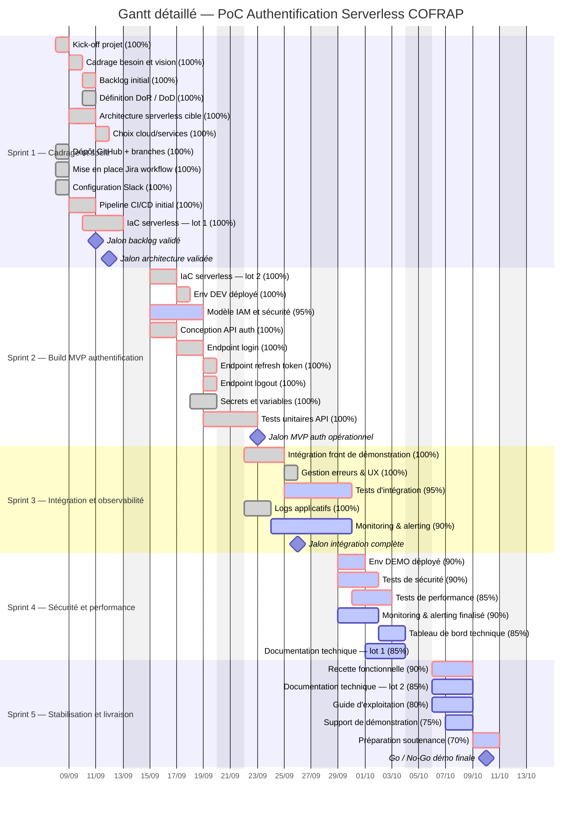

## 5.4 Gantt de synthèse pour vue exécutive

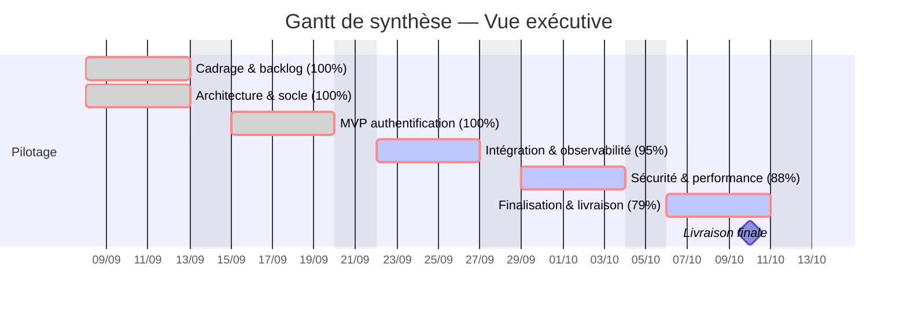

## 5.5 Comparaison baseline vs réel

### Baseline initiale

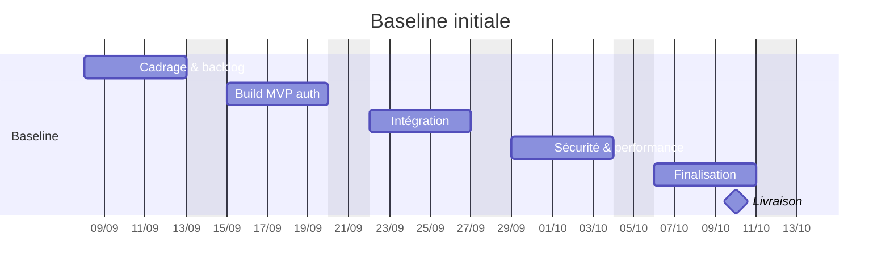

### Réel observé à date de suivi

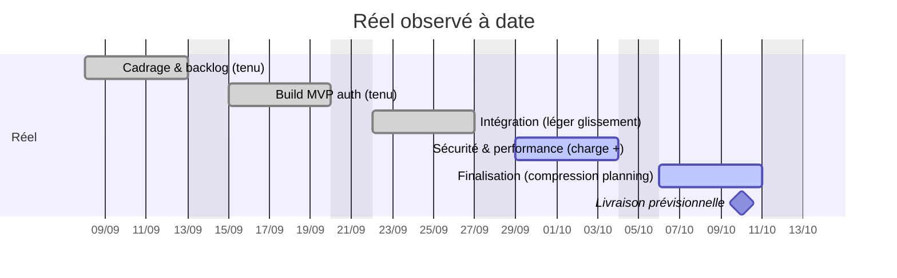

## 5.6 Analyse Gantt et chemin critique

### Chemin critique retenu

1. Cadrage besoin
2. Backlog initial
3. Architecture serverless
4. Choix cloud/services
5. Pipeline CI/CD initial
6. IaC serverless
7. Déploiement DEV
8. Conception API auth
9. Login
10. Refresh token
11. Tests unitaires
12. Intégration front
13. Tests d'intégration
14. Tests de performance / sécurité
15. Recette fonctionnelle
16. Préparation soutenance
17. Jalons finaux

### Écarts majeurs observés

| Sujet | Baseline | Réel | Impact | Décision |
|---|---|---|---|---|
| IAM et sécurité | Fin S2 | 95% fin S4 | Léger risque | Renfort DevOps et re-priorisation S4 |
| Monitoring final | Fin S3 | 90% fin S4 | Faible | Maintien dans périmètre |
| Guide d'exploitation | 100% en S5 | 80% à date | Moyen | Finalisation dédiée les 09/10 et 10/10 |
| Support soutenance | 100% en S5 | 75% à date | Moyen | Point quotidien spécifique fin de projet |

### Conclusion de conformité

Le diagramme présenté est **conforme** car il comporte :

- toutes les tâches du WBS ;
- les dépendances ;
- les jalons ;
- les sections par sprint ;
- l'avancement explicite ;
- le chemin critique ;
- une comparaison **baseline vs réel** ;
- une vue détaillée et une vue exécutive.

---

# 6. Indicateurs quantitatifs

## 6.1 Tableau de synthèse des KPI quantitatifs

| KPI | Définition | Formule | Valeur actuelle | Cible | Tendance | Action corrective |
|---|---|---|---|---|---|---|
| Vélocité | Story points terminés par sprint | SP terminés / sprint | 26 SP moyenne | 25 SP | ↗ stable | Maintenir backlog raffiné |
| Burndown | Travail restant journalier | SP restants / jour | Conforme sur 3 sprints / 5 | 0 fin sprint | ↘ correct | Revue quotidienne blocages |
| Lead Time | Temps entre création et livraison | Date done - date création | 4,8 jours | < 5 jours | ↘ bon | Limiter WIP |
| Cycle Time | Temps entre in progress et done | Date done - date in progress | 2,9 jours | < 3 jours | ↘ bon | Fractionner stories complexes |
| Taux d'utilisation ressource | Heures consommées / heures disponibles | h passées / h capacité | 94,3% | 90% à 95% | → nominal | Réserver marge incidents |
| PV | Valeur planifiée cumulée | Budget planifié à date | 11 200 € fin S4 | 11 200 € | → | Sans action |
| EV | Valeur acquise cumulée | % avancement × BAC | 10 920 € fin S4 | ≥ PV | ↘ léger retard | Focus tâches critiques |
| AC | Coût réel cumulé | Somme coûts constatés | 11 360 € fin S4 | ≤ EV | ↗ surcoût léger | Limiter rework |
| SPI | Performance planning | EV / PV | 0,98 fin S4 | ≥ 1,00 | ↘ | Reprioriser tâches non critiques |
| CPI | Performance coût | EV / AC | 0,96 fin S4 | ≥ 1,00 | ↘ | Réduire dispersion technique |
| Densité de défauts | Bugs / KLOC ou fonction | Nb bugs / KLOC | 0,9 bug/KLOC | < 1,2 | ↘ bon | Poursuivre tests auto |
| Couverture de tests | % code couvert | Lignes couvertes / lignes testables | 82% | ≥ 80% | ↗ | Ajouter tests sécurité |
| Fréquence de déploiement | Déploiements / semaine | Nb déploiements prod-like | 4 / semaine | ≥ 3 | ↗ très bon | Conserver pipeline léger |
| MTTR | Temps moyen de rétablissement | Somme durées incident / nb incidents | 42 min | < 60 min | ↘ bon | Runbook plus détaillé |

## 6.2 Vélocité sprint par sprint

### Données de vélocité

| Sprint | SP planifiés | SP terminés | Écart | Taux d'atteinte |
|---|---:|---:|---:|---:|
| Sprint 1 | 20 | 21 | +1 | 105% |
| Sprint 2 | 26 | 25 | -1 | 96% |
| Sprint 3 | 28 | 27 | -1 | 96% |
| Sprint 4 | 28 | 26 | -2 | 93% |
| Sprint 5 | 24 | 19 prévus à date | -5 | 79% à date |

### Interprétation

- La vélocité moyenne constatée sur les quatre premiers sprints terminés est de **24,75 SP**.
- La vélocité de pilotage retenue est arrondie à **25 SP/sprint**.
- Le Sprint 5 est encore en cours ; la projection finale reste cohérente avec l'objectif global.

### Graphique de vélocité

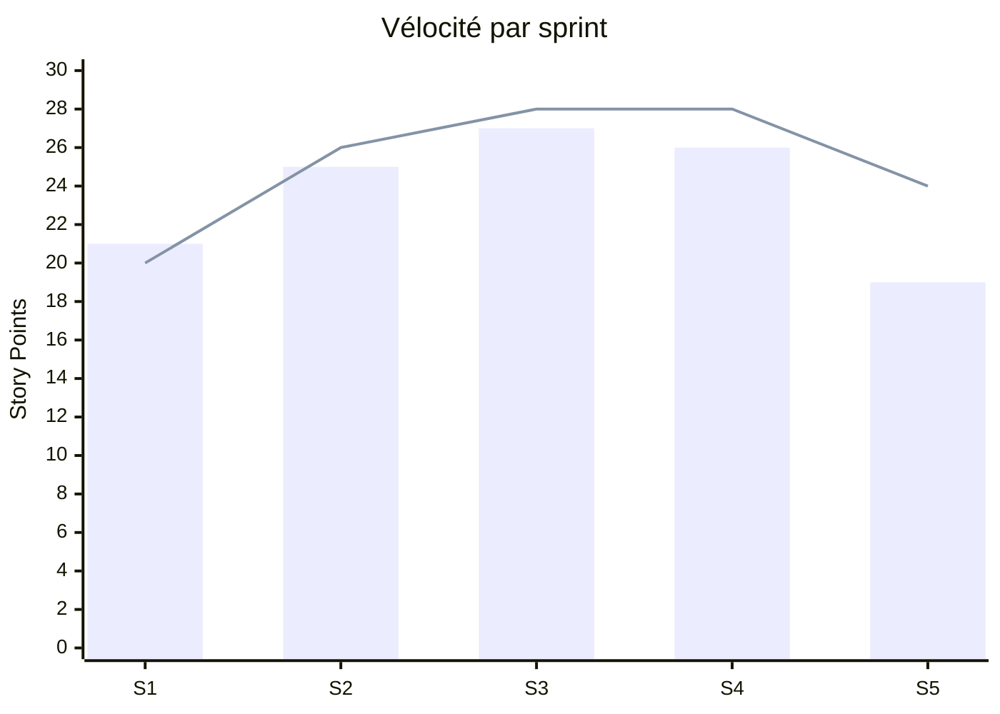

### Analyse KPI — Vélocité

- **Définition** : quantité de valeur fonctionnelle terminée par sprint.
- **Formule** : somme des story points des items « Done ».
- **Valeur actuelle** : 26 SP moyens observés si l'on inclut la projection S5, 24,75 SP sur sprints clos.
- **Cible** : 25 SP.
- **Tendance** : stable.
- **Action corrective si dérive** : réduire les stories trop larges, sécuriser la préparation du backlog en refinement.

## 6.3 Burndown par sprint

### Sprint 1

| Jour | SP restants plan | SP restants réel |
|---|---:|---:|
| J1 | 20 | 20 |
| J2 | 16 | 17 |
| J3 | 12 | 13 |
| J4 | 8 | 7 |
| J5 | 4 | 0 |

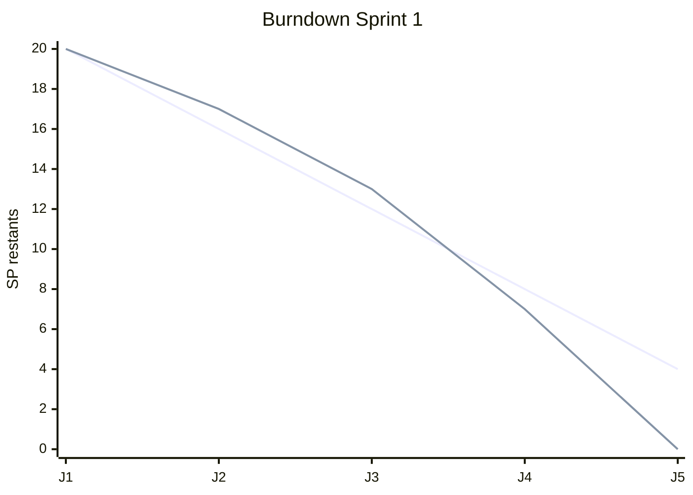

### Sprint 2

| Jour | SP restants plan | SP restants réel |
|---|---:|---:|
| J1 | 26 | 26 |
| J2 | 21 | 22 |
| J3 | 16 | 17 |
| J4 | 10 | 9 |
| J5 | 5 | 1 |

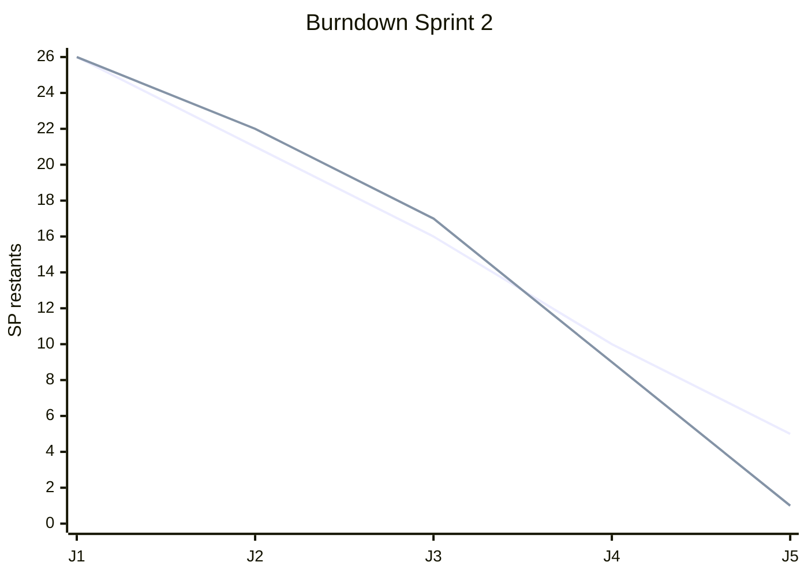

### Sprint 3

| Jour | SP restants plan | SP restants réel |
|---|---:|---:|
| J1 | 28 | 28 |
| J2 | 22 | 24 |
| J3 | 17 | 17 |
| J4 | 11 | 10 |
| J5 | 6 | 1 |

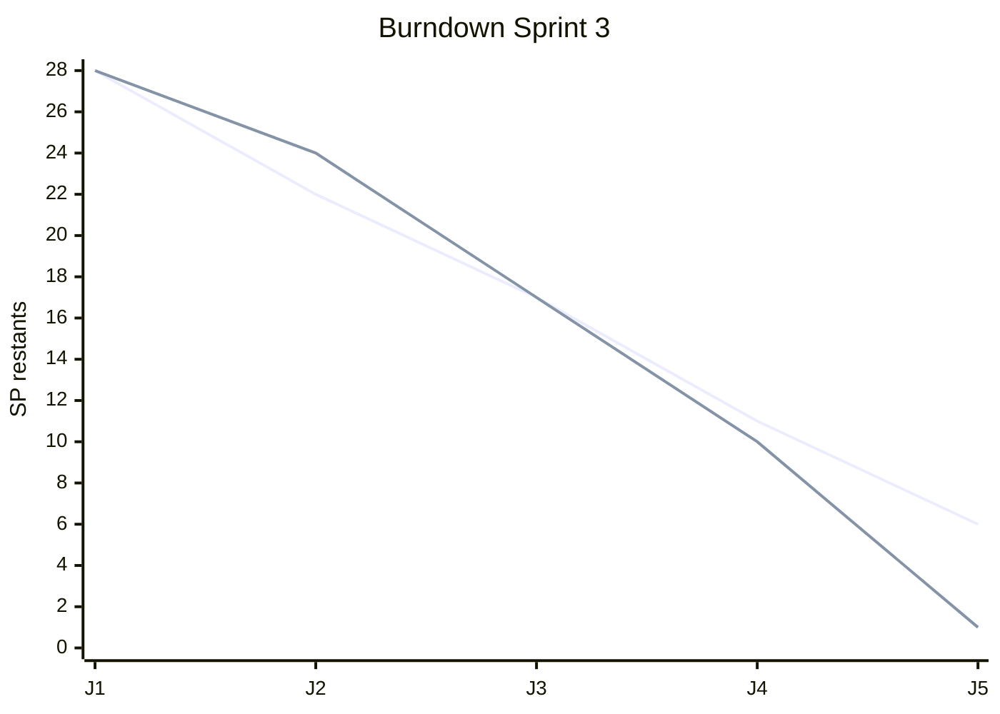

### Sprint 4

| Jour | SP restants plan | SP restants réel |
|---|---:|---:|
| J1 | 28 | 28 |
| J2 | 22 | 24 |
| J3 | 17 | 18 |
| J4 | 11 | 12 |
| J5 | 6 | 2 |

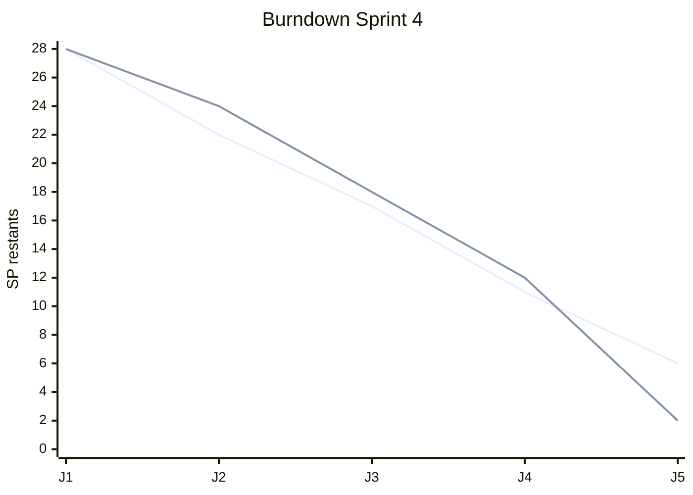

### Sprint 5 (projection à date)

| Jour | SP restants plan | SP restants réel |
|---|---:|---:|
| J1 | 24 | 24 |
| J2 | 19 | 20 |
| J3 | 14 | 16 |
| J4 | 9 | 10 |
| J5 | 4 | 5 |

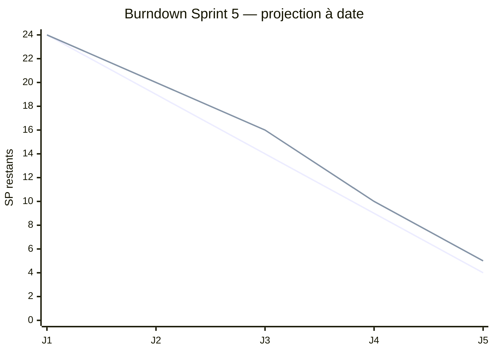

### Analyse KPI — Burndown

- **Définition** : quantité de travail restante suivie quotidiennement.
- **Formule** : SP ouverts restant à clôturer.
- **Valeur actuelle** : dérive légère en S4 et S5.
- **Cible** : atteindre 0 ou un reliquat marginal par fin de sprint.
- **Tendance** : légèrement défavorable en fin de projet.
- **Action corrective** : geler l'ajout de scope et concentrer la capacité sur les tâches critiques.

## 6.4 Lead time et cycle time

| Type de ticket | Lead Time moyen | Cycle Time moyen | Cible | Commentaire |
|---|---:|---:|---:|---|
| User Story | 5,2 jours | 3,1 jours | < 6 j / < 4 j | Conforme |
| Task technique | 3,8 jours | 2,4 jours | < 5 j / < 3 j | Bon |
| Bug | 2,1 jours | 1,2 jours | < 3 j / < 2 j | Très bon |
| Moyenne globale | 4,8 jours | 2,9 jours | < 5 j / < 3 j | Sous contrôle |

### Analyse KPI — Lead Time

- **Définition** : durée entre la création d'un ticket et sa mise en production / done.
- **Formule** : `date done - date création`.
- **Valeur actuelle** : 4,8 jours.
- **Cible** : < 5 jours.
- **Tendance** : bonne.
- **Action corrective** : limiter l'accumulation en backlog intermédiaire.

### Analyse KPI — Cycle Time

- **Définition** : durée entre le démarrage effectif d'une tâche et sa finalisation.
- **Formule** : `date done - date in progress`.
- **Valeur actuelle** : 2,9 jours.
- **Cible** : < 3 jours.
- **Tendance** : bonne.
- **Action corrective** : maintenir le WIP limité et privilégier des lots petits.

## 6.5 Taux d'utilisation des ressources

| Sprint | Heures disponibles | Heures consommées | Taux d'utilisation |
|---|---:|---:|---:|
| Sprint 1 | 140 h | 132 h | 94,3% |
| Sprint 2 | 140 h | 136 h | 97,1% |
| Sprint 3 | 140 h | 131 h | 93,6% |
| Sprint 4 | 140 h | 139 h | 99,3% |
| Sprint 5 | 140 h | 122 h prévision | 87,1% |
| Total | 700 h | 660 h | 94,3% |

### Analyse KPI — Utilisation ressource

- **Définition** : intensité d'utilisation de la capacité équipe.
- **Formule** : `heures consommées / heures disponibles`.
- **Valeur actuelle** : 94,3%.
- **Cible** : 90% à 95%.
- **Tendance** : nominale, avec tension en S4.
- **Action corrective** : conserver 5 à 10% de marge pour aléas techniques.

## 6.6 Earned Value Management (EVM)

### Référentiel EVM

- **BAC (Budget At Completion)** = 14 000 €
- Budget par sprint de référence = 2 800 €

### Données EVM par fin de sprint

| Fin de sprint | PV (€) | EV (€) | AC (€) | SV = EV-PV | CV = EV-AC | SPI = EV/PV | CPI = EV/AC |
|---|---:|---:|---:|---:|---:|---:|---:|
| S1 | 2 800 | 2 940 | 2 640 | +140 | +300 | 1,05 | 1,11 |
| S2 | 5 600 | 5 460 | 5 360 | -140 | +100 | 0,98 | 1,02 |
| S3 | 8 400 | 8 260 | 7 980 | -140 | +280 | 0,98 | 1,04 |
| S4 | 11 200 | 10 920 | 11 360 | -280 | -440 | 0,98 | 0,96 |
| S5 (prévision) | 14 000 | 13 720 | 13 920 | -280 | -200 | 0,98 | 0,99 |

### Calculs EVM détaillés

| Indicateur | Formule | Valeur fin S4 | Interprétation |
|---|---|---:|---|
| PV | Budget planifié cumulé | 11 200 € | Ce qui devait être réalisé à date |
| EV | % avancement réel × BAC | 10 920 € | Valeur réellement produite |
| AC | Coût réel cumulé | 11 360 € | Coût effectivement consommé |
| SV | EV - PV | -280 € | Léger retard planning |
| CV | EV - AC | -440 € | Léger surcoût |
| SPI | EV / PV | 0,98 | Sous 1 : retard faible |
| CPI | EV / AC | 0,96 | Sous 1 : coût moins performant |
| EAC | BAC / CPI | 14 583 € | Coût final estimé |
| ETC | EAC - AC | 3 223 € | Coût restant estimé |
| VAC | BAC - EAC | -583 € | Dépassement prévisionnel |

### Graphique EVM

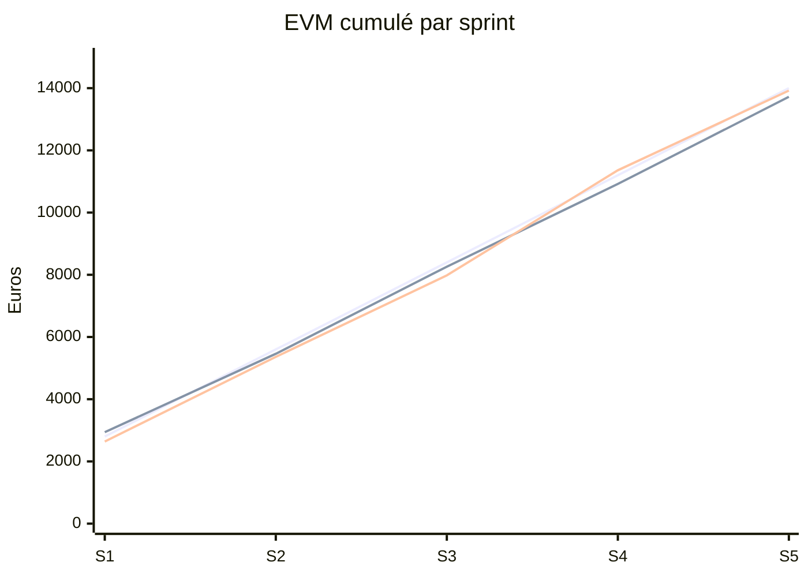

### Répartition budgétaire par domaine

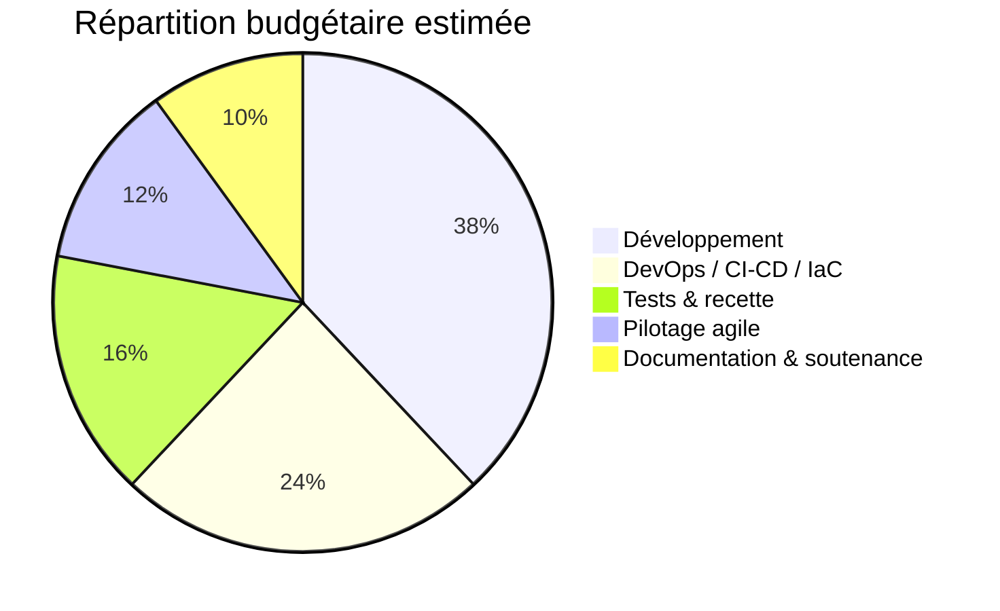

### Analyse KPI — EVM

- **Définition** : mesure croisée délai/coût/valeur produite.
- **Formules clés** :
  - `SPI = EV / PV`
  - `CPI = EV / AC`
  - `EAC = BAC / CPI`
  - `VAC = BAC - EAC`
- **Valeurs actuelles** : SPI 0,98 ; CPI 0,96.
- **Cibles** : SPI ≥ 1,00 ; CPI ≥ 1,00.
- **Tendance** : légère dérive contrôlée.
- **Action corrective** : arbitrer les tâches à faible valeur, limiter le rework, finir le sprint 5 en mode focus delivery.

## 6.7 Densité de défauts

| Mesure | Valeur |
|---|---:|
| Bugs fonctionnels détectés | 7 |
| Bugs techniques détectés | 5 |
| Total bugs | 12 |
| Taille estimée du code | 13,2 KLOC |
| Densité de défauts | 0,9 bug/KLOC |
| Cible | < 1,2 bug/KLOC |

### Analyse KPI — Densité de défauts

- **Définition** : quantité de défauts rapportée au volume de code ou au nombre de fonctions.
- **Formule** : `nombre de bugs / KLOC`.
- **Valeur actuelle** : 0,9 bug/KLOC.
- **Cible** : < 1,2.
- **Tendance** : bonne.
- **Action corrective** : maintenir les revues de code et l'automatisation des tests de non-régression.

## 6.8 Couverture de tests

| Type de tests | Valeur actuelle | Cible | Commentaire |
|---|---:|---:|---|
| Couverture unitaire | 86% | 85% | Atteinte |
| Couverture intégration | 78% | 75% | Atteinte |
| Couverture globale | 82% | 80% | Atteinte |

### Analyse KPI — Couverture

- **Définition** : proportion du code testable effectivement couverte par des tests automatisés.
- **Formule** : `lignes couvertes / lignes testables`.
- **Valeur actuelle** : 82%.
- **Cible** : 80%.
- **Tendance** : positive.
- **Action corrective** : ajouter des cas limites sécurité et expiration de token.

## 6.9 Fréquence de déploiement

| Sprint | Déploiements dev | Déploiements démo | Total |
|---|---:|---:|---:|
| S1 | 3 | 0 | 3 |
| S2 | 4 | 1 | 5 |
| S3 | 3 | 1 | 4 |
| S4 | 3 | 2 | 5 |
| S5 | 2 | 2 | 4 |

### Analyse KPI — Déploiement

- **Définition** : nombre de mises à disposition applicatives par période.
- **Formule** : `nombre de déploiements / semaine`.
- **Valeur actuelle** : 4 déploiements/semaine.
- **Cible** : ≥ 3.
- **Tendance** : très bonne.
- **Action corrective** : sécuriser les checklists avant déploiement DEMO.

## 6.10 Mean Time To Recovery (MTTR)

| Incident | Durée de résolution |
|---|---:|
| Erreur de variable d'environnement | 35 min |
| Régression refresh token | 55 min |
| Problème IAM de déploiement | 48 min |
| Timeout sur endpoint démo | 30 min |
| **MTTR moyen** | **42 min** |

### Analyse KPI — MTTR

- **Définition** : temps moyen nécessaire pour rétablir un service après incident.
- **Formule** : `somme des temps de résolution / nombre d'incidents`.
- **Valeur actuelle** : 42 minutes.
- **Cible** : < 60 minutes.
- **Tendance** : bonne.
- **Action corrective** : enrichir les runbooks et les alertes contextualisées.

---

# 7. Indicateurs qualitatifs

## 7.1 Tableau de synthèse des KPI qualitatifs

| KPI qualitatif | Définition | Mode d'évaluation | Valeur actuelle | Cible | Tendance | Action corrective |
|---|---|---|---|---|---|---|
| Qualité de code | Qualité structurelle du code | Revue + métriques type SonarQube | Bon niveau | Bon / Très bon | ↗ | Traiter dette restante |
| Satisfaction équipe | Ressenti collaboratif et charge | Vote rétro 1 à 5 | 4,3/5 | ≥ 4/5 | → | Préserver cadence soutenable |
| Satisfaction PO | Valeur perçue métier | Score fin sprint 1 à 5 | 4,6/5 | ≥ 4,5/5 | ↗ | Démos plus orientées usage |
| Qualité fonctionnelle | Critères d'acceptation passés | % AC validés | 92% | ≥ 95% | ↘ léger | Renforcer recette S5 |
| Complétude documentaire | Docs livrées / docs prévues | Ratio livrables | 84% | 100% | ↗ | Finaliser guide et support |
| Résolution findings sécurité | Findings fermés / findings ouverts | Taux de remédiation | 89% | 100% critiques | ↗ | Clôturer restes S5 |

## 7.2 Qualité du code

### Référentiel conceptuel type SonarQube

| Mesure | Valeur | Cible | Lecture |
|---|---:|---:|---|
| Ratio dette technique | 3,1% | < 5% | Conforme |
| Code smells | 24 | < 30 | Conforme |
| Duplications | 1,8% | < 3% | Conforme |
| Vulnérabilités bloquantes | 0 | 0 | Conforme |
| Hotspots sécurité revus | 100% | 100% | Conforme |

### Analyse

- Le code présente une **maîtrise structurelle satisfaisante**.
- Les duplications restent faibles grâce à la factorisation des composants auth.
- La dette technique est présente mais contenue, principalement sur la documentation et certains scripts d'exploitation.

## 7.3 Satisfaction équipe

### Score de satisfaction par sprint

| Sprint | Score /5 | Point fort | Point faible | Action retenue |
|---|---:|---|---|---|
| S1 | 4,2 | Vision claire | Cadence initiale forte | Clarifier priorités J+1 |
| S2 | 4,4 | Bonne coopération | Dépendances IAM | Ajouter point DevOps dédié |
| S3 | 4,5 | Démo motivante | Tests plus lourds | Réserver créneau qualité |
| S4 | 4,1 | Bonne entraide | Charge sécurité/perf | Réduire WIP |
| S5 | 4,3 prévision | Focus livraison | Tension soutenance | Préparer à l'avance |

### Suivi des actions de rétrospective

| Action de rétrospective | Sprint d'origine | Responsable | Statut |
|---|---|---|---|
| Mieux préparer les tickets avant sprint planning | S1 | PO | Fait |
| Ajouter un quick filter Jira "Bloqué" | S2 | Scrum Master | Fait |
| Normaliser les messages de commit liés aux tickets | S2 | Lead Dev | Fait |
| Prévoir 1 créneau fixe de stabilisation mid-sprint | S3 | Scrum Master | Fait |
| Formaliser un runbook incidents démo | S4 | DevOps | En cours |

## 7.4 Satisfaction des parties prenantes

| Sprint | Score PO /5 | Score sponsor /5 | Commentaire |
|---|---:|---:|---|
| S1 | 4,5 | 4,2 | Bonne compréhension de la cible |
| S2 | 4,7 | 4,4 | MVP crédible et démontrable |
| S3 | 4,8 | 4,5 | Très bonne visibilité du produit |
| S4 | 4,4 | 4,3 | Attente forte sur sécurité |
| S5 | 4,6 prévision | 4,5 prévision | Livrable jugé pertinent |

### Analyse

- La satisfaction PO reste élevée car les démonstrations montrent de la valeur à chaque fin de sprint.
- Le léger recul en S4 s'explique par l'exigence accrue sur les sujets non fonctionnels.

## 7.5 Qualité fonctionnelle

| Mesure | Valeur |
|---|---:|
| Critères d'acceptation prévus | 50 |
| Critères validés | 46 |
| Critères partiellement validés | 3 |
| Critères non validés | 1 |
| Taux de validation | 92% |
| Cible | 95% |

### Analyse

- **Définition** : niveau de conformité des fonctionnalités vis-à-vis des besoins.
- **Mode d'évaluation** : validation des critères d'acceptation en review et recette.
- **Valeur actuelle** : 92%.
- **Cible** : 95%.
- **Tendance** : légèrement sous la cible.
- **Action corrective** : concentrer la recette finale sur la robustesse des cas limites et la qualité de la démonstration.

## 7.6 Complétude documentaire

| Livrable documentaire | Prévu | Réalisé | Taux |
|---|---:|---:|---:|
| Schéma architecture | 1 | 1 | 100% |
| Guide installation | 1 | 1 | 100% |
| Guide exploitation | 1 | 0,8 | 80% |
| Dossier de sécurité | 1 | 0,9 | 90% |
| Support soutenance | 1 | 0,75 | 75% |
| README et consignes GitHub | 1 | 1 | 100% |
| **Ratio global** | 6 | 5,05 | **84%** |

### Analyse

- **Définition** : part des livrables documentaires produits et exploitables.
- **Formule** : `livrables réalisés / livrables prévus`.
- **Valeur actuelle** : 84%.
- **Cible** : 100%.
- **Tendance** : positive mais incomplète.
- **Action corrective** : réserver un couloir final de 1,5 jour pour documentation et soutenance.

## 7.7 Résolution des findings de sécurité

| Niveau | Findings détectés | Findings corrigés | Taux de résolution |
|---|---:|---:|---:|
| Critique | 1 | 1 | 100% |
| Majeur | 5 | 4 | 80% |
| Mineur | 12 | 11 | 91,7% |
| Total | 18 | 16 | 88,9% |

### Analyse

- **Définition** : capacité de l'équipe à corriger les écarts sécurité identifiés.
- **Formule** : `findings corrigés / findings détectés`.
- **Valeur actuelle** : 88,9%.
- **Cible** : 100% des critiques, > 90% au global.
- **Tendance** : satisfaisante.
- **Action corrective** : solder les 2 derniers points avant démonstration finale.

---

# 8. Outil de planification — Jira

## 8.1 Justification de l'usage de Jira

Jira est utilisé comme **outil central de planification, de suivi et de traçabilité**. Son emploi répond au critère d'évaluation relatif à l'utilisation d'un outil de planification de tâches de type **MS Project / Trello / Jira**.

## 8.2 Configuration du board Jira

### Type de board

- **Board Scrum** rattaché au backlog produit COFRAP-Auth-PoC.
- Cadence : **1 sprint = 1 semaine**.
- Estimation en **story points**.

### Colonnes du board

| Colonne | Signification | Règle de passage |
|---|---|---|
| Backlog | Travail non engagé | Priorisé par le PO |
| To Do | Travail sélectionné pour le sprint | Prêt selon DoR |
| In Progress | Développement ou configuration en cours | Un seul owner principal |
| In Review | Relecture technique / validation PR | PR ouverte et liée au ticket |
| In Test | Vérification fonctionnelle/technique | Build verte requise |
| Done | Travail terminé selon DoD | Critères d'acceptation validés |
| Blocked (flag) | État transversal | Ticket signalé comme bloqué |

### Swimlanes

- Swimlane par **type de travail** : User Story / Task / Bug / Spike.
- Alternative de lecture utilisée en sprint review : swimlane par **priorité**.

### Quick filters

| Quick filter | Usage |
|---|---|
| `assignee = currentUser()` | Visualiser son travail personnel |
| `status = Blocked OR Flagged = Impediment` | Suivre les blocages |
| `labels = security` | Isoler les sujets sécurité |
| `type = Bug` | Suivre les anomalies |
| `sprint in openSprints()` | Focaliser l'exécution en cours |

## 8.3 Description des captures d'écran Jira attendues

### Capture 1 — Vue backlog

La capture montre :

- la liste priorisée des user stories ;
- les estimations en story points ;
- la préparation du Sprint 5 ;
- les epics « Auth », « Infra », « Observabilité », « Sécurité », « Documentation ».

### Capture 2 — Sprint board en exécution

La capture montre :

- les colonnes **To Do / In Progress / In Review / In Test / Done** ;
- la progression visuelle des tickets ;
- les tickets marqués **flagged** en cas de blocage ;
- l'équilibrage entre DevOps et Lead Developer.

### Capture 3 — Burndown chart Jira

La capture montre :

- la courbe idéale de descente ;
- la courbe réelle ;
- les écarts de charge journaliers ;
- la dérive maîtrisée en S4 et la tension de clôture en S5.

### Capture 4 — Velocity chart Jira

La capture montre :

- la comparaison entre points engagés et points terminés ;
- la stabilisation de la capacité autour de 25 SP ;
- l'intérêt du graphique pour calibrer le sprint suivant.

### Capture 5 — Cumulative Flow Diagram

La capture montre :

- la largeur de chaque état du workflow ;
- la maîtrise du WIP ;
- le goulot éventuel entre **In Review** et **In Test** ;
- la fluidité globale du flux de production.

## 8.4 Burndown chart Jira — interprétation pédagogique

Le burndown Jira permet de vérifier :

- si l'équipe consomme la charge de manière régulière ;
- si les stories sont trop grosses ;
- si des tickets restent trop longtemps en cours ;
- si des blocages ralentissent la clôture.

## 8.5 Velocity chart Jira — interprétation pédagogique

Le velocity chart Jira permet de :

- projeter une capacité réaliste ;
- éviter la sur-planification ;
- fiabiliser les engagements du sprint planning ;
- objectiver la montée en maturité de l'équipe.

## 8.6 Cumulative Flow Diagram — interprétation

Le CFD est utilisé pour :

- surveiller la stabilité des flux ;
- identifier les files d'attente ;
- mesurer l'impact des relectures et des tests ;
- ajuster les limites WIP et les règles de passage.

## 8.7 Connexion Jira ↔ GitHub

### Principe de liaison

- Chaque branche GitHub reprend l'identifiant Jira : `AUTH-17-login-endpoint`.
- Chaque commit contient la clé ticket : `AUTH-17 feat: add login lambda handler`.
- Chaque Pull Request mentionne le ticket Jira associé.

### Valeur de cette intégration

| Bénéfice | Description |
|---|---|
| Traçabilité | Un ticket renvoie vers les commits et PR concernés |
| Auditabilité | Les changements sont justifiés par un besoin ou un bug |
| Pilotage | Le board reflète l'activité de développement réelle |
| Qualité | Les revues de code sont associées aux exigences |

## 8.8 Règles de gouvernance Jira

- Aucun ticket n'entre en sprint sans estimation.
- Aucun ticket ne passe en `Done` sans critères d'acceptation validés.
- Les bugs issus de recette sont créés dans Jira sous 24 h.
- Les tickets bloqués sont signalés au daily suivant au plus tard.
- Les tickets techniques liés à la sécurité portent le label `security`.

## 8.9 Conclusion sur l'outil de planification

L'utilisation de Jira ne se limite pas à la simple saisie de tâches :

- le backlog est piloté ;
- les sprints sont mesurés ;
- les métriques sont exploitées ;
- les liens avec GitHub renforcent la traçabilité ;
- les rituels Scrum s'appuient directement sur les vues Jira.

Cela répond au niveau attendu d'un **pilotage outillé et maîtrisé**.

---

# 9. Organisation des réunions de suivi

## 9.1 Principes généraux

L'organisation des réunions suit une logique **Scrum cohérente** avec un projet agile court, à forte contrainte de démonstration.

## 9.2 Daily Standup

### Cadre

- Fréquence : **tous les jours à 09h00 CET**
- Durée : **15 minutes maximum**
- Participants : toute l'équipe projet
- Animation : Scrum Master (facilitation principale)

### Format obligatoire

Chaque membre répond à trois questions :

1. **Ce que j'ai fait hier**
2. **Ce que je vais faire aujourd'hui**
3. **Mes blocages éventuels**

### Règles

- Pas de résolution technique détaillée pendant le daily.
- Les sujets longs partent en **after-daily**.
- Les blocages sont enregistrés dans Jira avec flag si nécessaire.

## 9.3 Sprint Planning

- Quand : **chaque lundi de sprint**
- Durée : **2 heures**
- Objectifs :
  - rappeler l'objectif du sprint ;
  - sélectionner les items ;
  - vérifier la capacité ;
  - découper les tâches si nécessaire ;
  - valider l'engagement réaliste.

## 9.4 Sprint Review

- Quand : **chaque vendredi**
- Durée : **1 heure**
- Participants : équipe + parties prenantes
- Format : démonstration des incréments livrés
- Résultat attendu : validation, remarques métier, adaptation backlog

## 9.5 Sprint Retrospective

- Quand : **chaque vendredi après la review**
- Durée : **45 minutes**
- Objectif : amélioration continue du fonctionnement équipe
- Sortie attendue : 1 à 3 actions concrètes maximum par sprint

## 9.6 Backlog Refinement

- Quand : **chaque mercredi**
- Durée : **1 heure**
- Objectif : préparer le sprint suivant, clarifier, estimer, découper

## 9.7 Planning calendaire complet des réunions sur 5 semaines

| Date | Heure | Réunion | Durée | Participants | Finalité |
|---|---|---|---|---|---|
| 08/09/2025 | 09:00 | Daily + kick-off court | 15 min + lancement | Tous | Démarrage sprint 1 |
| 08/09/2025 | 10:00 | Sprint Planning S1 | 2 h | Tous | Lancer le sprint |
| 09/09/2025 | 09:00 | Daily | 15 min | Tous | Synchronisation |
| 10/09/2025 | 09:00 | Daily | 15 min | Tous | Synchronisation |
| 10/09/2025 | 14:00 | Backlog Refinement | 1 h | PO + équipe | Préparer S2 |
| 11/09/2025 | 09:00 | Daily | 15 min | Tous | Synchronisation |
| 12/09/2025 | 09:00 | Daily | 15 min | Tous | Synchronisation |
| 12/09/2025 | 14:00 | Sprint Review S1 | 1 h | Tous + parties prenantes | Démo S1 |
| 12/09/2025 | 15:15 | Sprint Retro S1 | 45 min | Équipe | Amélioration continue |
| 15/09/2025 | 09:00 | Daily | 15 min | Tous | Synchronisation |
| 15/09/2025 | 10:00 | Sprint Planning S2 | 2 h | Tous | Lancer S2 |
| 16/09/2025 | 09:00 | Daily | 15 min | Tous | Synchronisation |
| 17/09/2025 | 09:00 | Daily | 15 min | Tous | Synchronisation |
| 17/09/2025 | 14:00 | Backlog Refinement | 1 h | PO + équipe | Préparer S3 |
| 18/09/2025 | 09:00 | Daily | 15 min | Tous | Synchronisation |
| 19/09/2025 | 09:00 | Daily | 15 min | Tous | Synchronisation |
| 19/09/2025 | 14:00 | Sprint Review S2 | 1 h | Tous + parties prenantes | Démo S2 |
| 19/09/2025 | 15:15 | Sprint Retro S2 | 45 min | Équipe | Ajustements |
| 22/09/2025 | 09:00 | Daily | 15 min | Tous | Synchronisation |
| 22/09/2025 | 10:00 | Sprint Planning S3 | 2 h | Tous | Lancer S3 |
| 23/09/2025 | 09:00 | Daily | 15 min | Tous | Synchronisation |
| 24/09/2025 | 09:00 | Daily | 15 min | Tous | Synchronisation |
| 24/09/2025 | 14:00 | Backlog Refinement | 1 h | PO + équipe | Préparer S4 |
| 25/09/2025 | 09:00 | Daily | 15 min | Tous | Synchronisation |
| 26/09/2025 | 09:00 | Daily | 15 min | Tous | Synchronisation |
| 26/09/2025 | 14:00 | Sprint Review S3 | 1 h | Tous + parties prenantes | Démo S3 |
| 26/09/2025 | 15:15 | Sprint Retro S3 | 45 min | Équipe | Ajustements |
| 29/09/2025 | 09:00 | Daily | 15 min | Tous | Synchronisation |
| 29/09/2025 | 10:00 | Sprint Planning S4 | 2 h | Tous | Lancer S4 |
| 30/09/2025 | 09:00 | Daily | 15 min | Tous | Synchronisation |
| 01/10/2025 | 09:00 | Daily | 15 min | Tous | Synchronisation |
| 01/10/2025 | 14:00 | Backlog Refinement | 1 h | PO + équipe | Préparer S5 |
| 02/10/2025 | 09:00 | Daily | 15 min | Tous | Synchronisation |
| 03/10/2025 | 09:00 | Daily | 15 min | Tous | Synchronisation |
| 03/10/2025 | 14:00 | Sprint Review S4 | 1 h | Tous + parties prenantes | Démo S4 |
| 03/10/2025 | 15:15 | Sprint Retro S4 | 45 min | Équipe | Ajustements |
| 06/10/2025 | 09:00 | Daily | 15 min | Tous | Synchronisation |
| 06/10/2025 | 10:00 | Sprint Planning S5 | 2 h | Tous | Lancer S5 |
| 07/10/2025 | 09:00 | Daily | 15 min | Tous | Synchronisation |
| 08/10/2025 | 09:00 | Daily | 15 min | Tous | Synchronisation |
| 08/10/2025 | 14:00 | Backlog Refinement / check final | 1 h | PO + équipe | Ajustements finaux |
| 09/10/2025 | 09:00 | Daily | 15 min | Tous | Synchronisation |
| 10/10/2025 | 09:00 | Daily | 15 min | Tous | Synchronisation finale |
| 10/10/2025 | 14:00 | Sprint Review S5 / Démo finale | 1 h | Tous + parties prenantes | Validation finale |
| 10/10/2025 | 15:15 | Sprint Retro S5 | 45 min | Équipe | Capitalisation |

## 9.8 Vue calendrier Mermaid des réunions

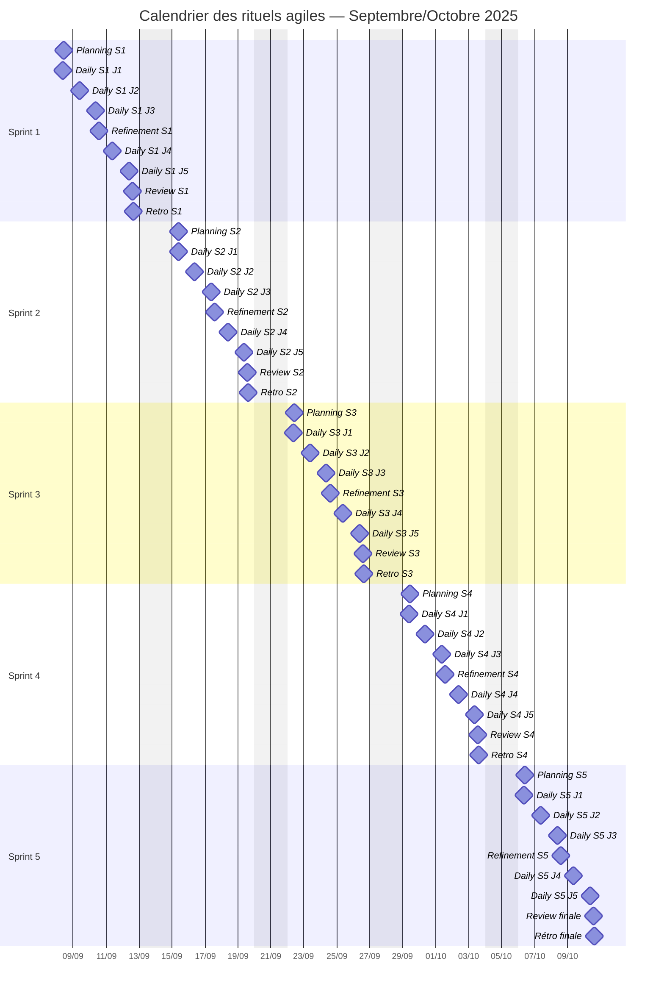

## 9.9 Règles de conduite des réunions

| Règle | Application concrète |
|---|---|
| Timeboxing | Chaque rituel a une durée fixe non dépassée |
| Facilitation claire | Scrum Master anime, PO arbitre la valeur, équipe estime |
| Tour de table structuré | Surtout au daily et en rétro |
| Décisions tracées | Compte-rendu synthétique dans Slack/Jira |
| Actions suivies | Chaque action de rétro devient un ticket Jira |
| Rotation possible | Animation de certaines rétrospectives tournante pour responsabiliser l'équipe |

## 9.10 Circuit de communication

### Slack

| Canal | Usage |
|---|---|
| `#cofrap-auth-general` | Communication projet globale |
| `#cofrap-auth-daily-sync` | Résumés daily et points bloquants |
| `#cofrap-auth-devops` | Déploiement, CI/CD, incidents environnement |
| `#cofrap-auth-review` | Comptes rendus review / rétro |

### Règles de communication

- Tout blocage critique remonté dans l'heure.
- Tout changement de scope discuté avec le PO avant implémentation.
- Toute décision impactant le planning matérialisée dans Jira.

---

# 10. Lecture managériale globale

## 10.1 Forces du pilotage

- Le rythme des sprints est régulier.
- Les artefacts Scrum sont présents et exploités.
- Le suivi quantitatif est complet : vélocité, burndown, lead time, cycle time, EVM.
- Le suivi qualitatif complète la lecture par la satisfaction, la qualité de code et la sécurité.
- Jira, Slack et GitHub sont intégrés dans un écosystème cohérent.

## 10.2 Points de vigilance

- Les sujets sécurité/performance ont comprimé la fin de projet.
- La documentation finale reste le principal risque résiduel.
- Le Sprint 5 nécessite un pilotage quotidien renforcé pour sécuriser la démonstration.

## 10.3 Plan d'actions finales avant clôture

| Priorité | Action | Responsable | Échéance |
|---|---|---|---|
| Haute | Clôturer les findings sécurité restants | Samir FOUL | 09/10/2025 |
| Haute | Finaliser support de démonstration | Wassim LOMRI + Mohamed CHAHOUR | 09/10/2025 |
| Haute | Finaliser guide d'exploitation | Samir FOUL | 10/10/2025 |
| Moyenne | Vérifier tous les critères d'acceptation | Wassim LOMRI | 10/10/2025 |
| Moyenne | Répéter la soutenance avec chronométrage | Tous | 10/10/2025 matin |

---

# 11. Conclusion

Ce tableau de bord démontre un **niveau de maîtrise avancé** du suivi de projet pour un PoC serverless mené en mode agile.

Il couvre de manière complète les attendus de la grille C4 niveau 3 :

- **diagramme de Gantt conforme** avec jalons, dépendances, avancement, baseline et chemin critique ;
- **indicateurs quantitatifs et qualitatifs** interprétés, chiffrés et assortis d'actions correctives ;
- **usage structuré de Jira** comme outil de planification et de pilotage ;
- **organisation cohérente des réunions de suivi** alignée avec Scrum, incluant les dailies et toutes les cérémonies.

Le document montre non seulement le suivi de l'avancement, mais aussi la capacité à **piloter la performance**, à **anticiper les dérives** et à **prendre des décisions correctives argumentées**, ce qui correspond au niveau d'exigence le plus élevé de la compétence visée.
